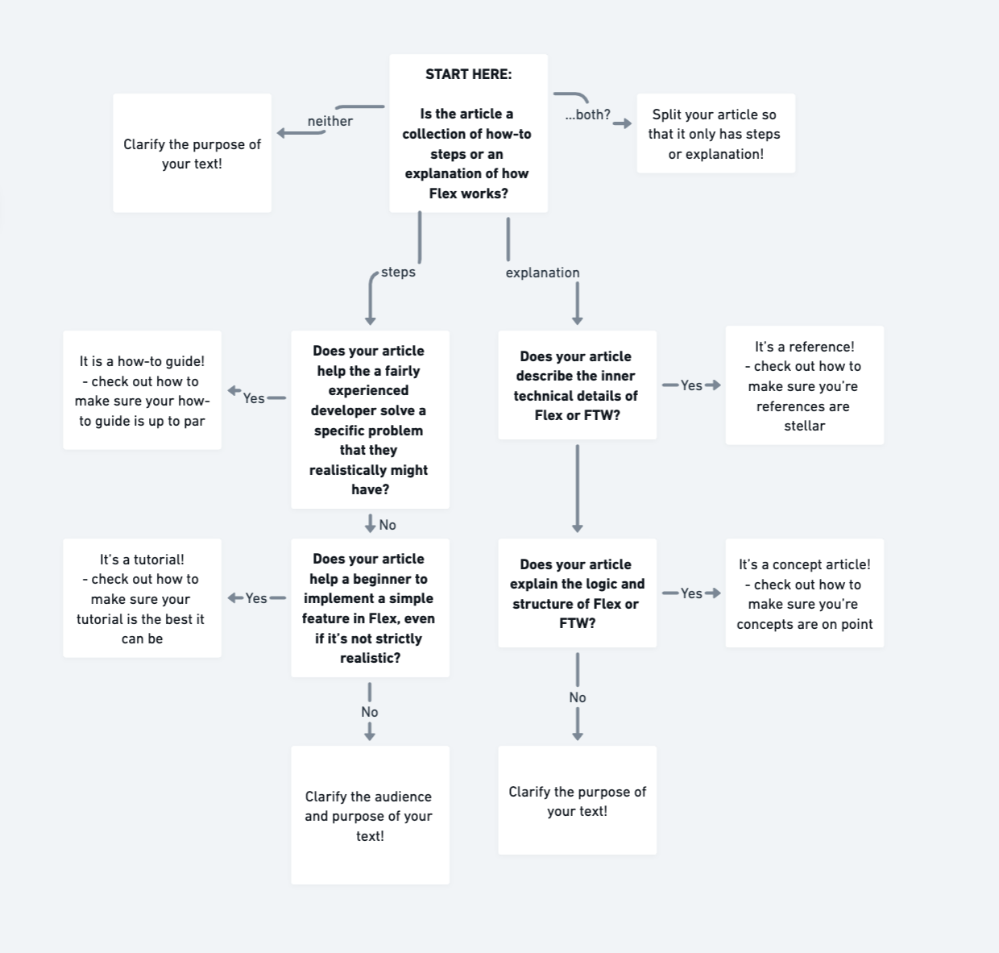

# Categories in Flex Docs

Flex Docs is organised into the following functional categories:
- Tutorials
- Concepts
- How-to articles
- References

These top-level categories are divided into semantic sub-categories e.g. 'Listings', 'Users and authentication, etc.

This categorisation is based on the [Divio documentation](https://documentation.divio.com/).

If you're unsure where your article should go, see the category definitions or the "Where does my article go -flowchart" below.

## Category definitions

### Tutorial
- Learning oriented
- Has specifically defined steps to achieve an outcome
- The process and its steps is primary, outcome is secondary (i.e. not everyone will want to create the exact same filters etc. but it is useful to learn how to manage filters in general)
- A specific context => not too many moving parts
- Minimum necessary explanation => learning by doing

### Concept
- Explanations with context
- Understanding oriented
- Discussion on the inner logic of Flex
- No instructions to achieve specific outcomes

### How-to guide
- Problem oriented
- Has specifically defined steps to achieve an outcome
- The outcome is more important than the process, i.e. if the user has some modifications in their code, those can be addressed
- No discussion of concepts => links where necessary instead of discussion

### Reference
- Technical description
- Structured around code
- No instructions to achieve specific outcomes
- No discussion on why things work a certain way

### Where does my article go -flowchart

