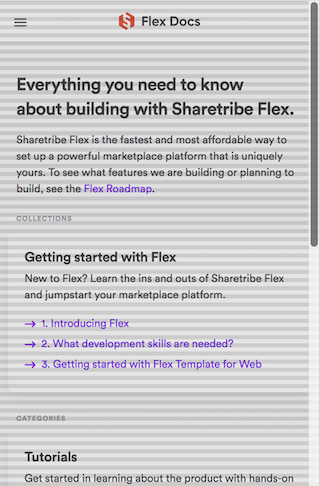
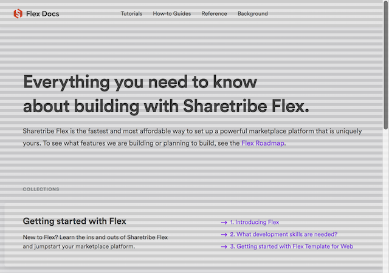

# Flex Docs coding conventions

Here are some common guidelines for making components and styling them.

There are a few reasons behind these guidelines:

- We want to be consistent
- We want to avoid unexpected behavior when context changes
- Component shouldn't leak styles _outside_ of its scope
- Component shouldn't leak styles to other components _within_ it
- Components should obey the baseline by default
- Components should be able to put in various places that behave differently
  e.g. related to responsiveness
- Components should be extendable without extra wrapper components

## Table of contents

- [Use sanitize.css](#use-sanitizecss)
- [Don't inject global styles](#dont-inject-global-styles)
- [Component should not define outside margins](#component-should-not-define-outside-margins)
- [Component should obey the baseline](#component-should-obey-the-baseline)
  - [Component height should be a multiple of the baseline](#component-height-should-be-a-multiple-of-the-baseline)
  - [Component should align with the baseline without adjustment](#component-should-align-with-the-baseline-without-adjustment)
  - [Use the baseline checker tool](#use-the-baseline-checker-tool)
- [Component should pass in extra props to the root component](#component-should-pass-in-extra-props-to-the-root-component)
- [Export style as a static propperty of the component](#export-style-as-a-static-propperty-of-the-component)
- [Prefer top margin when laying out components](#prefer-top-margin-when-laying-out-components)
- [Use the component index file](#use-the-component-index-file)
- [Use UI texts](#use-ui-texts)
- [Use the Styleguide](#use-the-styleguide)
- [Be mindful of HTML semantics for SEO and accessibility](#be-mindful-of-html-semantics-for-seo-and-accessibility)
  - [Use semantic HTML elements](#use-semantic-html-elements)
  - [Ensure keyboard accessibility](#ensure-keyboard-accessibility)
  - [Annotate document metadata](#annotate-document-metadata)
  - [Make sure the sitemap works](#make-sure-the-sitemap-works)

## Use sanitize.css

There are several options for resetting and normalizing browser default styles.
Resetting styles with [reset.css](https://meyerweb.com/eric/tools/css/reset/) is
an aggressive way to unstyle all elements.
[sanitize.css](https://csstools.github.io/sanitize.css/) and
[normalize.css](https://csstools.github.io/normalize.css/) both fix browser bugs
and unify default styles, but sanitize.css is more opinionated.

From the
[sanitize.css docs](https://github.com/csstools/sanitize.css#differences):

> ## Differences
>
> normalize.css and sanitize.css correct browser bugs while carefully testing
> and documenting changes. normalize.css styles adhere to css specifications.
> sanitize.css styles adhere to common developer expectations and preferences.
> reset.css unstyles all elements. Both sanitize.css and normalize.css are
> maintained in sync.

Because we wanted a lightweight solution and agreed with the opinionated styles
within sanitize.css, we decided to go with that.

## Don't inject global styles

To avoid components affecting elements outside of its scope, declaring global
styles like adding styles for an element selector should be minimized. There is
a single place to define application-wide global styles: the
[GlobalStyle](../src/components/GlobalStyle.js) component. However, making
global changes within that component should be minimized since many components
already make assumptions based on those styles and might break if something is
changed.

### Exceptions

The [MarkdownHtml](../src/components/ArticlePage/MarkdownHtml.js) component with
`ArticlePage` has to set global styles for the code highlight and uses element
selectors (which are scoped to within the component).

The [Modal](../src/components/Topbar/Modal.js) component within `Topbar` creates
global styles for the [react-modal](https://github.com/reactjs/react-modal)
element since that is actually rendered as a
[Portal](https://reactjs.org/docs/portals.html) outside the DOM tree of the
`Modal` component.

## Component should not define outside margins

A component doesn't know where it's rendered and how it should behave with
different viewport sizes. For example, default margins would behave differently
if the component is used in a normal document flow compared to a Flexbox
container where margins don't collapse.

Therefore a parent should always add the margins to a component it renders, and
components should not define outside margins.

To achieve this with [styled-components](https://www.styled-components.com/),
you would use the following pattern:

```jsx
// P.js
//
const P = styled.p`
  font-size: 16px;
  line-height: 24px;
`;
export default P;

// SomeComponent.js
//

// Create a version of P with margins added
const Paragraph = styled(P)`
  margin: 24px 0;
`;

const SomeComponent = props => {
  return (
    <div {...props}>
      <Paragraph>Some text content.</Paragraph>
      {/* ... */}
    </div
  );
};
```

## Component should obey the baseline

The whole design of the site is based on a baseline where the text flows in a
certain rhythm and things rendered side-by-side are aligned with each other.
Implementing a design that is based on a baseline can be quite a challenge many
times, so a few rules must be established.

Currently there are two baseline values:

- `6px` for small viewports
- `8px` for large viewports

The viewport changes from small to large at `768px`.

### Component height should be a multiple of the baseline

A component height should be a multiple of the baseline. This means that the
height should be a multiple of the small baseline in a small viewport and a
multiple of the large baseline in the large viewport. This ensures that we can
just render a component anywhere and it doesn't throw other components out of
alignment with the baseline.

Sometimes this requires adding e.g. a certain adjusted padding within a
component that defines a `1px` wide border that wouldn't behave well with the
baseline without extra adjustment. Using the Styleguide page and the baseline
checker tool are recommended when making new components.

#### Exceptions

The height of a responsive image depends on the width, and we cannot do much to
adjust the height to be a multiple of the baseline.

### Component should align with the baseline without adjustment

Where height of the component being a multiple of the baseline ensures that the
component doesn't throw other components out of alignment with the baseline, a
component should also align with the baseline by default. This means that
composing new component from other well-behaving components is just a matter of
adding margins and containers around them, and the basic rules ensure that the
composition model works everywhere.

One notable pattern for this is using `position: relative;` and a `top` value
for text elements together with a `line-height` that matches the baseline
height.

#### Exceptions

The navigation links in the large desktop view of the `Tobpar` don't align with
the baseline, but are aligned vertically to the center of the `Topbar`. This is
a design decision.

### Use the baseline checker tool

In dev mode, the [BaselineDevGrid](../src/components/BaselineDevGrid.js)
component lays out a visual grid on top of the page that changes between the
small and large baseline sizes reponsively when the viewport width changes.

You can toggle on the tool with `CTRL+b`.

#### Screenshots

Small viewport:



Large viewport:



## Component should pass in extra props to the root component

This is by default how many components from external libraries behave (or should
behave). Any styled-component also behaves like this, and it is essential for
how we extend components e.g. for adding margin to other components. Under the
hood, extending a component with styled-component just provides a generated
`className` prop to the underlying component.

To achieve this for components which don't have a styled-component as their
root, use the following pattern:

```jsx
const MyComponent = props => {
  cosnt { prop1, prop2, ...rest } = props;

  // `rest` props are given as props to the root component
  return (
    <div {...rest}>
      {/* Internal components that use `prop1` and `prop2` */}
    </div>
  );
};
```

### Exceptions

Some internal components don't necessarily need to do this.

## Export style as a static propperty of the component

This is a very specific case that shouldn't be used outside of its purpose. If
you check some text component like [P](../src/components/P.js), you note that
the component has a static property `styles` that contains all of its CSS.

This is purely because the
[MarkdownHtml](../src/components/ArticlePage/MarkdownHtml.js) component within
`ArticlePage` required the styles for many component to use within a content
section generated from Markdown files. Internally the elements are not using
those components, they just use the styles defined by those components in the
scoped element selectors.

**This pattern should be used only for what the `MarkdownHtml` component
requires.**

## Prefer top margin when laying out components

When laying out components that don't have margins, it is preferred to use the
top margin to space the elements. This is just a convention to be consistent.

## Use the component index file

For easy importing of components, a component index file
[src/components/index.js](../src/components/index.js) is used.

This enables importing many components with a single `import` statement. It also
enables us to control the import order of the components when we have problems
with circular dependencies.

## Use UI texts

All UI texts should be in the [ui-texts.json](../src/ui-texts.json) file. This
gives us the option of adding translations support in the future and enables
non-technical people of making content changes in one single place.

To use the UI texts, use the [UiText](../src/components/UiText.js) component:

```jsx
const MyComponent = () => {
  return (
    <P>
      <UiText id="MyComponent.someText" />
    </P>
  );
};
```

This renders a `P` with a `span` element within itself. The span has the `id` of
the UI text in the `data-ui-text-id` attribute in dev mode, so the browser
inspector can be used to track down which UI text is rendered to a certain
element.

If a UI text is needed as a `String`, the static function of the same component
can be used:

```js
console.log(`My UI text is ${UiText.fn('MyComponent.someText')}.`);
```

## Use the Styleguide

The [StyleguidePage](../src/pages/styleguide.js) is very useful in developing
new components and checking that all the baselines work nicely. The Styleguide
can be accessed from the `/styleguide` URL.

## Be mindful of HTML semantics for SEO and accessibility

SEO and accessibility are hugely valuable for a documentation site. Therefore we
must put extra effort that everything is done in a sensible way and doesn't
break the usability or findability of the whole site. Here are some things to
consider.

### Use semantic HTML elements

Instead of just throwing a `<div>`, think if a more semantic HTML element like
an [ARIA](https://developer.mozilla.org/en-US/docs/Web/Accessibility/ARIA)
landmark would be more suitable. This includes elements like `<section>`,
`<nav>`, `<main>`, `<header>`, `<footer>`, `<aside>` etc.

### Ensure keyboard accessibility

Always test that the site works nicely when tabbing links with a keyboard. The
order should be sane and all clickable things should be highlighted. Make sure
that both the mobile and the desktop layout work.

**NOTE:** Especially don't hide the clickable area outline if it stays active
when clicking with a mouse. That most likely removes the essential outline from
the element when navigating with a keyboard. There are better ways to handle
that situation: https://github.com/WICG/focus-visible

Many accessibility problems can be tested using the Lighthouse tool in the
"Audit" tab of Chrome dev tools.

### Annotate document metadata

The [BaseLayout](../src/components/BaseLayout.js) component takes a `title` and
a `description` props that are put to the document metadata. Make sure those are
used.

For more specific metadata annotation, [schema.org](https://schema.org/) should
be used. See examples in the
[ArticlePage](../src/components/ArticlePage/ArticlePage.js) and
[Breadcrumb](../src/components/Breadcrumb.js) components.

### Make sure the sitemap works

We use the
[gatsby-plugin-sitemap](https://www.npmjs.com/package/gatsby-plugin-sitemap)
plugin to generate a `sitemap.xml` file of all the pages. When adding new pages,
make sure the sitemap still works correctly. Note that the file is not generated
in the dev mode.

If you add a page that shouldn't be indexed by search engines, you should
exclude it from the sitemap by editing the plugin config in
[gatsby-config.js](../gatsby-config.js) and add a `noIndex={true}` prop to the
layout. See the
[ThanksForTheFeedbackPage](../src/components/ThanksForTheFeedbackPage.js)
component for an example.
