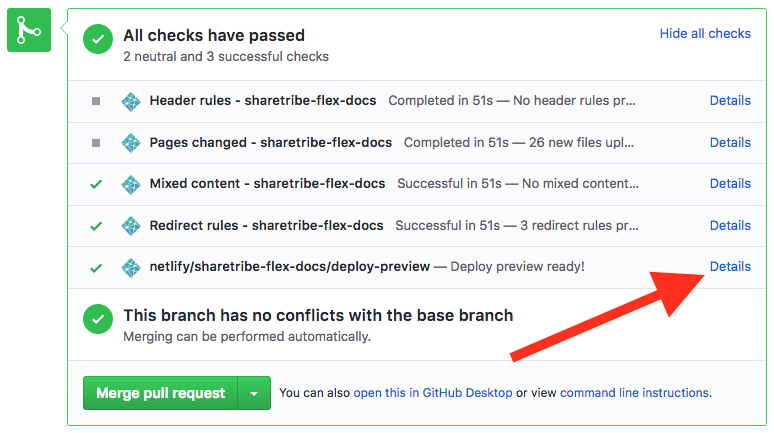

# Writing articles for Dev Docs

This document is for people adding articles or editing article contents
in the Dev Docs site.

## Choosing the correct category

Check the most direct category from sidebar and use that as the basis
for define, where you should add your article in `src/docs/`
subdirectory.

## Adding the article file

The articles are located in [src/docs](../src/docs). There is a
directory for each category, and a directory for each article.

By convention, the article directories are named as `article-slug`. The
order of the articles defaults to alphabetical order, but that can be
overwritten in `src/config-site-structure.js`.

Within an article directory there should be a `index.md` file that has
the article content. There can be other files that the index file
includes, such as images.

## Adding article frontmatter metadata

Every article should start with a metadata section called frontmatter.
It is written in [YAML](https://yaml.org/) and separated from the
article content with `---`.

There are several frontmatter fields in use:

- `title` (**required**): title of the article
- `slug` (**required**): the URL slug of the article (see the
  [Article URL](#article-url) section below)
- `updated` (**required**): date when article was last modified
- `category` (**required**): category of the article
- `ingress` (**required**): ingress text for the article
- `skills` (**optional**): Comma separated list of skills that are
  required to achieve the goal of the article. When this is defined, the
  skills are shown in the article info section in the beginning of the
  article page.
- `toc` (**optional** **currently ignored**): When defined, a full table
  of contents will be shown in the content column. This is useful for
  articles with lots of headers that don't fit in the side column.
- `published` (**optional**, `true` or `false`): by default articles are
  **not** published. They need to be explicitly published to show up in
  the site. In dev mode also unpublished articles are shown.

If some of the required fields are missing or have an invalid value, the
application will throw an error. See the server logs to understand what
the problem is.

## Article URL

The URL to the article is constructed from the `category` and the `slug`
in the article frontmatter. The final URL will be:

```bash
https://www.sharetribe.com / docs        / introduction / introducing-sharetribe /
| domain                   | path prefix | category   | slug             | trailing slash
```

Note that the path prefix will not be used when the application is
running locally with `yarn run dev`.

If the article URL needs to change, a redirect should be added to the
[\_redirects](../_redirects) file. One example would be changing the
slug when the title changes to get better SEO credit.

Checking the redirects file when adding a new article also avoids
problems with "reserved" URLs.

## Editing the article content

Articles are written in
[Markdown](https://en.wikipedia.org/wiki/Markdown). Articles are parsed
using the
[gatsby-transformer-remark](https://github.com/gatsbyjs/gatsby/tree/master/packages/gatsby-transformer-remark)
plugin. Under the hood, the plugin uses
[remark](https://remark.js.org/).

All possible Markdown syntax is parsed and rendered as HTML in the site,
but nice styles are only defined for a subset of all the possible
syntax. See the
[Markdown reference article](../src/docs/references/00-markdown/index.md)
to see what's possible and how everything renders in the dev server.

### Internal links

Extra note must be added for links within the article content that point
to pages within the Dev Docs site. Because the production environment is
running within the `/docs` path prefix and the development server is
just running in the localhost root `/`, the internal links **should not
have the `/docs` prefix**. That is added automatically.

Internal links should also always have the trailing slash to avoid extra
redirects.

## Automatic formatting

The article content can be nicely formatted using the
`yarn run format-docs` command that runs the Markdown files through
[Prettier](https://prettier.io/).

## Making a PR and previewing the content

It is strongly recommended to make a
[Pull Request](https://help.github.com/articles/about-pull-requests/)
(PR) in GitHub when adding a new article or when editing an already
existing article. This enables a review of changes by someone else, and
previewing the changes in the application before publishing them to
production site.

We have an integration in GitHub that shows a link to the preview site
of the code in the PR running in the production environment:



The "Details" link in the deploy preview line goes to the site preview
where the article can be seen running in the proper environment.

This integration also enables making article additions and edits
possible using only GitHub.

## Publishing an article

To publish an article, change the `published` field to `true` in the
article frontmatter and merge the article PR. The `master` branch is
automatically deployed to production.
