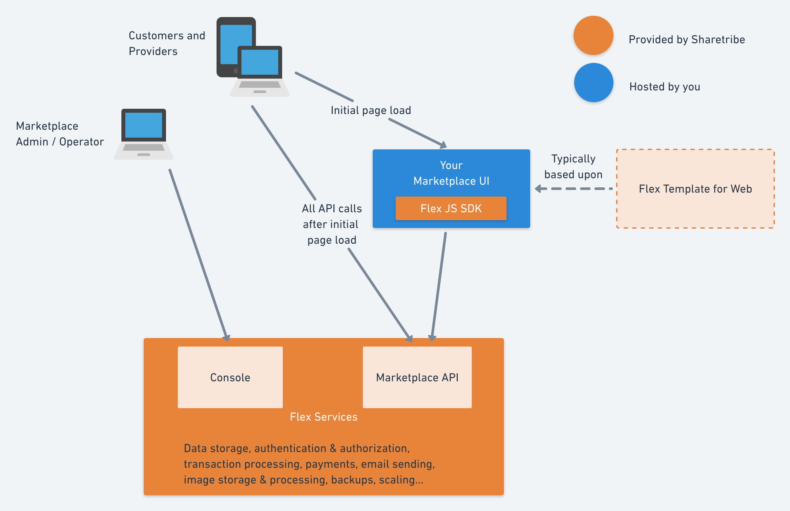

## Introduction

Sharetribe Flex is a complete solution for building a powerful sharing economy
platform. Flex provides you with all the necessary marketplace infrastructure
out of the box. At the same time, because of it's headless architecture, Flex
gives you total freedom to customize your user experience.

This makes Flex the fastest and most affordable way to build a unique platform
that adapts to the entire life cycle of your business. As your business grows,
Flex takes care of running and scaling your backend — allowing you to focus on
the unique value of your platform.

## Flex Components

### Your marketplace UI

Your marketplace user interface (UI), also known as the "front end", is what
your users see and interact with. They use the UI to sign up to your platform as
well as to post, find, book, and pay for listings. Whether a web-based UI, a
mobile application, or both, the user interface is the face of your solution.
That's why you have total control over it.

[Flex Template for Web](/references/ftw/) (FTW) is a web template that
implements a full-feature marketplace experience powered by Flex. With Flex
Template for Web, you can get started with your marketplace UI straight away:
just download the latest FTW version and start customizing it for your
marketplace. There are no limits to how much you can customize the template. You
can freely design the user interactions and alter the look and feel of your
marketplace. You can also integrate any web analytics or customer service
solutions directly into your UI.

If you prefer to start from scratch, you can build your own UI on top of Flex's
Marketplace API yourself.

### The Marketplace API

The Marketplace API is how your UI connects to the Flex services. It's a
standard REST JSON API that allows you to implement all the standard marketplace
functionality that Flex supports.

Sharetribe handles running and scaling the Marketplace API. To take full
advantage of this, we suggest you design your Marketplace UI to point a majority
of the traffic directly to the Marketplace API. For example, Flex Template for
Web only handles the initial page load when a user opens their browser. After
that, FTW lets the client application (Single-page application) talk directly
with the Marketplace API, and the API powers all further interactions.

To learn more about the capabilities of the Marketplace API and Flex, visit the
[API reference documentation](/references/api/).

### Flex JavaScript SDK

[The Flex JavaScript SDK](/references/js-sdk/) is a small JavaScript library
that helps you with integrating the Marketplace API. It handles tasks like
authentication and session management and makes it easy to use correct data
types with the API. Using the Flex JS SDK is not required, but if you are
working with JavaScript, we strongly encourage you to have a look.

### Console

[Console](https://flex-console.sharetribe.com/) is where you to manage all your
marketplace data, such as users, listings and transactions. Console also offers
tools to develop your marketplace, for example, an editor for email templates.
Console is accessed via a web UI that we provide out of the box. Think of it as
an admin interface you never have to build!

## How to use Sharetribe Flex

When building a platform with Flex, your task is to design and create a
fantastic marketplace UI. We handle everything else for you. If your Marketplace
UI is a web-based UI, you also need to host it somewhere.

If you're new to Flex, we recommend starting out with
[Flex Template for Web](/references/ftw/). The template comes with instructions
on how to easily set it up on your local machine, as well as how to host it in
the [Heroku](https://heroku.com/) PaaS platform.
