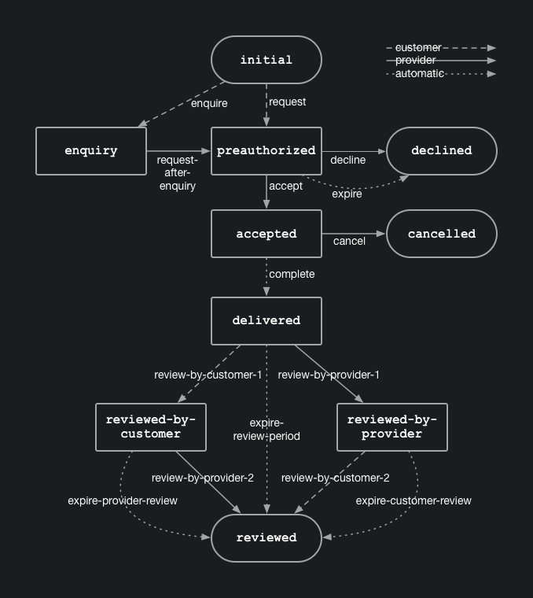

## Example transaction process

The marketplace transaction process, or order flow, defines how the
different parties interact at the marketplace to create value. The
transaction process varies between marketplaces. These variations can be
fundamental, such as do users book by night or by day (facility
rentals), by seat (event organizing) or not at all (bookings handled
external to marketplace platform). The variations can also be smaller,
such as requiring the provider to always accept before confirming a
booking or automatically confirming a booking as soon as it's made, or
offering a volume discount for longer stays.

The Sharetribe Flex transaction engine allows each marketplace to define
its own transaction process within certain platform-supported
boundaries. The transaction process consists of a set of _transitions_
between a set of _states_. _Transitions_ define what happens at each
step of the process (e.g. create booking, charge or payout, post a
review or make a refund, etc), what parameters need to be provided and
who can perform the given transition (the customer, the provider, the
operator or the platform itself in case of automatic transitions). The
_states_ define what are the possible subsequent transitions as the next
step in the process.

