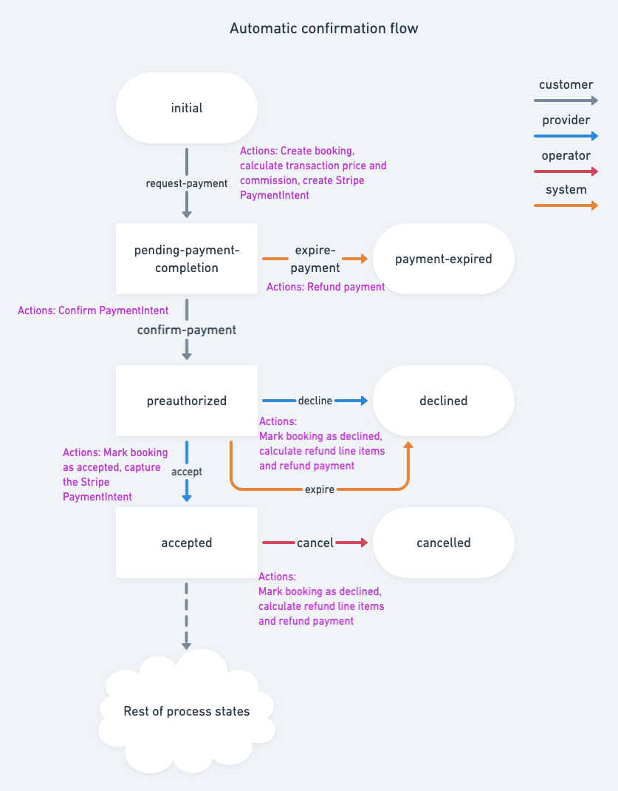

## Introduction

[PaymentIntents](https://stripe.com/docs/payments/payment-intents) are a
mechanism provided by Stripe to track the lifecycle of customer checkout flow.
In addition, PaymentIntents provide tools for [Strong Customer Authentication
(SCA)](https://stripe.com/en-fi/payments/strong-customer-authentication) where
required. Flex has built-in support for PaymentIntents and Strong Customer
Authentication.

In September 2019 [new European
regulation](https://stripe.com/en-fi/payments/strong-customer-authentication)
will begin requiring SCA for online payments from European customers. In order
to conform to these regulatory changes, Stripe encourages users to [migrate or
use
PaymentIntents](https://stripe.com/docs/strong-customer-authentication/migration)
instead of directly creating Charges.

In the future, PaymentIntents can be required in other countries outside Europe
due to local regulatory changes but they can already be used outside Europe. And
if needed, they can provide fraud prevention with things like [3D Secure Card
Payments](https://stripe.com/docs/payments/3d-secure).

This article will describe how PaymentIntents relate to Flex transaction
processes and the general principles of implementing a checkout flow with
PaymentIntents.

## Transaction process with PaymentIntents

On high level, the payment flow with PaymentIntents has the following steps:

1. Customer initiates (or transitions) a transaction with a transition
   containing action that creates a PaymentIntent.
2. Customer uses the PaymentIntent data to complete any steps necessary to
   authenticate and authorize the payment.
3. The transaction can proceed only after customer has authorized (if required)
   the payment. The PaymentIntent is confirmed, resulting in a Charge being
   preauthorized.
4. Transaction flow continues as usual onwards.



For technical implementation of PaymentIntents, Stripe offers two approaches -
[manual or automatic confirmation
flow](https://stripe.com/docs/payments/payment-intents#one-time-payments). Flex
uses the automatic flow. In practice, the Flex transaction engine models the
automatic flow with two transitions. First transition creates the PaymentIntent
(Step 1.) and second transition will validate and mark it confirmed in Flex
(Step 3.). Between these steps, the automatic flow pushes the responsibility of
authenticating, authorizing and confirming the payment in Stripe to the client
application (Step 2.). More information on the Step 2. can be found in this
[chapter](#required-changes-in-the-client).

## Actions related to PaymentIntents

The following actions can be attached to a transaction process in order to
implement PaymentIntent flow and are already present in the default flows.

### stripe-create-payment-intent

> Params: - paymentMethod: optional, the Stripe id of paymentMethod
>

Creates a PaymentIntent. You can optionally pass in a
[paymentMethod](https://stripe.com/docs/payments/payment-methods) id, or attach
a paymentMethod later to the transaction during the validation and confirmation
in the client by using Stripe Elements. The latter is the recommended way and is
covered in the [implementation
guide](#implementing-the-automatic-paymentintent-flow).

### stripe-confirm-payment-intent

Validates that the transaction has a PaymentIntent created and verifies via
Stripe API that the PaymentIntent status is `requires_capture` or
`requires_confirmation`. Confirms the PaymentIntent in Stripe, if needed, and
marks the payment as preauthorized in Flex.

### stripe-capture-payment-intent

Captures a confirmed PaymentIntent.

### stripe-refund-payment

Either cancels an unconfirmed PaymentIntent or refunds the related captured
charge.

## Required actions in the client

The required actions in the client are related to authentication and
confirmation. You need to be able to handle potential authentication steps
required by the customer's card issuing bank. After authentication, the client
needs to [obtain PaymentIntent data from the transaction's protected
data](#implementing-the-automatic-paymentintent-flow) and use that to confirm
the payment.

In case you wish to enforce [3D Secure Card
Payments](https://stripe.com/docs/payments/3d-secure) for cards that support
3DS, in addition to supporting payment authentication in your client app, you
may need to update your [Stripe Radar
rules](https://stripe.com/docs/payments/3d-secure#three-ds-radar).

### Handling Strong Customer Authentication

[Strong Customer
Authentication](https://stripe.com/en-fi/payments/strong-customer-authentication)
is a potential step enforced by governmental regulation. Not every PaymentIntent
will require customer authentication. For instance, authentication may not be
required for:

- transactions out of scope of SCA
- e.g. when card issuing bank is outside of EEA
- merchant initiated transactions
- transactions that fall under an SCA exemption
- low value or low risk transactions
- recurring payments for fixed amount
- other

This means that Flex implementation of PaymentIntents supports payment flows
that require authentication and those that do not. When implementing the
PaymentIntent flow in the client you need to be prepared for handling both
cases - payments requiring SCA and payments that do not. It might be impossible
to know in advance whether the payment will require authentication, unless the
marketplace and all its customers are outside of EEA.

The recommended way of implementing support for SCA is to use [Stripe
Elements](https://stripe.com/docs/payments/payment-intents/quickstart) that can
provide you with ready modals for handling e.g. 3D Secure Card Payments. The
next chapter will provide high level instructions on how to do this in the
client.

### Implementing the automatic PaymentIntent flow

[Stripe Elements](https://stripe.com/docs/payments/payment-intents/quickstart)
provides ready tools and a reference for implementing the automatic
PaymentIntent flow. It's the recommended way to support PaymentIntents in the
client and handle the authentication steps.

For implementing the PaymentIntent flow, you need to follow the steps in
[Automatic confirmation
quickstart](https://stripe.com/docs/payments/payment-intents/quickstart#automatic-confirmation-flow).
With Flex, the first step differs from Stripe instructions, since that is
handled through the transaction engine with the `stripe-create-payment-intent`
action. To complete the first step, you initiate (or transition) the transaction
so that a PaymentIntent is created.

For handling the next steps, you need to [pass in a client
secret](https://stripe.com/docs/payments/payment-intents/quickstart#passing-to-client).

The client secret is exposed in the transaction's protecedData map under a
well-known key `stripePaymentIntents` after the PaymentIntent has been created.
The value is a map in the form of:

```json
{
 "default": {
    "stripePaymentIntentId": "pi_1EXSEzLSea1GQQ9x5PnNTeuS",
    "stripePaymentIntentClientSecret": "pi_1EXSEzLSea1GQQ9x5PnNTeuS_secret_Qau2uE5J5L6baPs8eLPMa2Swb"
  }
}
```

This data is only exposed to the customer in the transaction. The provider can
not access the PaymentIntent ID nor the client secret.

After handling the client secret, you can continue with the next steps of
collecting payment information, completing the payment and handling the
authentication steps.

The final step is to transition the transaction process forward in Flex with
transition that has the `stripe-confirm-payment-intent` attached.

## Using PaymentIntents in Flex

The latest version of Flex Template for Web supports PaymentIntents by default.
If you need to adjust the default implementation, or if you're currently using
an older version of Flex Template for Web, don't hesitate to [contact the
Sharetribe support](mailto:flex-support@sharetribe.com) to get guidance on how
to proceed.
