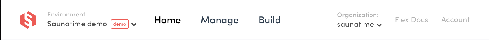

Flex environments are instances of your own marketplace, but with different functions. When you first create a Flex account, you have two environments: Demo and Development. When you are ready to go live, we will create you a third environment: Production.

The environment can be changed from the dropdown in the left corner of the topbar. Those who have access to multiple organizations can see the organization dropdown on the right.

Organization and environment are terms that are used to communicate what Flex marketplace you are looking at in Console. 

> **Organization**:  An entity that is created when you first create an account. This is where you can invite other admin users to work with. An organization can include multiple environments for different purposes, but only one live environment which is called production. 

> **Environment**:  A marketplace instance within your organization which can be created for different purposes. There are three different types of environments: demo, development and production. You can access them all with the same Flex account. 

## Environment types

### Demo environment

The Demo environment is created for you for trying out Flex marketplace functionality. The demo environment includes a fully working marketplace front, Saunatime, that can be accessed from the Home page. 

In this environment, you can explore the connection between the marketplace front the clients will be using, and Console which will work as your admin panel. Use Saunatime marketplace to create new users and listings, and try out how the transactions work. You can view and manage the activity in Console.

### Development environment

Development environment is for development and testing purposes. This is where building your marketplace happens and where you can test the build functionalities in peace by using test users and [test credit cards with Stripe](https://www.sharetribe.com/docs/cookbook-payments/set-up-and-use-stripe/). 

Even after launch you can continue building new features in the development environment without causing disruptions to your live marketplace. Note that you should not onboard real users or listings to the development environment, as they cannot be moved into the production environment. 

### Production environment

Production environment is where the business happens: here you can onboard your real customers and listings and your customers can make real money transactions. 

When the necessary development has been done and your marketplace is ready for onboarding real users, you can initiate the production environment setup from Console. This is also the point when you start paying the Flex subscriptions (see more information about [Flex pricing](https://www.sharetribe.com/products/flex/#pricing)). 
