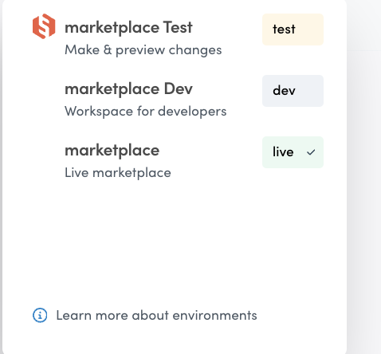

Console is the central control system of your Flex marketplace. In
Console, you can change a number of general settings and manage most of
the data of your marketplace related to users, listings, transactions
and reviews.

When you create a Flex account, you also create an organization within
Flex’s system. You can invite multiple people to your organization to
help you manage or develop your marketplace. In fact, you can even have
multiple marketplaces within the same organization.

## Environments

It is important to understand that Console is a way of viewing and
manipulating the data on your marketplace. Each marketplace is
specifically related to an environment. Each organization can have
multiple environments. By default, there are three environments to
consider: demo, development (dev) and production (prod). Each
environment has its own data and therefore the information that you can
view and manipulate through Console will be exclusively related to the
environment that you are working with. This means that the development
environment’s data in Console is completely separate from the data in
the production environment’s Console.

When you open your account, you have immediate access to the demo and
development environments within the organization. Eventually, when you
are ready to launch your marketplace, you can request a production
environment setup.

When you interact and create new users, listings, and transactions with
your [live demo](https://flex-console.sharetribe.com), you will see the
data in the demo environment. While you cannot modify the code of the
demo, you can start playing around with it and see the changes you make
reflected in the demo environment’s Console. You can create users, new
listings, and even transactions and reviews.

To interact and see data in your development environment’s Console, you
first need to set up the frontend application for your development
marketplace.

It is easy to change environments from the topbar.

## Sections

Console is divided in three main sections: Home, Manage and Build.

### Home

In the Home section, you find information about working with Flex. You
can find links to various resources that will help you understand, test,
and build your custom marketplace. These include:

- Links to your fully functional demo marketplace called Saunatime,
  where you can get an idea of how Flex works.
- Instructions on how to set up your local Flex instance and links to
  the Flex documentation and API reference, all of which you will need
  when you want to start developing your marketplace.
- Access to our Slack channel, where you can ask technical questions and
  engage with our technical team and the community.
- A calendar to book a call with one of our Flex representatives who are
  happy to help you assess whether Flex is the right tool for your
  project.

### Manage

In the Manage section, you can find and engage with data about your
users, listings, transactions, and reviews. This is the section you will
use most in the day-to-day operations of your marketplace. You can
delete users or listings, ban users, and edit default listing and user
information. You can also export all this information into a CSV file to
use as you see fit. Perhaps most important of all, you can add and
modify the extended data of your marketplace elements in the Manage
section. You can read more about extended data
[in this article](https://www.sharetribe.com/docs/concepts/extended-data-introduction/).

### Build

In the build section you can modify some marketplace settings. The Build
section will mostly be used by your developer, so you might not need to
worry about this specific section of your marketplace. It’s good to know
the basics, nonetheless, so here is a brief overview of what the Build
section includes.

**General settings** contain basic information about your marketplace:
your marketplace ID, URL and name. Here, you can also configure an
outgoing email address, where all notifications to your marketplace’s
users will be sent from.

**Content** is where you can modify your marketplace texts. You can add
your existing translation file content from your Flex Template, or copy
and paste the default microcopy from the featured links, and modify the
texts to suit your marketplace. Read more about
[modifying microcopy in Console](/concepts/microcopy/).

**Transaction processes** is quite self-explanatory: it shows the
different kinds of transaction processes your marketplace has. You can
toggle between the different processes in the left-side selection and
see how many transactions have used each process. You can also inspect
the components of the transaction processes. Read more about
[transaction processes in Flex](https://www.sharetribe.com/docs/concepts/transaction-process/).

**Payments** has information about your Stripe configuration. Your
Stripe secret key is added here. The public key is configured within the
code of your frontend application by your developer.

**Built-in email templates** includes all emails that are sent from your
marketplace as a part of the default user flow. They are essential to
the operation of Flex and are designed to be sent at the crucial moments
of the user onboarding flow and are not related to the transaction
process. The contents and visual style of these emails can be edited
with HTML directly in this tab of the Build section.

**Applications** compiles all applications that have access to the Flex
APIs through your marketplace. At minimum, this tab includes your
frontend application, but can also have applications for integrated
services.

**Events** has a summary of what the Events feature is about as well as
some quick links to the relevant documentation. It also mentions the
Zapier integration and shows the main command to view events with Flex
CLI.

**Social logins & SSO** contains all identity provider clients, that is,
the third-party solutions your users can sign up with on your
marketplace. They could be Facebook Login, Google Login, or maybe your
own identity provider.

## Top bar

In Console, you navigate between the different environments and sections
through links in your top bar.

On the left side of the top bar, you can switch between the environments
of your organization: demo, development, and production. If your
marketplace is not yet live, this is where you’ll find the option to set
up production and subscribe to Flex. Once your production environment is
created, you’ll access it from here.

Next come the different sections we discussed above: Home, Build, and
Manage.

On the right side of the top bar, you can manage your organization and
invite new members to join it. This is where you add the people who help
you develop or manage your marketplace.

Next to the organization, you find a link to the Flex documentation,
where you are now. Flex docs has information about the important
concepts of Flex, instructions for customizations, and more!

Finally, in the rightmost corner of the topbar, you can manage your
Console account. You can change your password and generate personal API
keys that you need for the Flex command-line interface (CLI). You can
also log out of Console here.
