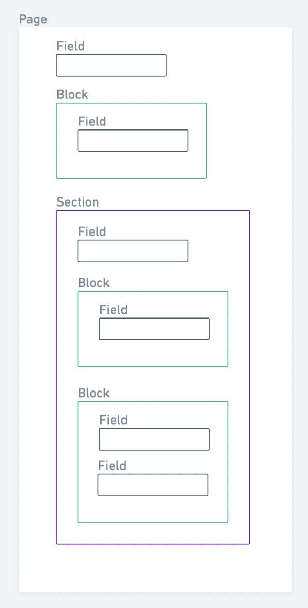

In 2022-09, Flex introduces a headless CMS-like feature to create static
pages in Flex. Initially, the feature allows operators to modify their
landing pages without code. Going forward, it will be possible to create
new pages as well.

## Content modeling

When managing content, it is useful to distinguish content modeling from
content. A **content model** means the different elements that can
comprise e.g. a single page – headings, text blocks, buttons, images and
so forth. A single content model that features a heading, a text block,
an image and a button, can be used to create several different pages
with different **content**.

The benefit of content modeling is that when you have a set of distinct
content models, the content creator can choose the one that best suits
their needs without needing to worry how the content will look on the
page. The designer, on the other hand, can design e.g. article pages or
feature pages without needing to have the specific pieces of content
already written. Instead, the content model provides the designer with
the necessary information to create a layout that looks great and covers
each part of the model.

A content model also facilitates using the same content in different
channels – your mobile application can have one design and your website
can have another, but they can both use the same content models.

In Flex, the content modeling is currently done for you. Each **page**
can have a selection of pre-determined **sections**, which in turn can
have several **blocks**. Depending on which kinds of sections and blocks
you choose for your page, you can create a wide range of content. In the
future, it will also be possible to create custom sections.

TODO: IS THE LEVEL OF TECHNICALITY OK FOR A FLEX DOCS ARTICLE CF
OPERATOR GUIDE?

## Flex Content modeling glossary

_TODO: A better place for this section?_

Before diving deeper into the different content model types in Flex,
here is a short glossary of the most central content related terms.

**Page**: The collection of different content elements under a specific
URL. Pages can have fields, sections, or blocks within them. A page can
be fetched as [an asset](/references/assets) from the Flex Asset
Delivery API. Example: `landing-page`.

**Section**: The main element of a page. In Flex, each section has a
specific content model that determines the information that the section
must have to function properly. Sections can have fields and blocks
within them. In Flex, sections are the main way to distinguish pages
from each other. Example: article, feature, columns.

**Block**: Blocks are optional, but they are very useful for more
extensive pieces of content. Different section content models can show
blocks in different ways, depending on the design. Blocks can have
fields within them. Example: default block.

**Field**: The simplest content element in Flex. Conveys a single piece
of information. Example: text field, button, image.

## Sections

Flex has X default content sections that you can select for your page.
All sections have a title, an ingress, and a button for a call to
action.

### Article

Article sections are great for prose text. If your content is longer,
you can add blocks with different levels of headings and text
paragraphs. The blocks are displayed in a column one after the other, as
if on a blog page.

### Columns

Columns sections divide the blocks within the section into pre-defined
columns, and the operator can decide the number of columns between 1-4.
The columns pattern is great for featuring specific options in parallel,
whether they are benefits, testimonials, or featured locations.

### Features

Features sections, by default, show blocks of visual and text content so
that the block contents are on a single row, alternating the order, and
different blocks are in a column. As with all content sections, the
designer of your website can make changes as to how exactly the blocks
get displayed on the page.

## Blocks

Currently, Flex has a single type of block that you can add to any
section. The block contains a title, and you can determine the level of
the title (page title, section title, section subtitle). A block can
also have text content and a button.

Block text content can be modified with Markdown. This allows the
content creator to use even more fine-grained editing, including italics
and bolding, subheadings, links, and code snippets.

## Content delivery

Once the page has been created, it is delivered as an
[asset](/references/assets) to the client application. For the landing
page, the asset being modified in Flex is `content/landing-page.js`.
Assets can be fetched by the latest version, or a specific version.

TODO: EXPLAIN PUBLICATION FLOW

## Content layout

Content modeling does not, by default, contain information how the
content should be laid out in the client application. The FTW templates
do have components corresponding to the different content sections.
However, the Flex content management assets can be used in any client
application, and even in the FTW templates you have full freedom as to
how the different sections get displayed. This means that even with the
pre-defined options, you can create a page setup that is entirely your
own.
