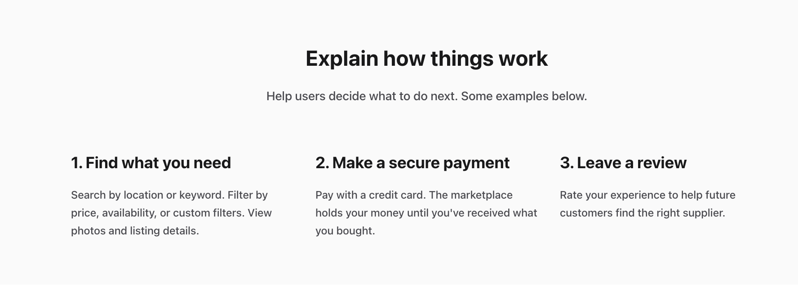

A Sharetribe marketplace allows you to manage content in Console without
making code changes.

## Sharetribe Content management glossary

Before diving deeper into content management in Sharetribe, here is a
short glossary of the most central content related terms.

### Content management

The way in which operator-created content is handled within Sharetribe.
Before Console-operated content management, operators could either

- add the content directly in the client app codebase,
- use the [marketplace text](/concepts/marketplace-texts/) files for
  marketplace content, or
- integrate an external content management system.

Currently, we recommend managing content using the assets-based Pages
feature in Sharetribe Console.

### Content modeling

The process of structuring patterns of content in a way that allows
operators to create content using existing building blocks, and that
allows designers and developers to create ways of showing the content in
a systematic way.

### Page

The collection of different content elements under a specific URL. Pages
can have fields, sections, or blocks within them. A page can be fetched
as [an asset](/references/assets/) from the Sharetribe Asset Delivery
API. Example: `landing-page`.

### Page asset

As the operator adds and edits the elements of the page in Sharetribe
Console, a page asset is created under the hood. The page asset uses a
**page schema** to describe the different content elements in a way that
the client application can then understand and render.

### Section

The main element of a page. In Sharetribe, each section has a specific
content model that determines the information that the section must have
to function properly. Sections can have fields and blocks within them.
In Sharetribe, sections are the main way to distinguish pages from each
other. Example: article, feature, columns.

### Block

Blocks are optional, but they are very useful for more extensive pieces
of content. Different section content models can show blocks in
different ways, depending on the design. In addition, adding images to
sections happens within blocks. Blocks can have fields within them.
Example: default block.

### Field

The simplest content element in Sharetribe. Conveys a single piece of
information. Example: text field, button, image.

## Content models

When managing content, it is useful to distinguish content modeling from
content. A **content model** means the different elements that can
comprise e.g. a single page – headings, text blocks, buttons, images and
so forth. A single content model that features a heading, a text block,
an image and a button, can be used to create several different pages
with different **content**.

The benefit of content modeling is that when you have a set of distinct
content models, the content creator can choose the one that best suits
their needs without needing to worry how the content will look on the
page. The designer and developer, on the other hand, can design e.g.
article pages or feature pages without needing to have the specific
pieces of content already written. Instead, the content model provides
the designer with the necessary information to create a layout that
looks great and covers each part of the model.

A content model also facilitates using the same content in different
channels – your mobile application can have one design and your website
can have another, but they can both use the same content models.

In Sharetribe, the content modeling step is currently done for you. Each
**page** can have a selection of pre-determined **sections**, which in
turn can have several **blocks**. Depending on which kinds of sections
and blocks you choose for your page, you can create a wide range of
content. In the future, it will also be possible to create custom
sections.

TODO UPDATE TO GENERIC ASSETS OR BIKETRIBE

## Sections

Sharetribe has four default content sections that you can select for
your page. All sections have a title, an ingress, and a button for a
call to action.

### Article

Article sections are great for prose text. If your content is longer,
you can add blocks with different levels of headings and text
paragraphs. Blocks are displayed in a single column one after the other,
as if on a blog page.

### Columns

Columns sections divide blocks into pre-defined columns, and the
operator can decide the number of columns between 1-4. The columns
pattern is great for featuring specific options in parallel, whether
they are benefits, testimonials, or featured locations.

### Features

Features sections, by default, show blocks of visual and text content.
The block contents are on a single row, alternating the order, and
different blocks are in a single column. As with all content sections,
the designer of your website can make changes as to how exactly the
blocks get displayed on the page.

### Carousel

The carousel section shows content blocks side by side, in a carousel
that can be browsed by swiping or scrolling. Carousel sections work
great for a long array of blocks that the reader may or may not want to
investigate in more depth.

## Blocks

Currently, Sharetribe has a single type of block that you can add to any
section. The block contains a title, and you can determine the level of
the title (page title, section title, section subtitle). A block can
also have text content and a button.

Block text content can be
[modified with Markdown](/operator-guides/how-to-format-your-text-in-pages/).
This allows the content creator to use even more fine-grained editing,
including italics and bolding, subheadings, links, and code snippets.

## Content delivery

Once the page has been created, it is fetched as an
[asset](/references/assets/) to the client application using the
[Asset Delivery API](https://www.sharetribe.com/api-reference/asset-delivery-api.html).
For the landing page, the asset being modified in Sharetribe is
`content/landing-page.js`. Assets can be fetched by the latest version,
or a specific version. The client application then shows the page
content it has fetched.

The Sharetribe Web Template is configured to show asset-based content by
default.

For legacy template versions that do not have asset-based content
capabilities, you can refer to our
[legacy template documentation](/template/legacy-templates/).

To see your page changes in your client application, you need to save
your changes in Sharetribe Console and navigate to the corresponding
page in your app.

Alternatively, if you have an application running in the address set as
your **Marketplace URL**, you can click the "View page" link next to the
page title in Sharetribe Console.

TODO UPDATE TO GENERIC ASSETS OR BIKETRIBE 

This will open the page in your **Marketplace URL** address.

### Publishing pages from test to live

When you first take your marketplace live, your live marketplace
environment is created as a duplicate of your test marketplace. This
includes all your page assets.

You can also modify your marketplace content pages after going live. You
will still need to make and test the changes in your test environment.
Then, after you are happy with all your page changes, you can click the
"Copy to live" button.

After clicking the button, you will see a modal detailing which pages
have been modified, created, and removed compared to your current live
pages. You can check the boxes of the pages you want to copy to Live.
This will override the current live content of those pages with the new
content from the test environment.

<warning>

Once you have copied a page to Live, you cannot return to the previous
live version of that page. Take extra good care to double check your
changes in test environment before copying anything to Live!

</warning>

It can take up to five minutes for your changes to update from test to
live environment.

## Content layout

Content modeling does not, by default, contain information how the
content should be laid out in the client application. The Sharetribe web
template does have components corresponding to the different content
sections. However, the Sharetribe content assets can be used in any
client application, and even in the template you have full freedom as to
how the different sections get displayed. This means that even with the
pre-defined options, you can create a page setup that is entirely your
own.

Read more about how the template shows content created in Sharetribe
Console:

- [How the Sharetribe Web Template renders content pages using the PageBuilder](/template/page-builder/)
