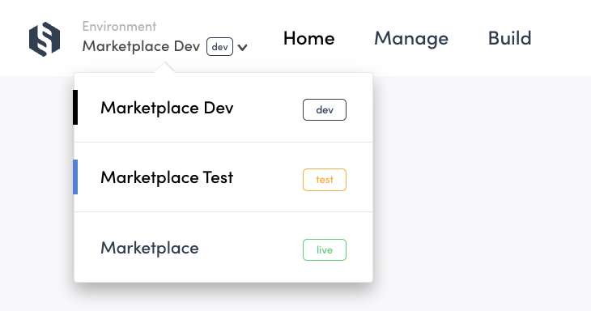
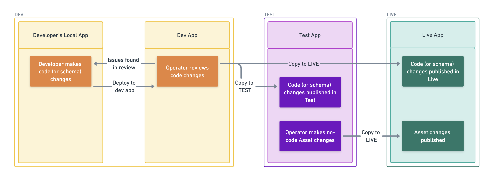

Sharetribe environments are instances of your own marketplace, but with
different functions. When you first create a Sharetribe account, you
have one environment: Test. If you start customizing your marketplace
with code, you can enable a second environment – Dev. Finally, when you
are ready to go live, we will create a third environment: Live.

The environment can be changed from the dropdown in the top of the
sidebar.

<info>

**Organization** and **environment** are terms that are used to
communicate which Sharetribe marketplace you are looking at in Console.

**Organization**: An entity that is created when you first create an
account. This is where you can invite other admin users to work with. An
organization can include multiple environments for different purposes,
but it can only include one Live environment.

**Environment**: A marketplace instance within your organization which
can be created for different purposes. There are three different types
of environments: Dev, Test, and Live. You can access them all with the
same Sharetribe account.

</info>

## Environment types

The three environments in Sharetribe each have their own specific
purpose. Each environment should also have its own dedicated client
application, which also follows the purpose of the environment.

### Test environment

The Test environment works as a preview environment for Live. Whereas a
possible Dev environment is meant for the developer to make code
changes, Test is meant to reflect your Live environment as accurately as
possible.

The operator can make no-code changes in Test, and copy them to Dev and
Live without needing a developer to intervene. Because Test and Live are
identical, the operator can trust that their changes made in Test show
up correctly when published to Live. Copying no-code assets to Dev makes
it easy for developers to be working on the correct configurations in
Dev.

<warning>

Do not onboard real users or listings to Test, as they cannot be moved
into Live.

</warning>

### Dev environment

The dev environment is for development purposes. This is where building
your marketplace happens and where you can explore the build
functionalities in peace by using test users and
[test credit cards with Stripe](/how-to/set-up-and-use-stripe/).

Whenever the development team wants to publish their code changes, they
will fully test and review them in Dev first, and then copy them to Test
and Live at the same time.

If development work requires new configurations to be copied from Dev to
Test (such as listing fields), they need to be recreated manually in
Test, and can then be copied to Live.

Even after launching your marketplace, you can continue building new
features in Dev without causing disruptions to your Test or Live
marketplaces. Note that you should not onboard real users or listings to
Dev, as they cannot be moved into Live.

### Live environment

The Live environment is where the business happens: here you can onboard
your real customers and listings, and your customers can make real money
transactions.

When the necessary development has been done and your marketplace is
ready for onboarding real users, you can initiate the Live environment
setup from Console. This is also the point when you start paying the
Sharetribe subscriptions (see more information about
[Sharetribe pricing](https://www.sharetribe.com/pricing/)).

## Workflow between the three environments

In a nutshell, the workflow between the environments is that changes
flow from Dev to Test to Live:

- code changes are made and reviewed in Dev, and get pushed from Dev to
  Test and Live
- no-code changes are made in Test, and get pushed from Test to Dev and
  Live.

Code changes include

- client application development, updated through your code repository
- transaction process changes, updated through Sharetribe CLI
- search schema changes, updated through Sharetribe CLI

No-code changes include

- Configuration changes in Console, like adding new listing fields
- Content changes in Console, like editing your landing page

We recommend that you keep Test and Live identical as much as possible.
In other words, push any code changes from Dev to Test and Live at the
same time before making further no-code changes in Test. This will
ensure that Test accurately works as a preview environment for Live.

## Additional development environments

Depending on your development flow, you might need additional dev
environments for your organization, e.g. for Quality Assurance (QA) or
automated testing. We can include additional environments to your paid
subscription at a price of \$49 per month per environment. To include
additional development environments in your subscription, contact
Sharetribe Support!
