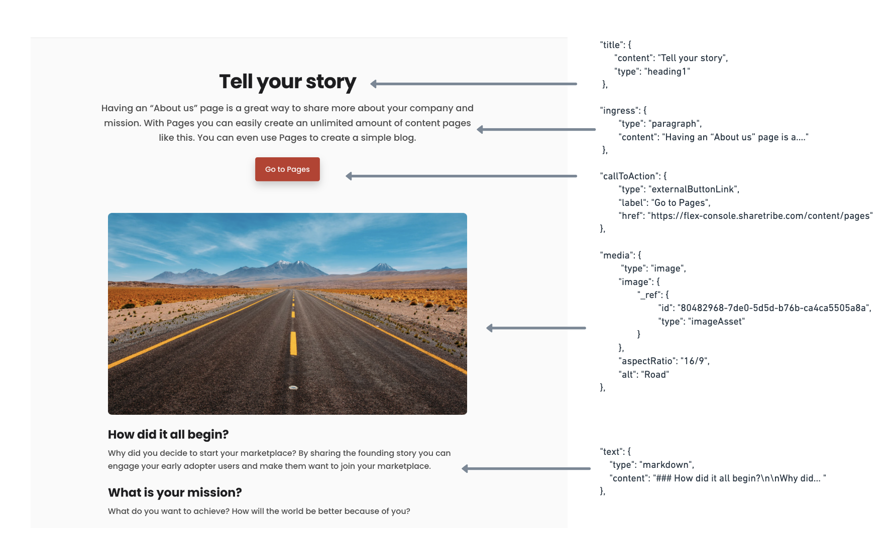
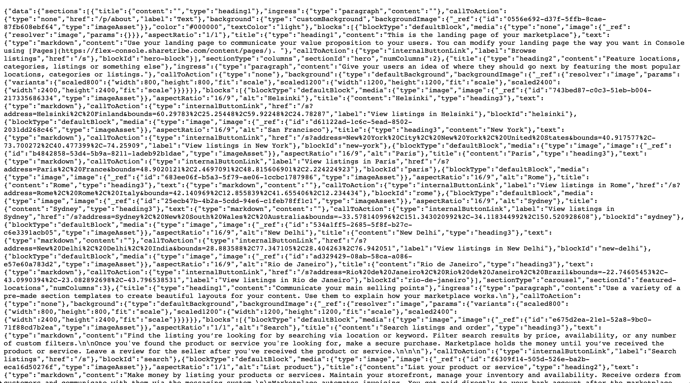
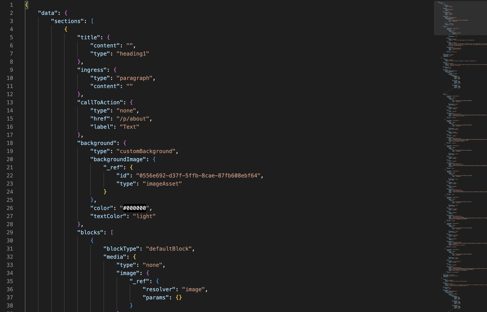
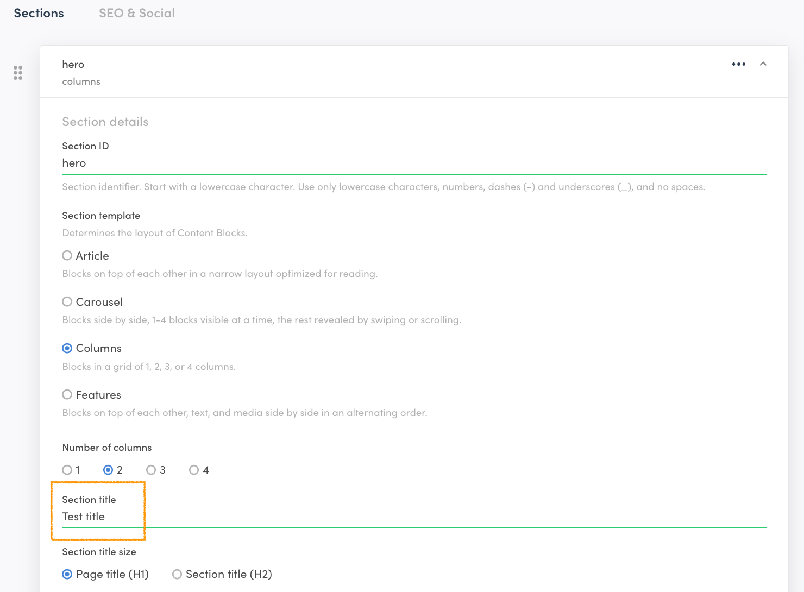

Pages is a lightweight headless content management system that allows
you to build content pages. Pages can be created and edited through the
Sharetribe Console, and the data can be queried via API, allowing you to
edit content pages through a visual interface.

## How is Pages "headless"?

The Pages feature allows content editors to make changes to content
pages without having to touch code. Pages is a “headless” feature, where
the content is decoupled from the frontend, and can be accessed via API.

In Sharetribe, the presentational layer, or frontend, is usually the
Sharetribe Web Template (if you are not using a custom client
application), and the content is the data that is managed through Pages.
The headless architecture allows you to render the content in any client
you choose, as it can be retrieved by a call to the Sharetribe API.

To illustrate further, here is an example of how data fetched from the
API maps to visual elements in the default “About page” in the template:



## Querying the Asset Delivery API

The content you edit through Console can be queried through the Asset
Delivery API. The template queries this data automatically and renders
the content on dynamic content pages using it. Learn more about how the
template renders content pages [here](/template/page-builder/).

A basic query to the Asset Delivery API to fetch the content of the
landing page looks like this:

```bash
curl https://cdn.st-api.com/v1/assets/pub/client_id/content/pages/landing-page.json
```

Remember to replace `client_id` with your client ID.

Through the Sharetribe SDK, this query is formatted as:

```js
sdk.assetByAlias({
  path: 'content/pages/landing-page.json',
  alias: 'latest',
});
```

You can try this out in the
[SDK playground](https://sharetribe.github.io/flex-sdk-js/try-it-in-the-playground.html),
curl, or by pasting the Asset Delivery API query into your web browser's
address bar. If you fetch the data through your browser, you should see
something like this:



This is the raw JSON API response that encodes the content and structure
you have entered into Console. Try pasting the response into your
preferred code editor to make it easier to interpret:



This data is meant for your client application to interpret. Sharetribe
Web Template can automatically render a landing page using this data.

<info>

Read more about the structure of page asset data:

- [Page asset schema reference](/references/page-asset-schema/)

</info>

To see how changes in the Console are reflected in the actual data,
let’s make a change to the landing page through Console. Edit the title
value through the Page Editor:



Fetch the most recent data from the Asset Delivery API either through
the SDK or through your browser. You’ll see that the change we made in
Console is now visible in the JSON data:

```json
{ "data" :
   {"sections": [
       { "title":
          {
            "content": "Test title"
            ...
```
