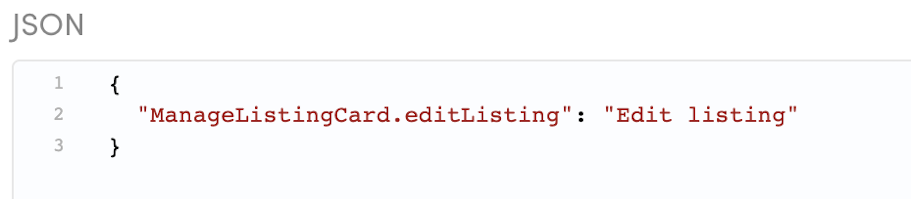
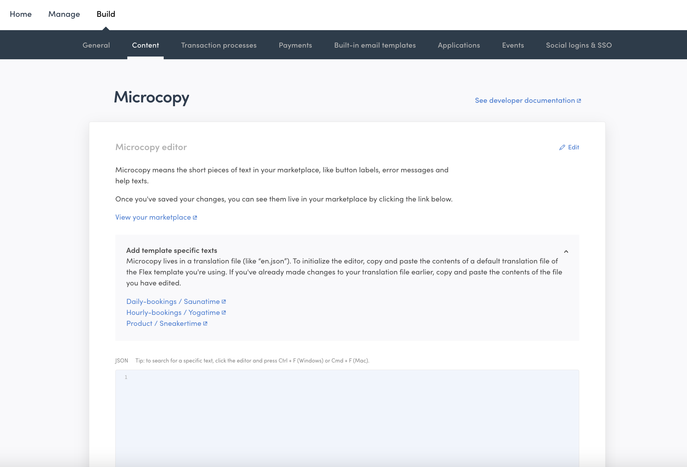
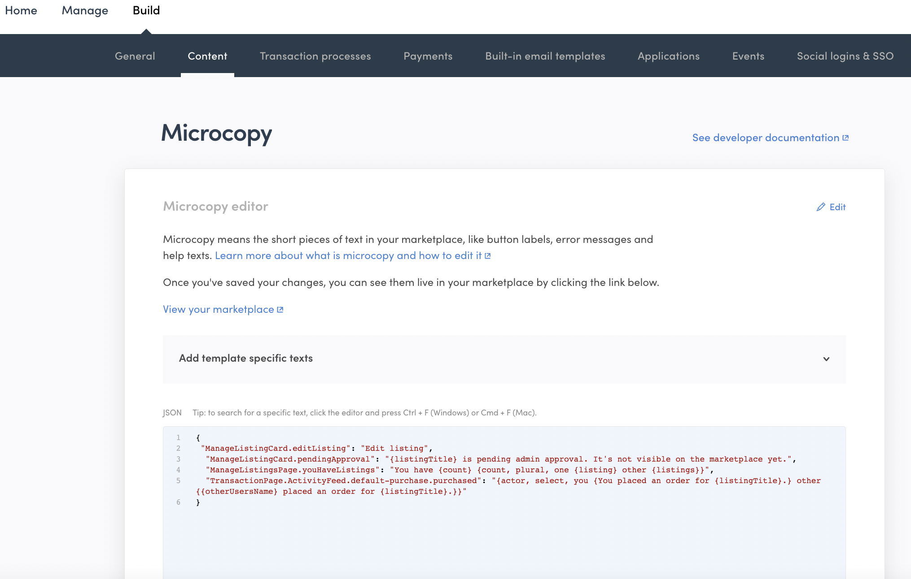
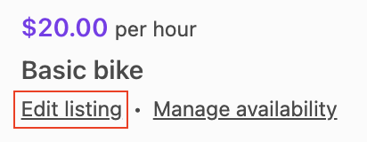
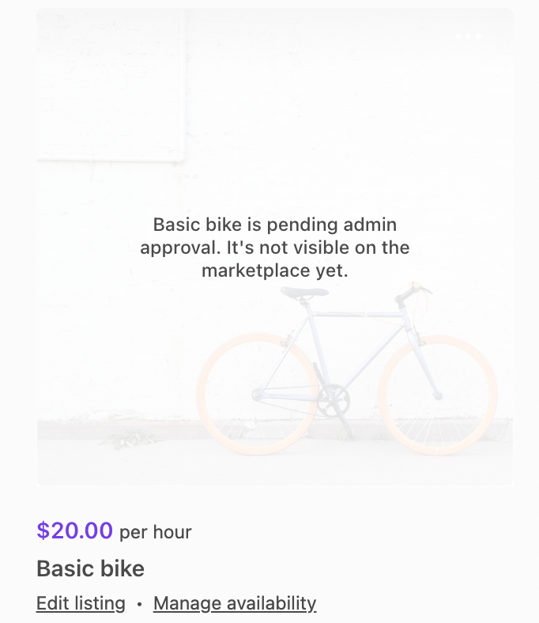

TODO: UPDATE SCREENSHOTS after new tx process names in place

Microcopy refers to all the small pieces of text in your marketplace's
dynamic pages – button labels, error messages, and help texts are all
examples of microcopy. Modifying microcopy to match your marketplace's
theme and tone of voice is a key task in customizing any marketplace.
[Read more about marketplace microcopy](/operator-guides/).

In the Sharetribe Web Template, microcopy is not written directly into
the source code. Instead, the source code uses
[React Intl message formatting](https://formatjs.io/docs/intl#formatmessage)
that defines keys for each meaningful piece of content, and a translator
or a content creator can then define the message (i.e. the value) for
each key in their language. The end user only sees the content creator's
words, not the key itself, unless the key is missing a value in the
selected language.

The key - value syntax is as follows:

```json
"<component name>.<microcopy key>": "<microcopy>"
```

For example:

```json
"ManageListingCard.editListing": "Edit listing"
```

The key is then used in the code, so that the code does not need to be
changed even if the value ends up changing.

```js
// ManageListingCard.js uses the variable to identify the message
<FormattedMessage id="ManageListingCard.editListing" />
```

Starting from 2022-05, marketplace operators can modify the wording of
microcopy in Flex Console. This means that operators can make changes to
the marketplace texts without the need for code changes. In addition,
the same microcopy can now be used from several different client
applications, making it easier to make centralized changes.



## How microcopy is handled in Flex

With Console-editable microcopy, Flex introduces a concept of
[assets](/references/assets/). Assets provide a way to define
marketplace content and configurations using JSON files without needing
to include the actual content in the client application codebase.

For the microcopy file version being edited in Flex Console, the asset
in question is `content/translations.json`. In other words, Flex Console
has a dedicated view – "Build" > "Content" – for modifying the
`content/translations.json` asset. The asset refers to translations
because the language-specific microcopy files allow the marketplace to
fairly easily be translated to languages other than English.



You can add one or more microcopy key-value pairs in JSON format into
the Microcopy field. You can copy them from the linked microcopy
resources in the template, or your existing marketplace microcopy file.



When the asset has been created, you will need to fetch the microcopy to
the client application. Microcopy is fetched through Asset Delivery API
in JSON format. Assets can be retrieved by the latest version, or by a
specific version. Read more:

- [Marketplace assets](/references/assets/)
- [Handling hosted asset microcopy in the Sharetribe Web Template](/ftw/hosted-microcopy/)

## Format for editing microcopy in Console

A piece of microcopy using the
[React Intl formatMessage formatting](https://formatjs.io/docs/intl#formatmessage)
can, at its simplest, consist of a phrase.

```json
{
  "ManageListingCard.editListing": "Edit listing"
}
```

In the template, the phrase is then passed to the UI element that shows
the value.

```js
// ManageListingCard.js uses the variable to identify the message
<FormattedMessage id="ManageListingCard.editListing" />
```



Read more about
[using microcopy in the Sharetribe Web Template](/ftw/how-to-change-ftw-bundled-microcopy/#using-the-microcopy).

### Simple argument

In addition, the format supports passing parameters as arguments to the
microcopy string. Passing a
[simple argument](https://formatjs.io/docs/core-concepts/icu-syntax/#simple-argument)
allows showing context-specific information as a part of the microcopy
string.

```json
{
  "ManageListingCard.pendingApproval": "{listingTitle} is pending admin approval. It's not visible on the marketplace yet."
}
```

Using the microcopy message then requires that the code passes parameter
`listingTitle` to the element that renders the value. The
`{ listingTitle }` parameter will then be replaced with whatever the
listing's title is.

```jsx
<Overlay
  message={intl.formatMessage(
    { id: 'ManageListingCard.pendingApproval' },
    { listingTitle: title }
  )}
/>
```



Do note that even if the microcopy message uses a simple argument, you
can choose to not use it. For instance, you could replace the microcopy
message in the previous example with
`"ManageListingCard.pendingApproval": "This listing is pending admin approval and can't be booked."`.
However, if you later decide you do want to use the title, it is
recommended to double check the original microcopy file in your client
application to see the names of the attributes available in the message.

### Pluralization

One important factor in creating natural microcopy is handling
pluralization in a text. The ICU format makes it possible to define
different wordings for singular and plural options.

```json
{
  "ManageListingsPage.youHaveListings": "You have {count} {count, plural, one {listing} other {listings}}"
}
```

When you use plural in the microcopy string, you will need to specify

- the variable determining which option to use (here: `count`)
- the pattern we are following (here: `plural`)
- the options matching each alternative you want to specify (here: `one`
  – there could be several options specified)
- an `other` option that gets used when none of the specified
  alternatives matches

```js
<FormattedMessage
  id="ManageListingsPage.youHaveListings"
  values={{ count: pagination.totalItems }}
/>
```


Since different languages have different pluralization rules,
pluralization is defined per language. You can see the full list of
pluralization arguments (`zero`, `one`, `two`, `few` etc.) in the
[ICU syntax documentation](https://formatjs.io/docs/core-concepts/icu-syntax/#plural-format).

### Selection

In addition to pluralization options, you can build logic to the
microcopy strings using
[select formatting](https://formatjs.io/docs/core-concepts/icu-syntax/#select-format).

When you use `select` in the microcopy string, you will need to specify

- the variable determining which option to use (here: `actor`)
- the pattern we are following (here: `select`)
- the options matching each alternative you want to specify (here: `you`
  – there could be several options specified)
- an `other` option that gets used when none of the specified
  alternatives matches

```json
{
  "TransactionPage.ActivityFeed.default-purchase.purchased": "{actor, select, you {You placed an order for {listingTitle}.} other {{otherUsersName} placed an order for {listingTitle}.}}"
}
```

You can then use the microcopy message in the code e.g. with the
`formatMessage` function:

```js
const message = intl.formatMessage(
  { id: `TransactionPage.ActivityFeed.${processName}.${nextState}` },
  {
    actor,
    otherUsersName,
    listingTitle,
    reviewLink,
    deliveryMethod,
    stateStatus,
  }
);
```


You can use `select` for cases where you have a predetermined list of
options you will encounter that require different microcopy strings.

## Can I have a multilanguage marketplace?

Having several language-specific microcopy files enables using a single
application for multiple languages. However, editing microcopy in
Console only supports one language at a time, so you will need to modify
any other languages using bundled microcopy files within your client
application.

Having multiple languages in a single marketplace may, however, cause a
problem in terms of user-generated content. Even though listings and
user profiles could include both language versions by saving the content
of language-specific input fields to a listing's extended data, users
are rarely capable of providing content for several languages.

With email notifications and built-in emails, you would need to save the
user's language to extended data and then have an if-statement that
shows the correct language, for example:

```js
{{#eq recipient.private-data.language "en"}}Hello{{else}}Bonjour{{/eq}}
```

Read more about what to consider when
[building a multilanguage Flex marketplace on top of Sharetribe Web Template](/ftw/how-to-change-ftw-language/#developing-the-sharetribe-web-template-into-a-multilanguage-marketplace).
