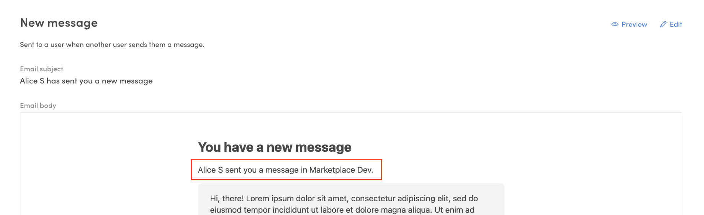
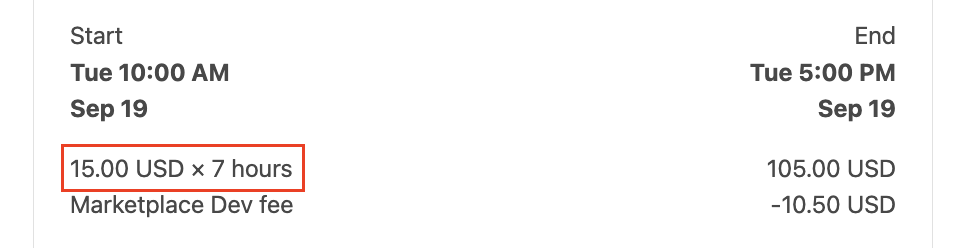
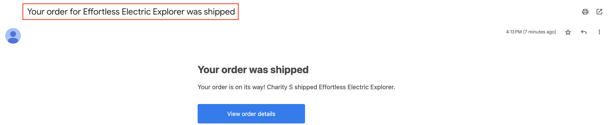

Marketplace texts cover all the small pieces of text in your
marketplace's dynamic pages – button labels, error messages, and help
texts, for example. Modifying marketplace texts to match your
marketplace's theme and tone of voice is a key task in customizing any
marketplace. [Read more about marketplace texts](/operator-guides/) TODO
UPDATE LINK.

## Marketplace texts in the Sharetribe Web Template

In the Sharetribe Web Template, marketplace texts are not written
directly into the source code. Instead, the source code uses
[ICU message formatting](https://unicode-org.github.io/icu/userguide/format_parse/messages/)
that defines keys for each meaningful piece of content, and a translator
or a content creator can then define the message (i.e. the value) for
each key in their language. The end user only sees the content creator's
words, not the key itself, unless the key is missing a value in the
selected language.

The key - value syntax is as follows:

```json
"<component name>.<marketplace text key>": "<marketplace text>"
```

For example:

```json
"ManageListingCard.editListing": "Edit listing"
```

The key is then used in the code, so that the code does not need to be
changed even if the value ends up changing.

```js
// ManageListingCard.js uses the variable to identify the message
<FormattedMessage id="ManageListingCard.editListing" />
```

In addition to adding a marketplace text file in the client application,
Flex marketplace operators can modify the wording of marketplace texts
in Flex Console. This means that operators can make changes to the
marketplace texts without the need for code changes. The same
marketplace texts can also be used from several different client
applications, making it easier to make centralized changes.


## Email texts in Sharetribe

Marketplace email templates also use a similar formatting with a
[custom Handlebar helper](/references/email-templates/#handlebars).

The key-value syntax is similar to the one Sharetribe Web Template uses:

```json
"<email template name>.<email template section>": "<message>",
```

For example,

```json
"EmailChanged.Title": "Your email address was changed",
```

The email template syntax uses the key with the Handlebar helper `t`. In
addition to the message key, the helper expects a fallback message, in
case the message key does not exist.

```handlebars
<h1 style="font-size:26px;line-height:1.3;font-weight:700;color:#484848">
  {{t "EmailChanged.Title" "Your email address was changed"}}
</h1>
```

Similarly to marketplace texts, email texts can also be modified in
Console > Build > TODO EXPLAIN.

## How marketplace texts are handled in Flex

Console-editable marketplace and email texts in Flex are based on a
concept of [assets](/references/assets/). Assets provide a way to define
marketplace content and configurations using JSON files without needing
to include the actual content in the client application codebase.

For the marketplace text file version being edited in Flex Console, the
asset in question is `content/translations.json`. In other words, Flex
Console has a dedicated view – "Build" > "Content" > "TODO TITLE" – for
modifying the `content/translations.json` asset. The asset refers to
translations because the language-specific marketplace text files allow
the marketplace to fairly easily be translated to languages other than
English.

TODO UPDATE SCREENSHOT


You can add one or more marketplace text key-value pairs in JSON format
into the Marketplace texts field. You can copy them from the linked
marketplace text resources in the template, or your existing marketplace
text file.


When the marketplace text asset has been created, you will need to fetch
the marketplace texts to the client application. Marketplace texts are
fetched through Asset Delivery API in JSON format. Assets can be
retrieved by the latest version, or by a specific version. Read more:

- [Marketplace assets](/references/assets/)
- [Handling hosted asset marketplace texts in the Sharetribe Web Template](/ftw/hosted-marketplace-texts/)

Since email notifications are sent directly from Flex, the email text
asset is used automatically as soon as it exists.

## Format for editing marketplace and email texts in Console

A piece of marketplace text using
[ICU message formatting](https://unicode-org.github.io/icu/userguide/format_parse/messages/)
can, at its simplest, consist of a phrase.

```json
{
  "ManageListingCard.editListing": "Edit listing"
}
```

In the template, the phrase is then passed to the UI element that shows
the value.

```js
// ManageListingCard.js uses the variable to identify the message
<FormattedMessage id="ManageListingCard.editListing" />
```


In the email templates, the phrase is passed to the Handlebar helper
`t`, which either renders the message itself, or the fallback message.

Read more about
[using marketplace texts in the Sharetribe Web Template](/ftw/how-to-change-ftw-bundled-marketplace-texts/#using-marketplace-texts).

### Simple argument

In addition, the format supports passing parameters as arguments to the
marketplace text string. Passing a
[simple argument](https://formatjs.io/docs/core-concepts/icu-syntax/#simple-argument)
allows showing context-specific information as a part of the marketplace
text string.

```json
{
  "ManageListingCard.pendingApproval": "{listingTitle} is pending admin approval. It's not visible on the marketplace yet."
}
```

Using the message then requires that the code passes parameter
`listingTitle` to the element that renders the value. The
`{ listingTitle }` parameter will then be replaced with whatever the
listing's title is.

```jsx
<Overlay
  message={intl.formatMessage(
    { id: 'ManageListingCard.pendingApproval' },
    { listingTitle: title }
  )}
/>
```


For the email texts, a simple argument works in a similar fashion.

```json
{
  "NewMessage.MessageSentParagraph": "{senderName} sent you a message in {marketplaceName}."
}
```

In the email template, all parameters that are used either in the ICU
message or the fallback message need to be defined within the `t`
helper.

```handlebars
<p style=\"font-size:16px;line-height:1.4;margin:16px 0;color:#484848">
  {{t "NewMessage.MessageSentParagraph" "{senderName} sent you a message in {marketplaceName}." senderName=sender.display-name marketplaceName=marketplace.name}}
</p>
```



Do note that even if the message uses a simple argument, you can choose
to not use it. For instance, you could replace the message in the
previous example with
`"ManageListingCard.pendingApproval": "This listing is pending admin approval and can't be booked."`.
However, if you later decide you do want to use the title, it is
recommended to double check the original marketplace text file in your
client application to see the names of the attributes available in the
message.

### Pluralization

One important factor in creating natural marketplace texts is handling
pluralization in a text. The ICU format makes it possible to define
different wordings for singular and plural options.

```json
{
  "ManageListingsPage.youHaveListings": "You have {count} {count, plural, one {listing} other {listings}}"
}
```

When you use plural in the marketplace text string, you will need to
specify

- the variable determining which option to use (here: `count`)
- the pattern we are following (here: `plural`)
- the options matching each alternative you want to specify (here: `one`
  – there could be several options specified)
- an `other` option that gets used when none of the specified
  alternatives matches

```js
<FormattedMessage
  id="ManageListingsPage.youHaveListings"
  values={{ count: pagination.totalItems }}
/>
```


You can use pluralization, too, in email templates.

```json
{
  "BookingNewRequest.PriceForHoursQuantity": "{amount, number, ::.00} {currency} × {units, number} {units, plural, one {hour} other {hours}}"
}
```

Here, too, we define

- the variable determining which option to use (here: `units`)
- the pattern we are following (here: `plural`)
- the options matching each alternative you want to specify (here: `one`
  – there could be several options specified)
- an `other` option that gets used when none of the specified
  alternatives matches

```handlebars
  <p style="font-size:16px;line-height:1.4;margin:16px 0;color:#484848;margin-bottom:1px">
    {{t "BookingNewRequest.PriceForHoursQuantity"
    "{amount, number, ::.00} {currency} × {units, number} {units, plural, one {hour} other {hours}}"
    amount=unit-price.amount currency=unit-price.currency units=units}}
  </p>

```



Since different languages have different pluralization rules,
pluralization is defined per language. You can see the full list of
pluralization arguments (`zero`, `one`, `two`, `few` etc.) in the
[ICU syntax documentation](https://formatjs.io/docs/core-concepts/icu-syntax/#plural-format).

### Selection

In addition to pluralization options, you can build logic to the
marketplace text strings using
[select formatting](https://formatjs.io/docs/core-concepts/icu-syntax/#select-format).

When you use `select` in the marketplace text string, you will need to
specify

- the variable determining which option to use (here: `actor`)
- the pattern we are following (here: `select`)
- the options matching each alternative you want to specify (here: `you`
  – there could be several options specified)
- an `other` option that gets used when none of the specified
  alternatives matches

```json
{
  "TransactionPage.ActivityFeed.default-purchase.purchased": "{actor, select, you {You placed an order for {listingTitle}.} other {{otherUsersName} placed an order for {listingTitle}.}}"
}
```

You can then use the message in the code e.g. with the `formatMessage`
function:

```js
const message = intl.formatMessage(
  { id: `TransactionPage.ActivityFeed.${processName}.${nextState}` },
  {
    actor,
    otherUsersName,
    listingTitle,
    reviewLink,
    deliveryMethod,
    stateStatus,
  }
);
```


```json
{
  "PurchaseOrderMarkedAsDelivered.Subject": "Your order for {listingTitle} was {option, select, shipping {shipped} other {delivered}}"
}
```

```handlebars
{{set-translations (asset "email/translations.json")}}
{{t "PurchaseOrderMarkedAsDelivered.Subject"
"Your order for {listingTitle} was {option, select, shipping {shipped} other {delivered}}"
listingTitle=transaction.listing.title option=transaction.protected-data.deliveryMethod}}
```



You can use `select` for cases where you have a predetermined list of
options you will encounter that require different marketplace text
strings.

## Can I have a multilanguage marketplace?

Having several language-specific marketplace text files enables using a
single application for multiple languages. However, editing marketplace
texts in Console only supports one language at a time, so you will need
to modify any other languages using bundled marketplace text files
within your client application.

Having multiple languages in a single marketplace may, however, cause a
problem in terms of user-generated content. Even though listings and
user profiles could include both language versions by saving the content
of language-specific input fields to a listing's extended data, users
are rarely capable of providing content for several languages.

With email notifications and built-in emails, you would need to save the
user's language to extended data and then have an if-statement that
renders a message key pointing to the correct language, for example:

```js
{{#eq recipient.private-data.language "en"}}
  {{t "TemplateName.TitleEn" "Hello"}}
{{else}}
  {{t "TemplateName.TitleFr" "Bonjour"}}
{{/eq}}
```

Read more about what to consider when
[building a multilanguage Flex marketplace on top of Sharetribe Web Template](/ftw/how-to-change-ftw-language/#developing-the-sharetribe-web-template-into-a-multilanguage-marketplace).
