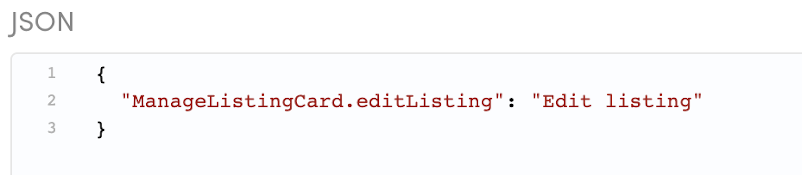
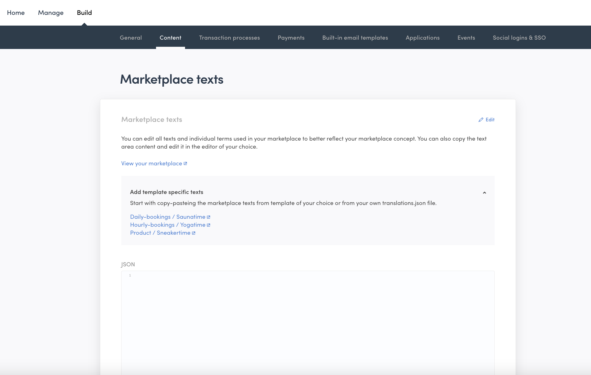
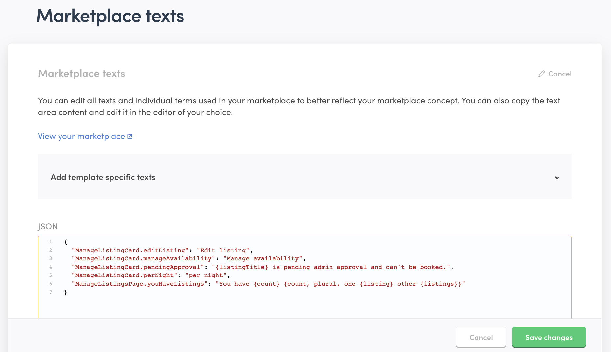
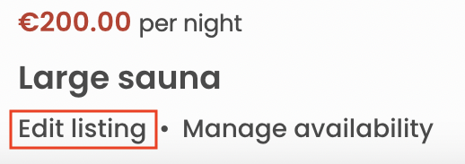
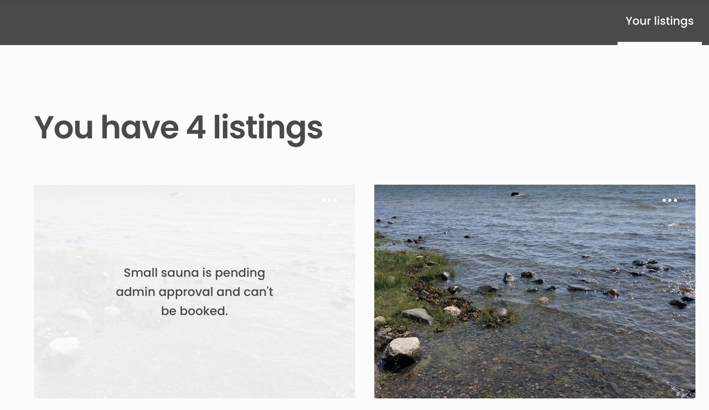

In the FTW templates, user-facing content is not written directly into
the source code. Instead, the source code uses the
[React Intl formatMessage formatting](https://formatjs.io/docs/intl#formatmessage)
that defines variables (i.e. keys) for each meaningful piece of content, and a
translator or a content creator can then define the specific words for the
variable (i.e. the value) in their language. The end user only sees the translator's
words, not the key itself.

The key - value syntax is as follows:

```json
"<component name>.<translation key>": "<translation>"
```

For example:

```json
"ManageListingCard.editListing": "Edit listing"
```

The key is then used in the code, so that the code does not need to
be changed even if the value ends up changing.

```js
// ManageListingCard.js uses the variable to identify the message
<FormattedMessage id="ManageListingCard.editListing" />
```

Starting from 2022-05, marketplace operators can modify the wording of
the translations in Flex Console. This means that operators can make
changes to the marketplace texts without the need for code changes. In
addition, the same translations can now be used from several different
client applications, making it easier to make centralized changes.



## How translations are handled in Flex

With Console-editable translations, Flex introduces a concept of assets.
Assets provide a way to define marketplace content and configurations using
JSON files without needing to include the actual content in the client application
codebase.

For the translation version being edited in Flex Console, the asset in
question is `config/translations.json`. In other words, Flex Console has
a dedicated view – "Build" > "Content" – for modifying the
`config/translations.json` asset.



You can add one or more translation key-value pairs in JSON format into
the Marketplace texts field. You can copy them from the linked
transaction resources in the FTW templates.



When the asset has been created, you will need to fetch the translations
to the client application. Assets are fetched through a new AssetDeliveryAPI as a JSON asset. Assets can be retrieved by the latest version, or by a specific version. Read more about [asset caching and versioning](/)TODO: ADD LINK ONCE REFERENCES EXIST!.

Read more about
[handling hosted asset translations in the FTW templates](/ftw/how-to-change-ftw-ui-texts-and-translations/).
TODO: UPDATE LINK ONCE ARTICLE IS SPLIT!

## Translation format for editing translations in Console

A translation using the
[React Intl formatMessage formatting](https://formatjs.io/docs/intl#formatmessage)
can, at its simplest, consist of a phrase.

```json
{
  "ManageListingCard.editListing": "Edit listing"
}
```

In the FTW template, the phrase is then passed to the UI element that
shows the value. Read more about
[using translations in the FTW templates](/ftw/how-to-change-ftw-ui-texts-and-translations/#using-the-translations).



### Simple argument

In addition, the format supports passing parameters as arguments to the
translation string. Passing a
[simple argument](https://formatjs.io/docs/core-concepts/icu-syntax/#simple-argument)
allows showing context-specific information as a part of the translation
string.

```json
{
  "ManageListingCard.pendingApproval": "{listingTitle} is pending admin approval and can't be booked."
}
```

Using the translation then requires that the code passes parameter
`listingTitle` to the element that renders the value.


Do note that even if the translation message uses a simple argument, you
can choose to not use it. For instance, you could replace the
translation in the previous example with
`"ManageListingCard.pendingApproval": "This listing is pending admin approval and can't be booked."`.
However, if you later decide you do want to use the title, it is
recommended to double check the original translation file in your client
application to see the names of the attributes available in the message.

### Pluralization

One important factor in creating natural translations is handling
pluralization in a text. The ICU format makes it possible to define
different wordings for singular and plural options.

```json
{
  "ManageListingsPage.youHaveListings": "You have {count} {count, plural, one {listing} other {listings}}",
}
```

When you use plural in the translation string, you will need to specify

- the variable determining which option to use (here: `count`)
- the pattern we are following (here: `plural`)
- the options matching each alternative you want to specify (here: `one`
  – there could be several options specified)
- an `other` option that gets used when none of the specified
  alternatives matches



Since different languages have different pluralization rules,
pluralization is defined per language. You can see the full list of
pluralization arguments (`zero`, `one`, `two`, `few` etc.) in the
[ICU syntax documentation](https://formatjs.io/docs/core-concepts/icu-syntax/#plural-format).

### Selection

In addition to pluralization options, you can build logic to the
translation strings using
[select formatting](https://formatjs.io/docs/core-concepts/icu-syntax/#select-format). The current FTW template translations do not have an existing example of this pattern, however you can of course modify your code to include this formatting as well.

When you use `select` in the translation string, you will need to specify
- the variable determining which option to use (here: `actor`)
- the pattern we are following (here: `select`)
- the options matching each alternative you want to specify (here: `you` – there could be several options specified)
- an `other` option that gets used when none of the specified alternatives matches

```json
{
  "TransactionPage.bookingAccepted": "{actor, select, you {You accepted the booking request.} other {{otherUsersName} accepted the booking request.}}"
}
```
You can then use the translation message in the code e.g. as follows: 

```js
// actor: 'you', 'system', 'operator', or display name of the other party
const actor = 'you';
// For { actor: 'you', otherUsersName: 'Riley' }, the message will read "You accepted the booking request.".
// For any other values of 'actor', the message would read "Riley accepted the booking request."
const bookingAccepted = intl.formatMessage(
  { id="TransactionPage.bookingAccepted" },
  { actor, otherUsersName }
);
```

You can use select for cases where you have a predetermined list of
options you will encounter that require different translation strings.

## Can I have a multilanguage marketplace?

Having several translation files enables using a single
application for multiple languages. However, editing translations in
Console only supports one language at a time, so you will need to modify
any other languages using bundled translation files within your client application.

Having multiple languages in a single marketplace may, however, cause a problem
in terms of user-generated content. Even though listings and
user profiles could include both language versions by saving the content
of language-specific input fields to a listing's extended data, users
are rarely capable of providing content for several languages.

With email notifications and built-in emails, you would need to save the
user's language to extended data and then have an if-statement that
shows the correct language, for example:

```js
{{#eq recipient.private-data.language "en"}}Hello{{else}}Bonjour{{/eq}}
```

Read more about what to consider when [building a multilanguage Flex marketplace on top of a FTW template](/ftw/how-to-change-ftw-language/#developing-ftw-into-a-multilanguage-marketplace).
