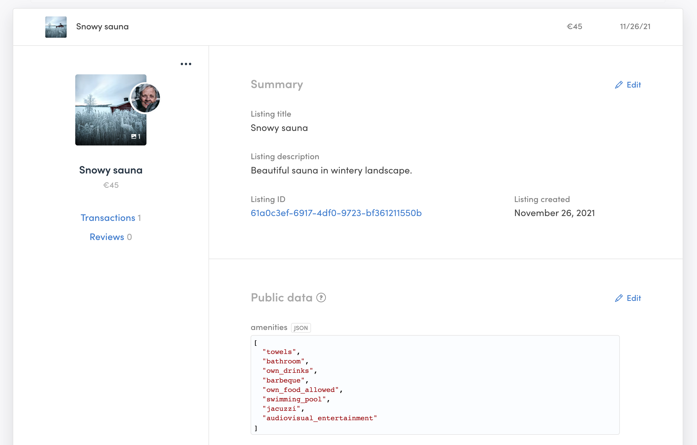

The Listings tab includes all information about your users. The data is
presented in a list of listing cards. To view a listing’s information,
click on their card and it will expand to show more information.

## Listing card

Each listing has a card with all the information about them. Each
listing card is divided into sections.

**The left side of the card has** general information and quick links.
You can see the main listing picture (and the listing author profile
picture) and a count of the number of pictures added if they have any.
You can navigate directly to the listing author user card from the
author profile picture. You find the listing title and the price. You
can also easily navigate to a filtered view of all transactions and
reviews where that listing is involved in the corresponding transaction
or review section.

You also have an options menu on the top right corner where you can find
quick actions links to close the listing or delete the listing
permanently. If the listing is pending approval, the only option
available is to delete the listing.

**The right side of the card has** the Summary section, which contains
default information about the listing, like the Listing title, Listing
description, Listing ID, and the listing’s creation date. These fields
are not changeable or deletable, but most of their contents can be
edited directly on this page. You cannot, however, make changes to the
listing creation date and the listing ID, which is a unique identifier
within the Sharetribe database.

Below the summary, you have separate sections for each type of extended
data. Extended data is a Sharetribe feature that allows you to customize
and collect user, listing, and transaction data specific to your
marketplace. You can read
[an introduction to extended data](/concepts/extended-data-introduction/)
to learn more. All extended data can be edited directly through Console.
You can change existing field values or even add new extended data
fields.

At the bottom of the listing card, you have the Events section. It
contains a Sharetribe CLI command that you can use to view all the
events related to this listing. Read more about
[viewing events with Sharetribe CLI](/how-to/view-events-with-flex-cli/)
or visit the [Events reference in our Docs site](/references/events/).

### Listing approval

If you have
[the listing approval feature](/operator-guides/concepts/#listing-pending-approval)
enabled in your marketplace, you will find the “approve listing” button
at the bottom of the displayed section of the listing card.

## Browse and search Listings

You can scroll through listings cards at a rate of 100 per page, or use
the search function to find specific listings via title, description, or
ID. You can also filter listings by status: pending approval, closed,
published, or draft. You can combine the filters with the search
function.

## Download listings’ information

You also have the option to download your listing data as a CSV, which
you can import to a third-party system.
