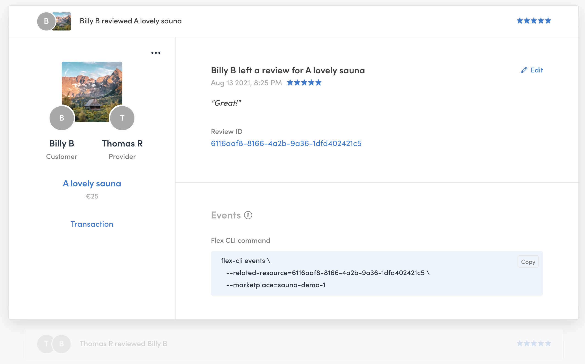

Reviews, as [other elements of your marketplace Console](https://www.sharetribe.com/docs/concepts/console-manage-overview/), are displayed in cards. 

Review cards are the simplest, by far. Reviews cannot be searched. However, if you want to find a specific review, it is better to locate it through one of the user, listing, or transaction cards connected to that review. All of these have links to the reviews associated with them. 

You can also download a CSV version of the review data and import it to a third-party system.

**On the left side**, you have general information and quick links. You can see the main listing picture, the customer, and the provider involved in the transaction. You can navigate directly to the user cards by clicking on the profile pictures. Below them, you find the listing title and the listing’s basic price. You can navigate to the listing card involved in this transaction through the listing title link. You can also navigate to the transaction card related to this review.

From the menu on the top right of this side, you can delete the review. 

**On the right side**, you have the default information of the review: the review ID, review title, the date given, the review rating, and the review text. The ID is a unique database identifier for this review. The title is formatted depending on who posted the review and who received it. 

You can edit the text and rating directly in Console. 

At the bottom of the review card, you find the Events section. It contains a Flex CLI command that you can use to view all the events related to this review. Read more about [viewing events with Flex CLI](https://www.sharetribe.com/docs/flex-cli/view-events-with-flex-cli/) or visit the [Events reference in our Docs site](https://www.sharetribe.com/docs/references/events/).

