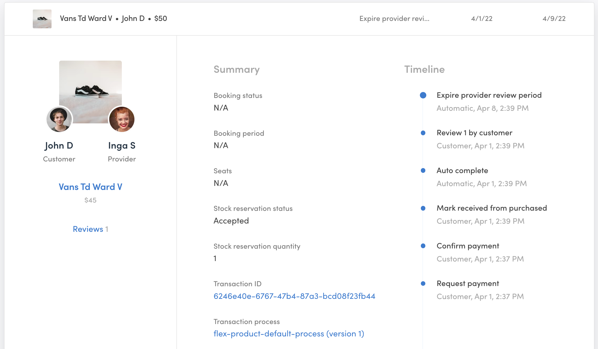

The Transactions tab contains the most relevant information about
transactions in your marketplace. The data is presented in a list of
transaction cards. To view the transaction information, click on the
card and it will expand to show more information. The transaction cards
are the most complex data cards in Console. They are rich in information
and extremely useful in running your marketplace.

## Transaction card

Each transaction card contains the most relevant information about
transactions in your marketplace.

**On the left side**, you have general information and quick links. You
can see the main listing picture, the customer, and the provider
involved in the transaction. You can navigate directly to the user cards
by clicking on the profile pictures. Below them, you find the listing
title and the listing’s basic price. You can navigate to the listing
card involved in this transaction through the listing title link. You
can also navigate to a filtered view of this listing’s reviews from the
link available in this section.

**On the right side**, you have a lot of information. We will present
this information in sections.

### Summary

The summary includes most of the information about the transaction.

- Booking status: If your transaction process uses availability, the
  transaction will be in one of
  [the different booking statuses](/references/transaction-process-actions/#bookings).
  The booking status is different from the transaction status.
- Booking period: If your transaction uses availability, the booking
  period will be the timeframe of this transaction. In case of a rental
  marketplace, it will be the rental period of a sauna, for example.
- Seats: If your listing has a specific number of
  [seats](/references/availability/#seats) available, you will see how
  many seats were booked as a part of this transaction.
- Stock reservation status: If your transaction process uses stock, the
  stock reservation can be in one of the different
  [stock reservations states](/references/stock/#stock-reservation-states).
- Stock reservation quantity: The amount of stock reserved in this
  transaction.
- Transaction ID: Unique ID of the transaction in the Sharetribe
  database.
- Transaction process: You can have multiple
  [transaction processes](/concepts/transaction-process/) active in your
  marketplace and each transaction process can have multiple versions.
  This field specifies which process and which version the transaction
  uses.
- Customer paid: This field shows how much money the customer paid. It
  also includes a breakdown of the line items and the fee that your
  marketplace collects from the buyer.
- Provider received: This field shows how much money the provider will
  receive for this transaction. It also includes a breakdown of the line
  items charged and the fee that your marketplace collects from the
  seller.
- Marketplace receives: This field shows the total of the customer and
  provider fees to determine the total marketplace commission on the
  transaction. Stripe’s fees are not separated and can only be viewed in
  your Stripe dashboard.

### Timeline

In the timeline, you see all the transitions that have been triggered so
far in the transaction as well as the time when they took place and
[the actor who initiated each transition](/concepts/transaction-process/#transitions).
You also see the possible next transitions. If the actor of the next
possible transition is the Operator (you), you will be able to initiate
that transition in the timeline section.

### Activity

[All customer interactions in your marketplace](/concepts/transaction-process/#users-interact-through-transactions)
are considered transactions in Sharetribe. In the activity section, you
will see the history of the transaction. This includes all the
transitions that have occurred already, similar to the Timeline section,
interwoven with the communication that has happened within the
transaction.

The communication includes all the
[notifications that have been sent](/references/transaction-process-format/#notifications)
as a part of the transaction process, the written messages between
users, and the reviews given at the end of the transaction, if
available.

### Extended data

There are two separate sections for each type of extended data supported
by transactions: protected data and metadata. You can read
[an introduction to Extended data](/concepts/extended-data-introduction/)
to learn more about different types of Extended Data. Unlike with
[user cards](/concepts/console-manage-users/) and
[listing cards](/concepts/console-manage-listings/), transaction public
extended data cannot be edited directly through Console. You can change
existing field values or even add new fields for the metadata, but,
since protected data is captured at specific points of the transaction,
it is seared in the transaction information. Transaction related
protected data cannot be changed through Console.

At the bottom of the transaction card, you find the Events section. It
contains a Flex CLI command that you can use to view all the events
related to this transaction. Read more about
[viewing events with Flex CLI](/how-to/view-events-with-flex-cli/) or
visit the [Events reference in our Docs site](/references/events/).

## Browse and Search transactions

You can use the filter function to find transactions based on what their
last transition was. If you want to find a specific transaction, it may
be easier to navigate to it through the user or listing interfaces.

## Download transactions’ information

You also have the option to download your transaction data as a CSV,
which you can import to a third-party system.
