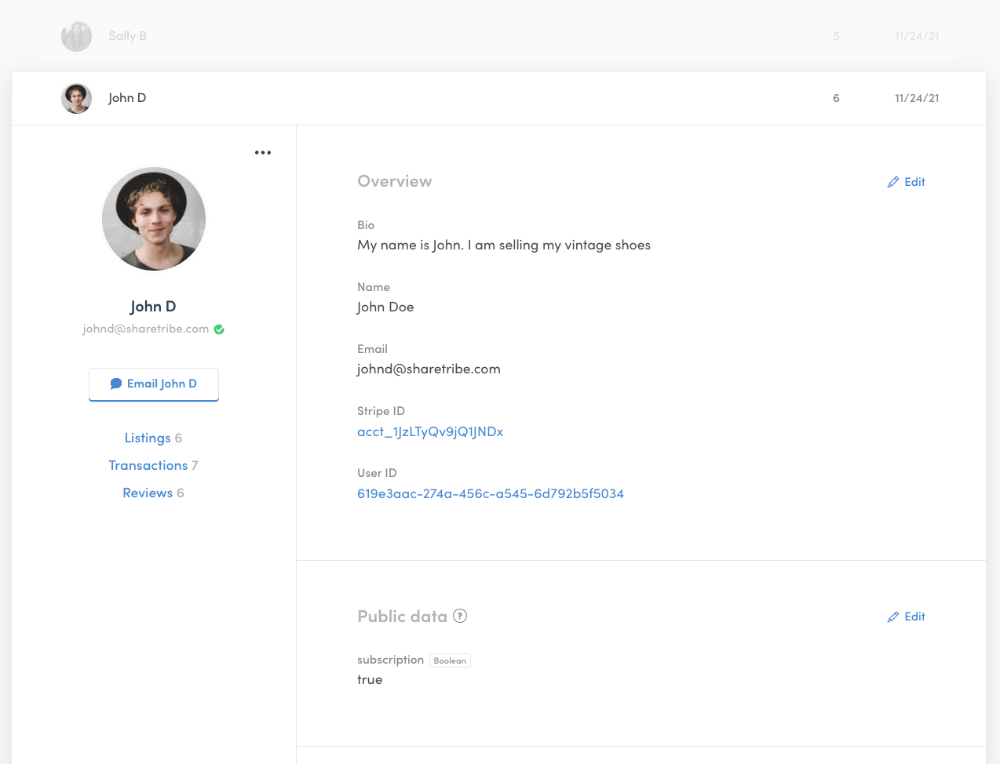
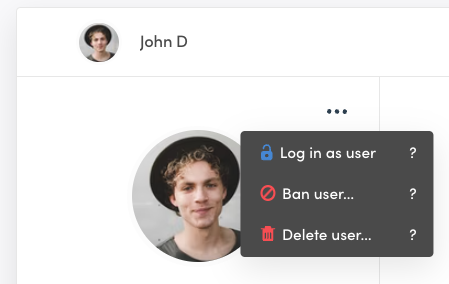

The Users tab includes all information about your users. The data is
presented in a list of user cards. To view a user’s information, click
on their card and it will expand to show more information.

## User card

Each user on your marketplace has a card that includes all the
information you’ve collected about them.

**The left side of the card has** general information about the user:
profile picture (if they have one), email, and whether or not they have
verified the email. If they have, there’s a green checkmark next to
their email. Otherwise, the checkmark is yellow.

Here, you also have quicklinks to email the user directly from Console,
and navigate to their listings, transactions, and reviews.

In the user card, there is also a menu for admin-exclusive user
management actions:

- Login as user: You can access your marketplace as the user in question
  with limited rights. You can edit information in their profile and
  listings.
- Ban user: You can deny the user access to their account. After getting
  banned, they can no longer make a new account using the same email.
  You can take this action if a user has not followed your terms of use,
  for example.
- Delete user: This action permanently deletes the user and their data
  from your marketplace. This action cannot be reversed.
- Verify email: If a user cannot verify their email themselves, you can
  verify it manually for them.

**The right side of the user card** includes an Overview section with
default information about the user: Bio (also known as description),
Name, Email, Stripe ID and User ID. These fields cannot be edited or
deleted, but the content of the bio, name, and email, can be modified
directly through Console. You cannot make changes to the Stripe ID,
which depends on the information provided by Stripe when the user
connects their bank account details to their profile, and the User ID,
which is a unique identifier within the Sharetribe database.

Below the overview, you have separate sections for each type of extended
data. Extended data is a Sharetribe feature that allows you to customize
and collect user, listing, and transaction data specific to your
marketplace. You can read
[an introduction to extended data](/concepts/extended-data-introduction/)
to learn more. All extended data can be edited directly through Console.
You can change existing field values or even add new extended data
fields.

At the bottom of the user card, you have the Events section. It contains
a Sharetribe CLI command that you can use to view all the events related
to this user. Read more about
[viewing events with Sharetribe CLI](/how-to/view-events-with-sharetribe-cli/)
or visit the [Events reference in our Docs site](/references/events/).

## Browse and search users

You can browse users by scrolling through the cards (100 cards per page)
or by using the search function to find specific users via their name,
email, or ID. You can also filter users by different parameters and
combine the filters with the search function.

### Filtering parameters

The filtering parameters that you can use are:

- Users with listings: users who have posted a listing or started a
  listing draft
- Users without listings: users who haven’t created any listings or
  listing drafts
- Users with verified email: users who have signed up and confirmed
  their email address
- Users with unverified email: users who have signed up but haven’t
  verified their email address
- Users with listings & Stripe not connected: users who have posted a
  listing but haven’t connected their payment details to their profile.
  These users cannot receive payments.
- Banned: users that you have banned from the marketplace. These users
  cannot access their marketplace accounts.

## Download users’ information

You can download your user data in CSV format. You can use this file to
import your user data into third-party systems.
