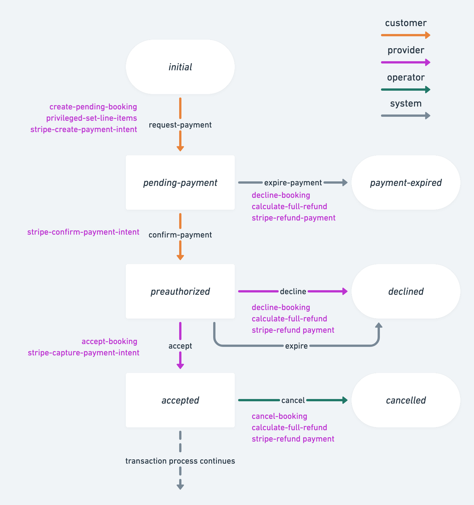

Sharetribe is a full-fledged marketplace solution, complete with payment
capabilities. In this article, you will learn about the Sharetribe
default payment integration, implemented with Stripe, as well as some
alternatives in case the default integration does not fully serve your
marketplace needs.

## Marketplace payment flow

In a nutshell, a basic payment flow in a marketplace contains five
significant steps:

### Step 1: Provider onboarding

In this step, the provider connects their Sharetribe account with the
payment gateway. This is where they provide the bank details that
eventually receive money from the customers. In addition, in this step,
they provide the necessary information and documents for the identity
verification and _Know Your Customer_
[(KYC)](https://en.wikipedia.org/wiki/Know_your_customer) requirements.
[These requirements vary](https://stripe.com/docs/connect/required-verification-information)
depending on the user’s country of residence.

### Step 2: Customer checkout

Customer checkout happens when the customer initiates a transaction. At
this stage, they also provide the payment information, such as their
credit card number. Also, the payment will be made at this point. The
payment gateway will preauthorize the money, i.e. reserve the money on
the customer's credit card.

### Step 3: Provider acceptance

After the customer has checked out, the provider has the ability to
either accept or reject the request. If the request is accepted, the
payment will be captured, and the reserved money will be transferred
from the customer's credit card to the payment gateway.

This is a step that you can combine with the customer checkout. The flow
where the “provider accept” happens instantly after customer checkout is
called [instant booking](#instant-booking) flow.

### Step 4: Customer refund

Typically, the marketplace payment flow contains a delayed payment
period. This is the time between when the money is captured from the
customer's credit card and when it is transferred to the provider's bank
account. The payout in marketplaces usually happens after the provider
has successfully provided the agreed product or service.

Customer refund usually happens during this delayed payment period.
There are many reasons why a refund may be necessary. For example, the
provider or customer may not be able to make it to a booked event, or
the provided product or service was not what was agreed.

### Step 5: Provider payout

If everything in the transaction went right and the customer received
the agreed product or service, the money from the payment gateway will
be eventually paid out to the provider.

## Stripe default integration

In the default Sharetribe transaction process and Sharetribe Web
Template, the steps described above are implemented using Stripe. The
integration uses
[Stripe Custom Connect accounts](https://stripe.com/docs/connect/custom-accounts)
for providers. The customer can check out using a payment card or
[another supported method](#payment-methods-and-currencies), and they
can also save their payment method for future use. The integration uses
[Stripe destination charges](https://stripe.com/docs/connect/destination-charges)
([on behalf of the provider](https://stripe.com/docs/payments/connected-accounts))
to collect the payment from the customer to the provider's Custom
Connect account first, and the possible commission is then transferred
to the platform account as an
[application fee](https://stripe.com/docs/connect/destination-charges#application-fee).
Once the transaction is successfully over, the provider's share is paid
out to the bank account that the provider gave upon onboarding.

<extrainfo title="What does &quot;destination charge&quot; mean?">
The Stripe on_behalf_of destination charge means that when the charge is created,
the money goes directly to the provider's Custom Connect account in Stripe, and
the provider's information is shown on the customer's payment method receipt.
This also means that a listing cannot be booked or purchased if the provider has
not onboarded to Stripe, because the charge cannot be created in Stripe without
the provider's Custom Connect account information.
</extrainfo>

### Default payment process with Stripe

#### 1. Provider onboarding

In the Sharetribe default integration, users need to have a Stripe
account with a bank account set up before others can initiate
transactions with them successfully. This is done by
[creating a Stripe account](https://www.sharetribe.com/api-reference/marketplace.html#create-stripe-account)
for the authenticated user. The
[Sharetribe Web Template](/how-to/provider-onboarding-and-identity-verification/)
is configured to do this step out-of-the-box using
[Stripe Connect Onboarding](https://stripe.com/en-fi/connect/onboarding).

To create the account, Stripe requires verification information from the
provider, and the specific types of verification information depend on
the provider's country. You can check the verification requirements for
your most likely marketplace provider demographics in
[Stripe's own documentation](https://stripe.com/docs/connect/required-verification-information).

#### 2. Customer checkout

When the customer initiates a transaction in the Sharetribe default
transaction processes, Sharetribe creates a
[PaymentIntent](/concepts/payment-intents/) for the total price of the
transaction. Once the PaymentIntent is confirmed, Stripe preauthorizes
the sum from the customer's payment method. In other words, even though
the sum is not paid out from the customer's card, it is reserved and not
available to be used by the customer.

The preauthorization is valid for 7 days, after which the
preauthorization is automatically released by Stripe, and the funds are
again available to the customer.

In the Sharetribe Web Template default purchase process, creating and
confirming the PaymentIntent are both triggered at the same customer
action.

**Related Stripe actions:**

- [:action/stripe-create-payment-intent](/references/transaction-process-actions/#actionstripe-create-payment-intent)
- [:action/stripe-confirm-payment-intent](/references/transaction-process-actions/#actionstripe-confirm-payment-intent)

#### 3. Provider acceptance

The default purchase process in the Sharetribe Web Template uses an
instant checkout, which means customer checkout and purchase acceptance
are all triggered on the same customer action. In other words, provider
acceptance is not necessary. However, it is possible to add the provider
acceptance step to the product buying process as well.

In the default booking process, on the other hand, a provider has 6 days
to accept the booking until it expires automatically. This timeline
ensures that the Stripe preauthorization does not expire before the
provider has the opportunity to accept or reject the booking. Once the
provider accepts the booking, the PaymentIntent is captured and the
transaction sum is transferred from the customer's card to the
provider's Custom Connect account. If the transaction has any
commissions, those are then paid from the provider's Connect account to
the platform's account as an
[application fee](https://stripe.com/docs/api/application_fees).

Depending on how the
[transaction's line items](/concepts/pricing/#line-items) have been
defined, the platform can take a
[commission of the price](/concepts/commissions-and-monetizing-your-platform/)
from either the provider, the customer, or both. The platform is also
responsible for paying all
[Stripe fees](https://stripe.com/en-fi/connect/pricing) related to the
Custom Connect account usage, so the commissions must be defined to
cover those expenses as well.

**Related Stripe actions:**

- [:action/stripe-capture-payment-intent](/references/transaction-process-actions/#actionstripe-capture-payment-intent)

#### 4. Customer refund

If the customer requests a refund for one reason or another, the
operator can refund the PaymentIntent. The Sharetribe integration with
Stripe only supports full refunds. (Handling partial refunds is
discussed
[later in this article](/concepts/payments-overview/#how-can-i-partially-refund-transactions-in-my-sharetribe-marketplace).)
The default transaction process takes into account whether or not the
PaymentIntent has already been captured from the customer's account.

**Related Stripe actions:**

- [:action/stripe-refund-payment](/references/transaction-process-actions/#actionstripe-refund-payment)

#### 5. Provider payout

Once the booking has completed successfully, the provider's payout is
paid to the bank account that is linked to their Custom Connect account.

It is important to note that Stripe can
[hold funds for up to 90 days (with some exceptions)](https://stripe.com/docs/connect/account-balances#holding-funds).
In other words, the payout must be triggered no more than 90 days after
the PaymentIntent is created. This means that for booking or purchase
times exceeding 90 days, the process needs to be modified.

<extrainfo title="Manual or automatic payout?">
In Stripe terms, the Sharetribe integration uses manual payouts. This means
that Stripe does not automatically pay out the funds from the Connect 
accounts e.g. daily or weekly, and instead the platform controls the payout
schedule. Since the payouts are triggered by the transaction process, they happen
automatically from the marketplace operator's point of view. In other words, the operator should not pay out funds
manually through the Stripe Dashboard if the marketplace transaction
process is using the Stripe payout action.
</extrainfo>

**Related Stripe actions:**

- [:action/stripe-create-payout](/references/transaction-process-actions/#actionstripe-create-payout)

### Modifications to the default process

One of the strengths of Sharetribe is that you have complete control
over the transaction process. In terms of payments, you can make
parallel paths depending on your payment strategy, and you can fine-tune
the timeline of different actions to suit your marketplace.

You can edit the transaction processes on your marketplace with
[Sharetribe CLI](/how-to/edit-transaction-process-with-sharetribe-cli/).
If you use Sharetribe Web Template, you will also need to make some
[changes in the template](/how-to/change-transaction-process-in-template/)
to enable it to use a different process. If you do make changes to a
transaction process when you already have transactions in your
environment, it is good to note that a transaction will proceed with the
transaction process it was initiated with, and changing the transaction
process of a single transaction is not possible. You can see the
transaction process related to each transaction in
[Sharetribe Console](https://console.sharetribe.com/) > Manage >
Transactions.

The transaction process also controls the automatic
[email notifications](/references/email-templates/) sent at different
stages of the transaction flow. When you make changes to the transaction
process, be sure to also update the wording and logic of the
notifications for a consistent user experience for your marketplace
customers and providers.

#### Instant booking

As mentioned, the default purchase process combines the customer
checkout and provider acceptance steps into a single customer action. In
other words, the purchase is automatically accepted and paid as soon as
the customer clicks to pay for the listing. The
[example-processes Github repository](https://github.com/sharetribe/example-processes)
contains an example of a booking process called `instant-booking` that
you can use to implement a similar flow for bookings in Sharetribe Web
Template, as well as in any custom client application you may be using.

#### Automatic off-session payments

Another notable approach to modifying the payment timeline in Sharetribe
is the
[off-session payment pattern](/concepts/off-session-payments-in-transaction-process/).
In an off-session payment, the customer checkout and provider acceptance
happen when the customer books or purchases the listing, but the payment
takes place at a later date. That way, customers can, for instance, book
listings or purchase preorder products further in the future than the 90
day Stripe limitation, and they will be charged closer to the moment of
receiving the product or service they purchased.

### Payment methods and currencies

Sharetribe supports multiple payment methods as a part of its Stripe
integration. The default payment method is a payment card, which is what
the Sharetribe Web Template uses. However, you can enable
[other payment methods](/concepts/payment-methods-overview/) as well
with moderate custom development work.

The user can save a default payment method in Sharetribe. If your
marketplace uses the
[automatic off-session payment flow](#automatic-off-session-payments),
the customer must save their payment method so that the transaction
process can try to automatically charge them at the specified moment.

Sharetribe does not determine a currency for listings. However, each
listing needs to have a currency specified in its `price` attribute. The
value for `price.amount` is given in the minor unit of `price.currency`
(e.g. cents for USD). Sharetribe Console displays listing prices based
on the listing's currency. The Sharetribe Web Template has a single
currency defined by default, to facilitate e.g. price filtering and
sorting.

As the transaction progresses, the payment intent is created and charged
from the customer's payment method in the listing's currency, or
alternatively the
[currency of the line items](/concepts/pricing/#line-items) if different
from the listing currency. The payout currency is determined by the
provider's bank account currency.

<extrainfo title="Stripe currency terminology">
In Stripe terminology, the <b>presentment currency</b> is the currency
of the charge, i.e. the currency at which the listing price is charged from the
customer's card. The customer's card provider may charge a conversion
fee if the presentment currency differs from the customer's card currency,
or if the credit card and the marketplace platform are registered in
different countries regardless of currency.  
The <b>settlement currency</b> is the currency of the payout, i.e.
the currency at which the provider's payout is paid to their bank account.
If the presentment currency differs from the settlement currency, Stripe
converts the charge to the settlement currency.  
See <a href="https://stripe.com/docs/currencies">Stripe's own documentation</a>
for country-specific details on supported currencies.
</extrainfo>

## Sharetribe Web Template and Stripe

The default Stripe integration in Sharetribe works with any client
application. However, the Sharetribe Web Template is further configured
to work hand in hand with Stripe:

- [Provider onboarding](/how-to/provider-onboarding-and-identity-verification/)
  is handled with Stripe Connect Onboarding. A provider cannot create
  listings (i.e. receive money from customers) unless they have verified
  their identity with Stripe &mdash; this ensures that the platform is
  always KYC compliant.
- _CheckoutPage.js_ and its subcomponent _CheckoutPageWithPayment.js_
  handle Stripe actions related to customer checkout, including creating
  and confirming the payment intent, with a single button click.
- The customer can save their payment method to Sharetribe either when
  purchasing a listing, or on a separate Payment Methods page.

## Frequently asked questions

### Where can I use Stripe?

In order to use Stripe for your marketplace, your platform account needs
to be in a Stripe-supported country. (You can define your country in
Stripe Dashboard Account Settings.) The platform country then determines
in which countries the platform can create Connect accounts, i.e. where
your marketplace's users can be from. Check
[Stripe's own documentation](https://stripe.com/docs/connect/custom-accounts#requirements)
for the most up-to-date requirements for your marketplace country.

### I'm having problems with the Stripe integration, how do I fix it?

Sometimes it takes a while to get Stripe to work. Here are some ideas to
troubleshoot the problem.

- Double check that you have followed the
  [Stripe setup instructions](https://www.sharetribe.com/help/en/articles/8413086-how-to-set-up-stripe-for-payments-on-your-marketplace).
  Note that in your Dev and Test environments, you need to use the
  Stripe keys starting with `sk_test` and `pk_test`, and you will also
  need to use
  [Stripe's test payout details](https://stripe.com/docs/connect/testing#payouts)
  and
  [test payment methods](https://stripe.com/docs/testing#payment-intents-api)
  with those test keys. In the Live environment with real payment
  methods, you will need to use the keys starting with `sk_live` and
  `pk_live`. Also check that the keys you are using match the keys in
  Stripe Dashboard. You can "roll" i.e. refresh the keys if necessary
  and enter the new keys &mdash; they will still be connected to the
  same Stripe platform account.

- If you get your Stripe integration working to the point that you get
  an error message from Stripe, it is useful to take a moment to check
  [what the error code means](https://stripe.com/docs/error-codes). It
  is also often useful to put the error code into a search engine and
  check if someone has already solved a similar problem.

- In case of payout problem issues, you can check out our article about
  [Stripe payout issues](/concepts/solving-payout-problems/) for advice
  or ideas.

If nothing seems to work, you can always contact Sharetribe technical
support through the chat widget in your
[Sharetribe Console](https://console.sharetribe.com/) or
[by email](mailto:hello@sharetribe.com) for further troubleshooting.

### How can I partially refund transactions in my Sharetribe marketplace?

The default Stripe integration in Sharetribe only supports fully
refunding PaymentIntents. If you have a use case where you would need to
implement partial refunds, here are some options you can consider. All
of these require some degree of custom development effort.

#### Multiple transactions for one purchase

If you want to keep using the default Sharetribe Stripe integration, you
can look into triggering two transactions in Sharetribe for a single
purchase &mdash; one for the main price, and one for the refundable part
of the price. Each transaction would have its own PaymentIntent towards
Stripe, so you would need to implement separate transaction processes
for each type of transaction to handle the PaymentIntents, and the
payments would show up as two different charges on the customer's
account. Furthermore, you would need to coordinate commission amounts,
as well as the possibility of a full refund, e.g. if the booking is
cancelled by the provider for one reason or another. Also bear in mind
that if you trigger two transactions for the same payment method in
quick succession, some card providers may flag this as suspect behavior,
so you will need to consider the timing of the transactions carefully.

#### Partial third party payment integration

In this option, you would use the Sharetribe default payment integration
up to the point where the payment gets captured onto the provider's
Custom Connect account. You would then handle all payouts and refunds
manually, i.e. outside the Sharetribe transaction process &mdash; either
in Stripe Dashboard, or through the Stripe API with your own
integration. This would require you to keep track of the correct sums to
be paid out for each transaction yourself. This option poses the risk of
causing payout issues for completely unrelated transactions; Stripe does
not separate funds by PaymentIntent, so a miscalculated excessive refund
on a transaction between provider A and customer B may cause payout to
fail for customer C on a different transaction. You can read more on
[payout issues on manual refunds](/concepts/solving-payout-problems/#why-payouts-fail)
to figure out what you would need to consider to implement this option
successfully.

#### Full third party payment integration

Of course, you can create a fully separate third party payment
integration to handle creating and capturing the payments as well as
managing payouts and refunds. This gives you the greatest flexibility
with your setup, and conversely it requires more customization and
development. You can refer to our high-level instructions on
[integrating a 3rd-party payment gateway](/how-to/how-to-integrate-3rd-party-payment-gateway/)
to find out whether this option would best suit your needs.

If you are contemplating partial refunds for your marketplace, you can
also contact Sharetribe technical support through the chat widget in
your [Sharetribe Console](https://console.sharetribe.com/) or
[by email](mailto:hello@sharetribe.com). Let us know your specific use
case, and we may be able to recommend some avenues for you to explore.

### Can I use Sharetribe and not use Stripe?

You can absolutely use Sharetribe without using Stripe. You might not
use payments at all in your marketplace, or your platform operates in a
non&ndash;Stripe supported country, or you may have some other reason.

Using the Sharetribe backend without the Stripe integration is fairly
simple. You will need to remove references to all
[Stripe-related transaction process actions](/references/transaction-process-actions/#stripe-integration)
from your transaction processes, and avoid using
[Stripe-related endpoints](https://www.sharetribe.com/api-reference/marketplace.html).
For clarity, all references to Stripe's backend elements (endpoints,
transaction process actions etc.) are named with the prefix `stripe`.

If you want to modify your template to work without Stripe, the effort
is more extensive, since each template is built around a logic that uses
Stripe actions and endpoints. You can use
[this article](/how-to/removing-stripe-and-payments/) as your starting
point.

When removing the Stripe integration, you will want to consider whether
or not you want to implement some other payment gateway in your
marketplace to handle payments. You can refer to our high-level
instructions on
[how to integrate a 3rd-party payment gateway](/how-to/how-to-integrate-3rd-party-payment-gateway/)
when making the decision and when implementing any changes.
