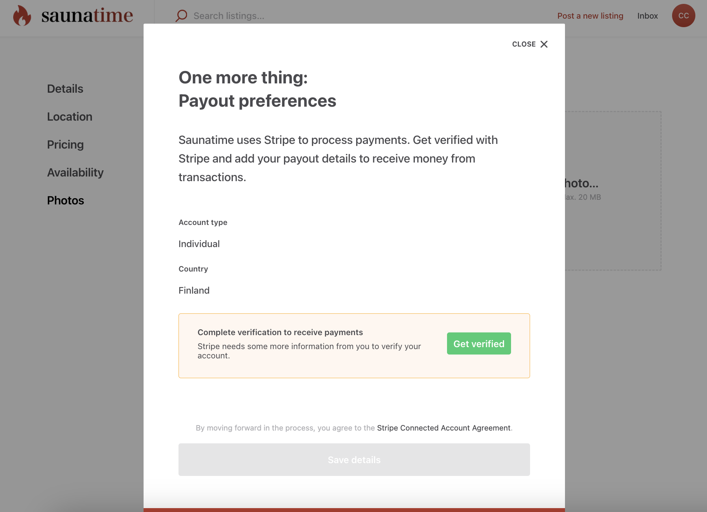
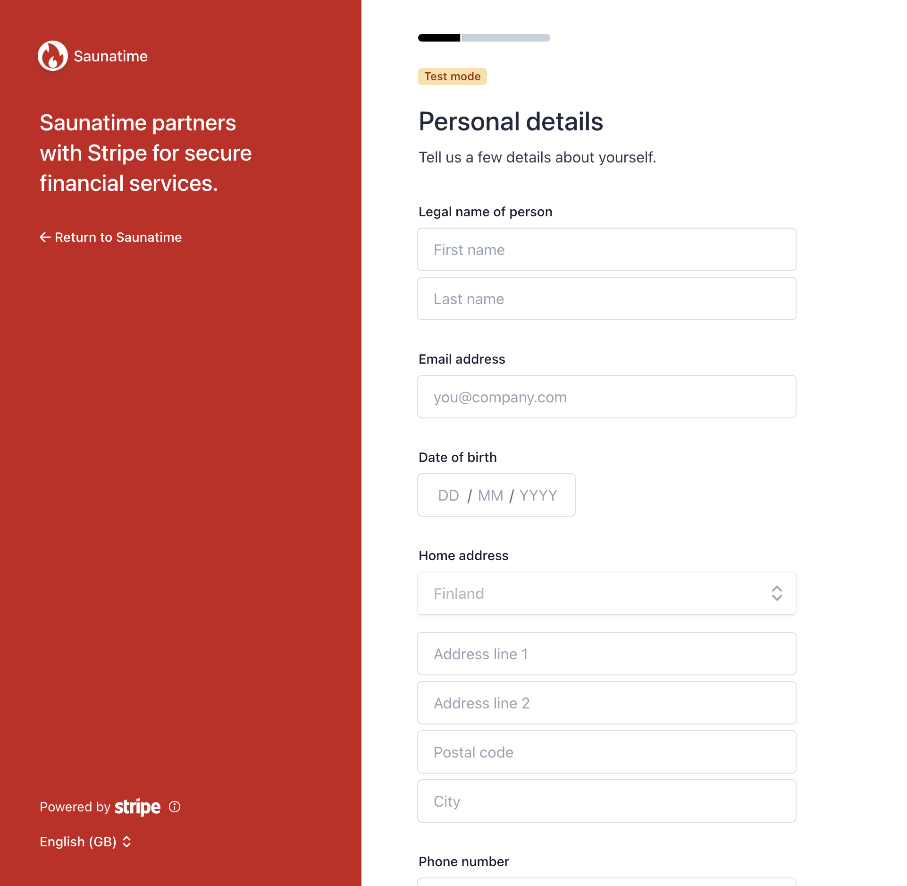
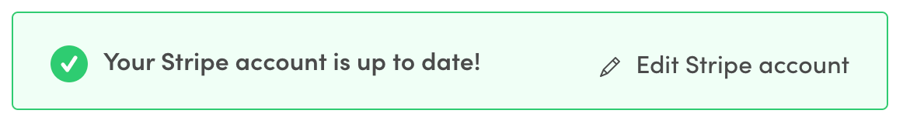
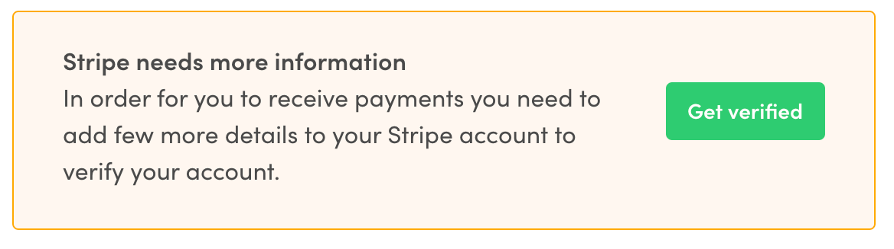
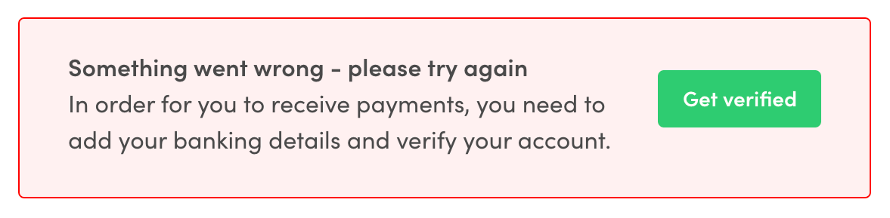

## Introduction

If your marketplace handles payments through the Sharetribe Stripe
integration, your providers and customers will show up in different ways
on your Stripe platform account. The main ways this happens is through
Stripe Connect accounts and Stripe Customers.

The Sharetribe Stripe integration uses Stripe Custom Connect accounts
for providers. When a provider first creates a listing, they need to
onboard to Stripe Connect before they can receive payouts. For
customers, on the other hand, a Stripe Customer is not created by
default in the Sharetribe Web Template.

## Stripe for providers: Stripe Connect Onboarding

When your marketplace handles payments, it is important to have a
provider verification process where providers can enter all necessary
and required information for them to receive payments,

Regulatory aspects of provider onboarding can be challenging and
changing rapidly. Stripe Connect Onboarding provides ready tools for
meeting the requirements and reducing the operational complexity of
self-managing the onboarding flow and identity verification.

For both Sharetribe Web Template and custom implementations, your
marketplace will first need to set up Stripe for payments and enable
Connect Onboarding. You can review the
[instructions in our Help Center](https://www.sharetribe.com/help/en/articles/8413086-how-to-set-up-stripe-for-payments-on-your-marketplace)
for more details.

Below, you can see the changes required to implement Stripe Connect
Onboarding.

### Stripe Connect Onboarding for custom implementations

In the template, Connect Onboarding is mainly handled in the following
files:

- [StripePayoutPage](https://github.com/sharetribe/web-template/tree/main/src/containers/StripePayoutPage)
- [StripeConnectAccountForm](https://github.com/sharetribe/web-template/tree/main/src/components/StripeConnectAccountForm)
- [stripeConnectAccount.duck.js](https://github.com/sharetribe/web-template/blob/main/src/ducks/stripeConnectAccount.duck.js)

You can also check out
[PR #1234](https://github.com/sharetribe/ftw-daily/pull/1234) where you
can find all the code changes.

### 1. Creating a provider Stripe Account

With Stripe Connect Onboarding, you need to collect minimum information
from your providers when creating a
[Stripe Account](https://www.sharetribe.com/api-reference/marketplace.html#create-stripe-account)
for them. It's recommended for you to pass the following information in
the create-stripe-account call:

- `country`: A mandatory field determining the country of residence for
  the provider.
- `requestedCapabilities`: Required capabilities for payments to work in
  Sharetribe are `card_payments` and `transfers`.



As of version vXX.XX, the Sharetribe Web Template does not collect the
provider's bank account in the template. Instead, the provider enters
their bank account information as a part of the Stripe Connect
Onboarding flow. However, if you want to collect the bank account in
your custom implementation, you can also pass an additional parameter:

- `bankAccountToken`: Stripe
  [bank account token](https://stripe.com/docs/api#create_bank_account_token)
  for the user.

You can see this PR for details on how the bank account token was
previously handled in the template.

<info>

In the `EditListingWizard` component, the modal with
`StripeConnectAccountForm` is shown if the user doesn't have a Stripe
Account yet or if there is some information missing from the account.
The modal will be shown only if the user is publishing the listing. This
means that users can update already published listing even if their
Stripe Account is in the restricted state but they can't publish new
listings.

</info>

### 2. Fetching information about a Stripe Account

If the user already has a Stripe Account, you need to fetch the
up-to-date account data from Stripe through Sharetribe API. This way we
can warn the users if there is some required information missing from
their Stripe Account.

The account data is returned after each create and update Stripe Account
API call, so there is no need for separate fetch API call in these
cases.

In Sharetribe Web Template, the Stripe Account is fetched in
[`loadData`](https://github.com/sharetribe/web-template/blob/main/src/containers/StripePayoutPage/StripePayoutPage.duck.js#L73)
function on `StripePayoutPage.duck.js`. Quite similar `loadData`
funciton is also used on `EditListingPage`. You can find more
information about data loading in
[our routing article](/template/how-routing-works-in-template/).

After the Stripe Account has been fetched, we need to check
`requirements` of the `stripeAccountData` attribute which contains the
related
[Stripe Account Object](https://stripe.com/docs/api/accounts/object). If
there are any fields in `past_due` or `currently_due` it means that
those fields need to be collected to keep the account enabled. In other
words, there are requirements missing. If there are no fields in
`past_due` or `currently_due` it means that the verification is
completed for now. It is still possible that there might be new fields
to be collected if the account reaches the next volume thresholds.

### 3. Creating Stripe Account Link

Stripe Account Links are a mechanism for enabling your providers to
access Stripe Connect Onboarding UI. You need to
[create an account link](https://www.sharetribe.com/api-reference/marketplace.html#create-stripe-account-link)
and provide the return URLs for success and failure cases. After
creating an account link the user will be redirecet to Connect
onboarding.



If there are any requirements missing from the Stripe Account we will
create a `custom_account_verification` link. Otherwise, we will create a
`custom_account_update` link. By default, we will use `currently_due` as
a collect type. A new Account Link is created only when the user clicks
the link to go to Connect onboarding to make sure the link will not
expire. When the Account Link is returned the user is redirected to
Connect Onboarding.

When creating the Account Link we need to provide success and failure
URLs where user will be redirected after onboarding. These routes with
URL parameter need to be added to `routeConfiguration.js`.

E.g. StripePayoutPage with URL parameter

```
    {
      path: '/account/payments/:returnURLType',
      name: 'StripePayoutOnboardingPage',
      auth: true,
      authPage: 'LoginPage',
      component: props => <StripePayoutPage {...props} />,
      loadData: StripePayoutPage.loadData,
    }
```

If the user returns to the success URL, we still need to check the
status of the Stripe Account again. Returning to success URL doesn't
automatically mean that the account has all the required information.

- If there are no requirements missing from the Stripe Account, the
  status box is in `verificationSuccess` mode

  

- If there is still something missing from the Stripe Account, the
  status box is in `verificationNeeded` mode

  

- If the user returned to failure URL, the status box is in
  `verificationError` mode. Failure can happen e.g. if the Connect
  onboarding page was refreshed or if the Account Link had already
  expired

  

### 4. Updating provider Stripe account

Most of the information related to Stripe Account like email or address
can be updated from Stripe's Connect onboarding. For updating this
information, you need to
[create a new Account Link](https://www.sharetribe.com/api-reference/marketplace.html#create-stripe-account-link)
and redirect user back to Connect onboarding.

If you want to allow users to add their bank account without going
through the Stripe Onboarding flow, you can enable updating the
`bankAccountToken` of the Stripe Account. This means that if the
provider want's to update their bank account number (e.g. IBAN), you
would need to pass a new bankAccountToken to
[update Stripe Account](https://www.sharetribe.com/api-reference/marketplace.html#update-stripe-account)
API endpoint.

<info>

Currently, Stripe doesn't support updating the country of the account
after the account has been created.

</info>

### Using custom flow for Stripe provider onboarding

It's also possible to implement the onboarding flow in your own
application, if using Stripe Connect Onboarding is not an option. This
way the user will stay in your application throughout the whole
onboarding. The downside with this approach is that you are responsible
for collecting all the required information and keeping the UI
up-to-date also with the possible future changes. In general, we
strongly recommend that you always use Stripe Connect Onboarding to
onboard your providers, regardless of your front-end application.

In our older
[legacy templates](/how-to/provider-onboarding-and-identity-verification/#using-deprecated-payoutdetailsform-and-payoutdetailspage-as-a-starting-point),
Stripe onboarding was implemented with a custom flow. There are some now
deprecated components you can use as a starting point if you want to
implement your own flow. You should keep in mind that these components
will not be updated by our team since Sharetribe Web Template uses
Connect Onboarding by default.

You can find the deprecated files still from v.3.7.0

- [PayoutDetailsForm](https://github.com/sharetribe/ftw-daily/tree/v3.7.0/src/forms/PayoutDetailsForm)
- [PayoutPreferencesPage](https://github.com/sharetribe/ftw-daily/tree/v3.7.0/src/containers/PayoutPreferencesPage)
- [stripe.duck.js](https://github.com/sharetribe/ftw-daily/blob/v3.7.0/src/ducks/stripe.duck.js).

## Stripe for customers: saved payment methods

Providers always need a Stripe Connect account to receive a payout from
a transaction. For a customer, you can make a payment either with a
Stripe Customer or without one.

When you make a payment without a Stripe Customer, you create the
PaymentIntent in the Sharetribe backend transaction process without
passing payment method information to the transition. In that situation,
you then need to attach the payment method to the PaymentIntent by
making an API call to Stripe directly.

If you want to create a Stripe Customer and save the payment card as you
make the payment, you need to create the payment intent with a
_setupPaymentMethodForSaving: true_ parameter. This sets up the
PaymentIntent so that its PaymentMethod can later be attached to a
Stripe Customer.

In this flow, you

1. Create the PaymentIntent as a part of the transaction process
2. Pass the card information to Stripe API when you confirm the
   PaymentIntent
3. Use the Sharetribe API to
   [create the Stripe Customer](https://www.sharetribe.com/api-reference/marketplace.html#create-stripe-customer)
   and pass the PaymentIntent's _paymentMethodId_ as a parameter.

You can also create a Stripe Customer without handling a payment at the
same time. In that case, you need to create a
[Stripe Setup Intent](https://www.sharetribe.com/api-reference/marketplace.html#create-stripe-setup-intents)
with the Sharetribe API, and then use the setup intent to call Stripe
handleCardSetup.

Read more:

- [Using stored payment cards](/concepts/using-stored-payment-cards/)
- [How saving a payment card works in the Sharetribe Web Template](/how-to/save-payment-card/)

## Changing a marketplace's Stripe platform account

Marketplaces sometimes need to change their Stripe platform account for
one reason or another. Since Stripe Connect accounts and Stripe
Customers are both associated with your Stripe platform account, it is
not possible to change your Stripe keys if Connect accounts or Customers
exist on your marketplace. You can reach out to Sharetribe support, and
we can help you clear the Stripe Connect accounts and Customers from
your marketplace.

In practice, removing all Stripe Connect accounts and Stripe Customers
means that all payout details (bank accounts) are lost from the
marketplace users, and all providers will need to complete Stripe
onboarding again before other users can start transactions against their
listings. In addition, existing transactions that have an upcoming
Stripe related action are not able to move forward. This means that if
you need to change the Stripe keys for your Live marketplace, you will
need to either cancel in Console all ongoing transactions that have
upcoming Stripe actions, and then manage the necessary payouts and
refunds manually on your old Stripe platform for transactions that
cannot be canceled.
