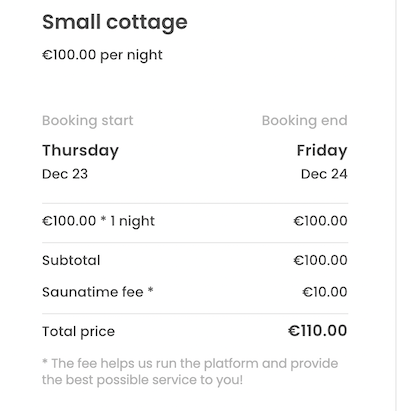

## Introduction

If you have already defined a pricing model for your marketplace, this
article will provide you with basic information on the options Flex
provides and how to take them into use.

If you need more information on how to decide the pricing, our
Marketplace Academy has
[an article](https://www.sharetribe.com/academy/how-to-set-pricing-in-your-marketplace/)
describing different pricing models and the tradeoffs behind different
options.

As background, familiarizing yourself with
[line items](/concepts/pricing/#line-items) and
[privileged transitions](/concepts/privileged-transitions/) gives you a
good understanding of the concepts discussed in this article. In
addition, the article that describes
[payments in Flex](/concepts/payments-overview/) provides valuable
information about how the payment flow in Flex works.

Configuring commissions happens with the
[privileged-set-line-items](/references/transaction-process-actions/#actionprivileged-set-line-items)
transaction process action. In the template, this is done
[on the server side](https://github.com/sharetribe/ftw-daily/blob/master/server/api-util/lineItems.js)
because of the privileged nature of this action. If you are developing a
client application that is not based on the Sharetribe Web Template, you
can apply a similar logic.

## Percentage-based commissions

One of the simplest ways to configure commissions is to define a
percentage of the listing price as a commission. Commissions can be
charged from the provider, the customer, or both.

### Example

A marketplace that charges 10 % from the customer and 12 % from the
provider would configure the commissions like this:

```js
const PROVIDER_COMMISSION_PERCENTAGE = -12; // Provider commission is negative
const CUSTOMER_COMMISSION_PERCENTAGE = 10; // Customer commission is positive

const order = {
  code,
  unitPrice,
  quantity,
  includeFor: ['customer', 'provider'],
};

const providerCommission = {
  code: 'line-item/provider-commission',
  unitPrice: calculateTotalFromLineItems([order]),
  percentage: PROVIDER_COMMISSION_PERCENTAGE,
  includeFor: ['provider'],
};

const customerCommission = {
  code: 'line-item/customer-commission',
  unitPrice: calculateTotalFromLineItems([order]),
  percentage: CUSTOMER_COMMISSION_PERCENTAGE,
  includeFor: ['customer'],
};

const lineItems = [order, providerCommission, customerCommission];
```

For a 100 EUR listing, this would result in a 110 EUR payin for the
customer and a 88 EUR payout for the provider. The marketplace would
receive 22 EUR minus Stripe fees.

<extrainfo title="Negative or positive commission?">
Commission line items are defined as either positive or negative depending on the transaction
party. 
<ul>
<li> Provider commission is defined as <b>negative</b>, since the provider's total is the listing price minus the provider commission.

<li> Customer commission is defined as <b>positive</b>, since the customer's total is the listing price plus the customer commission.

</ul>
</extrainfo>

## Fixed commissions

In addition to percentages, you can define commissions with fixed sums
as the `unitPrice` of the line item using `quantity` instead of
`percentage`. In the following example, both the provider and customer
pay a fixed commission regardless of the listing price or quantity.

### Example

```js
const FIXED_PROVIDER_COMMISSION = -1500; // Provider commission is negative
const FIXED_CUSTOMER_COMMISSION = 1050; // Customer commission is positive

const calculateCommission = (unitPrice, amount) => {
  return new Money(amount, unitPrice.currency);
};

const order = {
  code,
  unitPrice,
  quantity,
  includeFor: ['customer', 'provider'],
};

const providerCommission = {
  code: 'line-item/provider-commission',
  unitPrice: calculateCommission(unitPrice, FIXED_PROVIDER_COMMISSION),
  quantity: 1,
  includeFor: ['provider'],
};

const customerCommission = {
  code: 'line-item/customer-commission',
  unitPrice: calculateCommission(unitPrice, FIXED_CUSTOMER_COMMISSION),
  quantity: 1,
  includeFor: ['customer'],
};

const lineItems = [order, providerCommission, customerCommission];
```

For a 100 EUR listing, this would result in a 110.5 EUR payin for the
customer and a 85 EUR payout for the provider. The marketplace would
receive 25.5 EUR minus Stripe fees.

## Dynamically calculated commissions

You can also calculate the commissions with more complex logic. You can
set the result of the calculation as either the `unitPrice` or the
`percentage` of the line item.

In this example, the customer's commission percentage gets reduced when
they buy over 5 items. The provider's commission is percentage based,
but always at least 10 dollars.

### Example

```js
const PROVIDER_COMMISSION_PERCENTAGE = -12; // Provider commission is negative
const MINIMUM_PROVIDER_COMMISSION = -1000; // Negative commission in minor units, i.e. in USD cents

const CUSTOMER_COMMISSION_PERCENTAGE = 10;
const REDUCED_CUSTOMER_COMMISSION_PERCENTAGE = 7;

const calculateProviderCommission = booking => {
  // Use existing helper functions to calculate totals and percentages
  const price = calculateTotalFromLineItems([booking]);
  const commission = calculateTotalPriceFromPercentage(
    price,
    PROVIDER_COMMISSION_PERCENTAGE
  );

  // Since provider commissions are negative, comparison must be negative as well
  if (commission.amount < MINIMUM_PROVIDER_COMMISSION) {
    return commission;
  }

  return new Money(MINIMUM_PROVIDER_COMMISSION, price.currency);
};
```

```js
const order = {
  code,
  unitPrice,
  quantity,
  includeFor: ['customer', 'provider'],
};

const providerCommission = {
  code: 'line-item/provider-commission',
  unitPrice: calculateProviderCommission(order),
  quantity: 1,
  includeFor: ['provider'],
};

const customerPercentage =
  booking.quantity > 5
    ? REDUCED_CUSTOMER_COMMISSION_PERCENTAGE
    : CUSTOMER_COMMISSION_PERCENTAGE;

const customerCommission = {
  code: 'line-item/customer-commission',
  unitPrice: calculateTotalFromLineItems([order]),
  percentage: customerPercentage,
  includeFor: ['customer'],
};

const lineItems = [order, providerCommission, customerCommission];
```

## Subscription-based model

The line item commissions are the most straightforward way of monetizing
your marketplace and are directly supported by Flex. However, you might
want to experiment with other monetization models depending on your
business idea. For example, subscriptions might be a good way of
monetizing your marketplace. With the
[Integration API](/concepts/marketplace-api-integration-api/#when-to-use-the-integration-api),
you can integrate a third-party service such as
[Chargebee](https://www.chargebee.com/) or
[Stripe billing](https://stripe.com/en-fi/billing) to process
subscription payments from users who want access to your marketplace.
