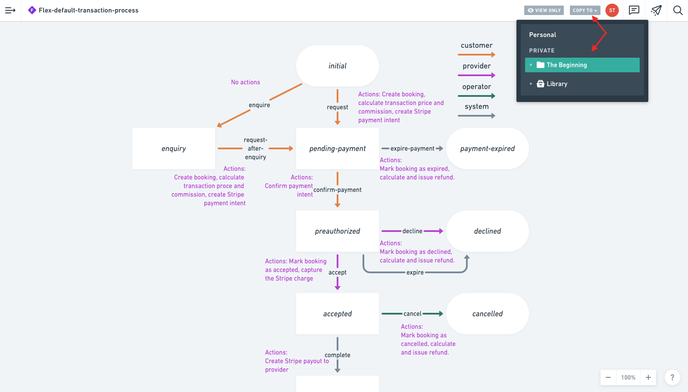

Capturing how your users transact is a critical part of customizing your
marketplace. Sharetribe uses a feature called the transaction process to
implement the steps your users take when they interact on your
marketplace.

Even if you’re not the one developing your marketplace, you still have
work to do. First, you must design how you want transactions on your
marketplace to happen. Second, you must communicate this to your
developer so they can get building.

Understanding how the transaction process works will help you be on the
same page with your developer on what and how to build.

This article continues the general overview of the transaction process
offered [here](/concepts/transaction-process/) by suggesting a few
principles to keep in mind when designing how your users will transact.

## What to think about in designing your own transaction process

When you’re designing your transaction process, you should be thinking
of how you want your users to interact between each other and with the
platform. Most marketplace transactions contain at least some of the
following elements.

### Forward or reverse flow

Consider whether you want your marketplace to follow a forward flow or a
reverse flow.

In a forward marketplace flow, a provider creates a listing and a
customer responds to that listing by placing an order, such as making a
booking or a purchase. The customer makes the payment, and the provider
receives a payout. The transaction process needs to have one or more
initial transitions defined for the customer, and the customer needs to
initiate the transaction using one of those initial customer
transitions.

In a reverse marketplace flow, a customer creates a listing and a
provider responds to that listing by making an offer, such as suggesting
their service or product. The customer chooses between all provider
offers they have received, and then places an order on the offer of
their choice. The customer makes the payment, and the provider receives
a payout. The transaction process needs to have one or more initial
transitions defined for the provider, and the provider needs to initiate
the transaction using one of those initial provider transitions.

In the Sharetribe transaction engine, both providers and customers can
initiate a transaction – in other words, initiating transitions can be
defined for both providers and customers. This means that you can build
both forward flows and reverse flows on a Sharetribe marketplace.

### Pricing

Consider how the price of a transaction is calculated. Likely, the type
of marketplace you’re building will be a strong determinant to how
prices are determined. A marketplace facilitating daily rentals, for
instance, probably calculates prices based on the length of a booking.

Your pricing may be affected by other factors, such as price variation
based on seasonality, discounts through vouchers, or the addition of a
commission payment.

As you think about pricing, you may find
[our article on setting pricing](https://www.sharetribe.com/academy/how-to-set-pricing-in-your-marketplace/)
in your marketplaces helpful.

### Payments

Payments are a typical component of online marketplaces. Sharetribe
already has an integration with Stripe Connect using Custom Accounts, a
payment gateway specifically designed for marketplaces allowing credit
and debit card payments, commissions and delayed payouts.

Note that Stripe Connect offers these functionalities in only certain
countries; your platform _and_ your providers must be located in
[these supported countries](https://stripe.com/docs/connect/custom-accounts#requirements)
in order to process payments with Stripe. If your marketplace will
process payments, answer how you would like that to happen. Consider
what you would like to happen and when. For instance, if refunds happen
on your marketplace, define at what point customers are eligible to
receive them and when not.

### Bookings or stock

Booking is a process specific to reserving a time slot from a provider’s
availability calendar. If your marketplace includes bookings, then be
sure to outline how they will work. The most important detail to specify
is the time-units used to make reservations: hours, days, weeks, or
something else? You can use bookings for both rentals and services.

If your marketplace is for selling products, you would use stock instead
of bookings to manage how many units each listing has available to be
purchased.

### Shared information

Sometimes, additional information needs to be shared between a customer
and provider during a transaction. Messaging is a common feature in
marketplaces for this reason, and comes included in Sharetribe. Will
that be all your users need to share additional information, or does
your marketplaces require something more?

### Email notifications

You can send email notifications to your customers and providers
throughout a transaction. Specifically, an email can be sent whenever a
transition occurs. Consider what notification emails you want to send,
to whom, and when during a transaction.

### Reviews

Reviews are an important part of most marketplaces. You should think
about the following.

- Can both parties review each other, or is it only customers reviewing
  providers?
- Does a review include both a five star rating and a text description,
  or only one of these?
- What is the time period during which a review can be made?
- When are the reviews published? For example, Sharetribe’s default is a
  "double-blind" process, where reviews are published after both parties
  have submitted their review.

To further think about the user experience on your marketplace in
addition to transactions,
[consult our guide](/design-toolkit/what-are-user-journeys/) on defining
the discovery and listing creating process in your marketplace. You can
see the default user experience provided by the
[Sharetribe Web Template](/template/sharetribe-web-template/) there too.

## Draw it out

It’s time to put the pieces of your marketplace transaction into a
coherent journey. Drawing a graph is the best way to illustrate this
journey.

Start by identifying the various states of a transaction and mapping the
possibilities users have to move through them. You’re trying to show how
customers and providers transact on your platform from start to finish.

Keep it high level, focus on just the states and possible next steps.
Later, you’ll flesh out the details, such as the particular actions each
user can take as part of moving from state to state.

You can draw out your transaction process with a pen and paper or online
using a tool like
[Whimsical](/concepts/change-transaction-process/#start-designing).

## Modify an existing process, if you can

Modifying an existing process is easier than building one from scratch.
Think of a marketplace similar to yours and write down the steps you
completed last time you used the platform. You can also consult this
[article describing several of the most common marketplace](https://www.sharetribe.com/academy/design-booking-flow-service-marketplace/)
transaction processes to find the one most similar to your needs.

Use the example to specify what will happen in your own marketplace.
What steps will be the same? What will be different?

Also, check out some of the default processes in Sharetribe that you can
find in the Build tab of your
[Console](https://console.sharetribe.com/). Using existing processes
always saves development time on configuring your transaction process.

## Remember your marketplace website or app

The transaction process plays out in your web or mobile marketplace
application. Therefore, the steps you outline must be possible for your
users to execute in your user interface. The default transaction
processes have been built in to Sharetribe Web Template. If you want to
add elements to your transaction process, your developer will need to
customize the required pieces in order for your transaction process to
be possible.

You can review everything included in the Sharetribe Web Template by
exploring the test marketplace in your Console. You can refer to this
article to
[review the screens that are part of a transaction](/design-toolkit/your-user-journey-a-guide/#transaction-process).

## Share your transaction process with your developer

If you’re working with a developer to build your marketplace, share the
outlines of how a transaction should happen on your marketplace with
your developer early. Start the conversation about how you want things
to work and what will it take to make it happen. Moreover, discussing is
a great way to crystallize the finer details of your process, such as
when email notifications are sent.

## We’re here to help

Building with a technical solution may be new to you. If you have any
questions or concerns, need some feedback, or something is unclear,
don’t hesitate to reach out to our team at hello@sharetribe.com. We’re
glad to facilitate you building with Sharetribe.

## Start designing

Whimsical is a intuitive and easy to use tool to communicate visually.
You can create, mindmaps, wireframes, and most importantly, flowcharts
to communicate your transaction process clearly to your developers.

We have a transaction process flowchart template that you can leverage
to design your own transaction process or processes. It is quite simple
to use and super intuitive.

Follow these steps:

1. Go
   [to this address](https://whimsical.com/flex-default-transaction-process-GDRUyuF7M5nMSte6rfwNuc)
2. Sign in to your Whimsical account or create an account if you don't
   have one.
3. On the top right, click on "COPY TO" and select your private folder
4. That's it! You can now start designing your own transaction process

