# Negotiation process overview

One of the default Sharetribe transaction processes includes price
negotiation dynamics. The same process enables both forward and reverse
transaction flows.

### **Forward transaction flow**

A forward transaction flow is another name for a traditional marketplace
transaction flow. This happens on a marketplace when the provider posts
a listing and customers can initiate a transaction against that listing.

A transaction process supports the forward (or regular) flow when it has
one or more initial transitions defined for the customer. When a
transaction is initiated using a customer transition, it follows a
forward transaction flow.

The default negotiation process has one initial transition defined for a
customer:

```clj
  {:name :transition/request-quote,
   :to :state/quote-requested,
   :actor :actor.role/customer,
   :actions [{:name :action/update-protected-data}]}
```

### **Reverse transaction flow**

A reverse transaction flow on a marketplace happens when the customer
posts a listing and providers can initiate a transaction against that
listing. This means that the initiating transition for the transaction
is made by the provider.

A transaction process supports the reverse flow when it has one or more
initial transitions defined for the provider. When a transaction is
initiated using a provider transition, it follows a reverse transaction
flow.

The default negotiation process has two initial transitions defined for
a provider: _transition/make-offer_ and _transition/inquire_:

```clj
  {:name :transition/make-offer,
   :to :state/offer-pending,
   :actor :actor.role/provider,
   :actions
   [{:name :action/privileged-set-line-items}
    {:name :action/update-protected-data}
    {:name :action/privileged-update-metadata}],
   :privileged? true}
  {:name :transition/inquire,
   :to :state/inquiry,
   :actor :actor.role/provider,
   :actions []}
```

<info>

Sharetribe Console supports creating listing types with the reverse
negotiation flow starting in October 2025. The Sharetribe Web Template
supports starting and processing transactions with those listing types
starting with version [XX.XX.XX](TODO).

Adding forward transaction negotiation flow to listing types, or
processing transactions with the forward negotiation process flow, is
not supported in the template or Console as of October 2025.
Implementing support for this part of the negotiation process in your
client application will require custom development.

</info>

In both forward and reverse flows, the provider provides the product or
service in question, and the customer pays for the transaction.

<extrainfo title="No bookings or stock by default">

The _default-negotiation_ process does not include bookings or stock.
You can customize the process to include availability handling or stock
handling in addition to price negotiation. For bookings, we also offer
an example transaction process
[negotiated-booking](https://github.com/sharetribe/example-processes/blob/master/README.md#negotiated-booking)
– it is not supported by default in the Sharetribe Web Template, so you
will need to build a client-side implementation.

</extrainfo>

The default negotiation process is best suited for use cases where the
customer and provider negotiate both the scope and the price of the
transaction, such as a custom built item or a complex project.

The negotiation process has four main phases:

1. Transaction initiation
2. Price negotiation loop
3. Change request loop
4. Reviews

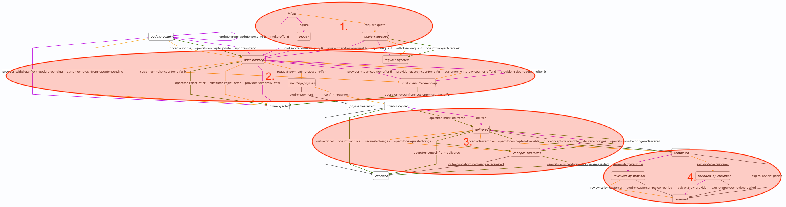

In addition to transitions that process in a linear manner, it is also
possible to build loops in a process. A loop in a transaction process
means that the same state may be entered multiple times. Loops make it
possible for the participants to go back and forth in the process, or
for either participant to take the same action multiple times.

The default-negotiation process has two main loops: the
[price negotiation loop](#price-negotiation-loop) and the
[change request loop](#change-request-loop).

In addition, the price negotiation loop contains a sub-loop where a
provider can update their offer multiple times before the customer has
accepted it.

<info>

With all transaction process loops, including the ones in this process,
it is important to keep in mind that a single transaction can only have
a maximum of 100 transitions. This means that any implementation you
create must make sure that you restrict looping transitions after a
certain threshold, because your users should always have enough
transition quota left to finish the transaction.

The Sharetribe Web Template default implementation for the reverse
negotiation flow [takes this limitation into account](TODO). It prevents
the customer from making counter offers after 50 transitions, and from
requesting changes to the order after 90 transitions. You can change
these thresholds with custom development.

</info>

## Transaction initiation

First, either the customer or the provider initiates the transaction.
Transaction initiation does not have looping logic.

In a forward flow, a customer can start the transaction against the
provider's listing by requesting a quote. The provider can then make an
offer from the request, and making an offer
[adds line items](/references/transaction-process-actions/#actionprivileged-set-line-items)
to the transaction. Alternatively, the provider (or operator) can reject
the quote request. The customer can also withdraw their own quote
request.

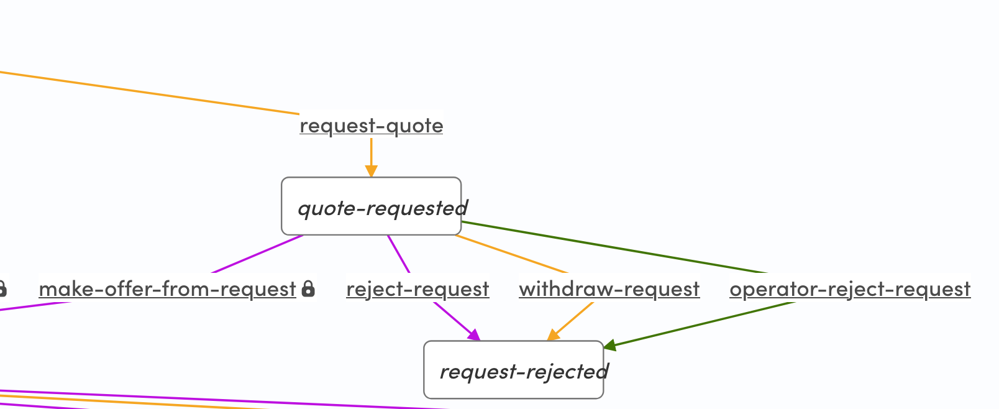

<info>

In the transaction process graphs in this article and in Console, orange
arrows show transitions defined for the customer, and purple arrows show
transitions defined for the provider. Green arrows show transitions
defined for the operator, and grey arrows show automatic transitions.

</info>

In a reverse flow, a provider can start the transaction against the
customer's listing in two ways:

- the provider can inquire, which does not add line items to the
  transaction
- or the provider can make an offer, which does add line items to the
  transaction.

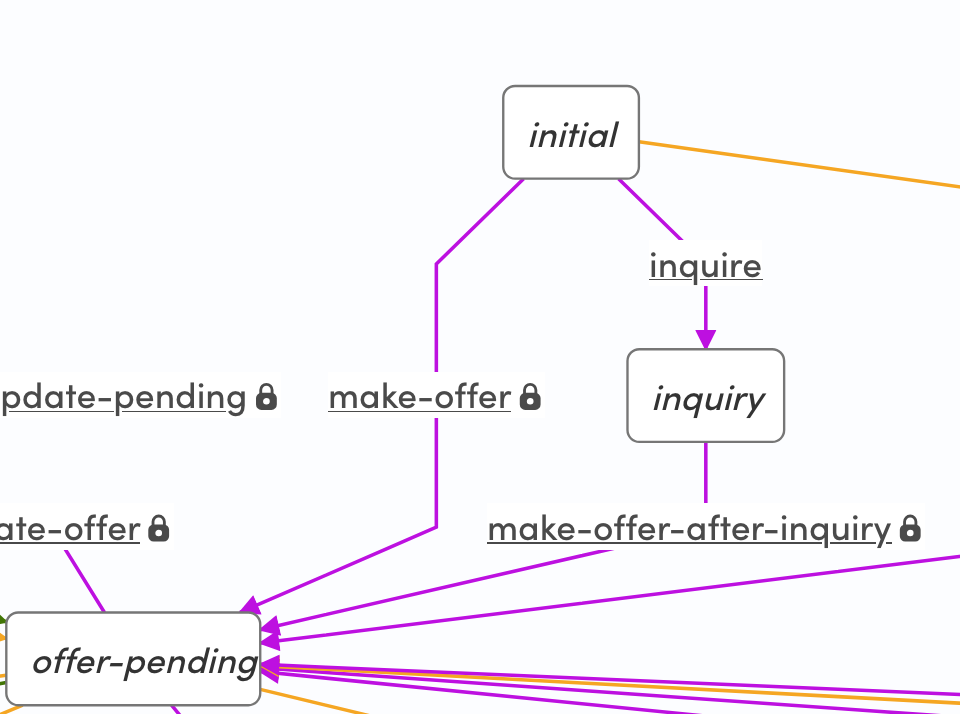

## Price negotiation loop

After the transaction has been initiated and the provider has made an
offer, the negotiation phase loops between two states:

- _state/offer-pending_
- _state/customer-offer-pending_


From _state/offer-pending_, there are multiple paths for both the
customer and the provider.

<info>

Even though technically the parties can use the looping transitions to
negotiate the price, in practice we recommend that the participants
exchange messages to land on the offer details. That way, they don't use
up the allowed transaction quota during the price negotiation

</info>

When there is a pending offer from the provider (_state/offer-pending_),
the customer can continue the transaction in two ways: either

- accept the offer and make a payment, which exits the negotiation loop
- or make a counter-offer and suggest new line items for the
  transaction.

The customer or operator can also end the transaction by rejecting the
offer from _state/offer-pending_.

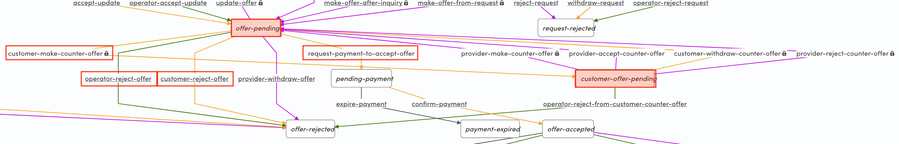

The provider can withdraw or update their offer from
_state/offer-pending_. If the provider updates their offer, the
transaction goes to _state/update-pending_. From this state, the
provider can re-update their offer or withdraw it.


The customer can either accept the update or reject the new offer from
_state/update-pending_. The operator can also accept an update to the
offer. Accepting the offer transitions the transaction back to
_state/offer-pending_ and the main price negotiation loop.

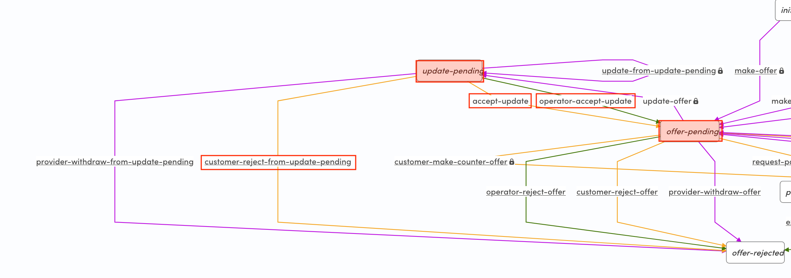

If a customer makes a counter offer from _state/offer-pending_ and moves
the transaction to _state/customer-offer-pending_, the provider can
continue the transaction in three ways, all of which transition the
transaction back to _state/offer-pending_:

- they can make a new counter offer
- they can accept the customer's counter offer
- or they can reject the customer's counter offer

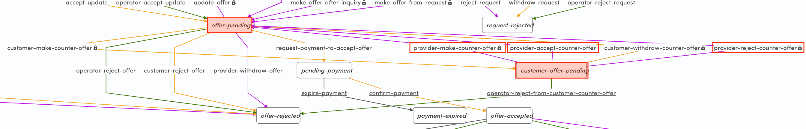

The customer can withdraw their counter offer, which also transitions
the transaction back to _state/offer-pending_. The only way to end the
transaction from _state/customer-offer-pending_ is the operator
transition _operator-reject-from-customer-counter-offer_

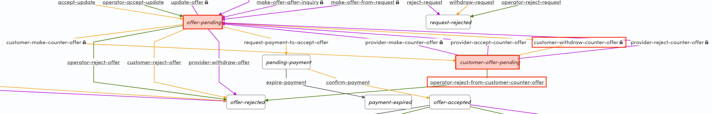

When the customer and provider are both happy with the offer, the
customer can initiate payment with the current line items set for the
transaction. Once the payment has been confirmed, the transaction moves
to the second main loop, which is the change request loop.

## Change request loop

After the payment step, the transaction now moves forward into the
delivery and change request phase.

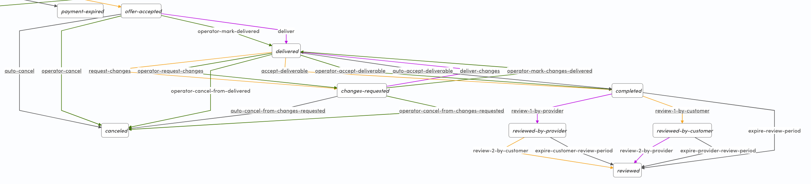

When the provider delivers the end result of the project, or the
operator marks the end result delivered, the transaction transitions to
_state/delivered_.

The transaction can now loop between two states:

- _state/delivered_
- _state/changes-requested_

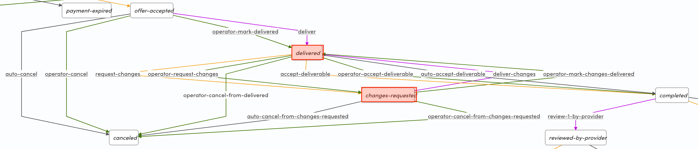

The customer and operator can now

- accept the deliverable, and transition the transaction to
  _state/completed_
- or they can request changes by transitioning the transaction to
  _state/changes-requested_

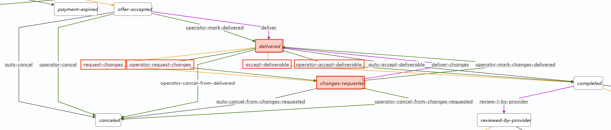

The details of the change request will need to be discussed in messages,
since the change request transition does not have any actions to store
the change request information.

Once changes have been requested, the provider has only one transition
available – to deliver the changes and transition the transaction back
to _state/delivered_.

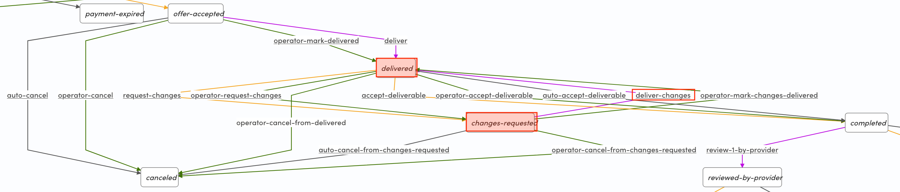

In addition, there are multiple operator transitions and automatic
transitions at play.

- If the provider doesn't deliver the end result in 75 days from the
  payment, the transaction is automatically canceled with _auto-cancel_.
  The operator can also manually cancel the transaction before the end
  result is delivered with _operator-cancel_. This ends the transaction.
- Once the end result has been marked as delivered, the operator can
  cancel the transition with _operator-cancel-from-delivered_.
- Once a customer has requested changes, the operator can cancel the
  transaction with _operator-cancel-from-changes-requested_. If the
  change request is still pending in 75 days from the payment, the
  transaction is automatically canceled with
  _auto-cancel-from-changes-requested_.

All of these paths transition the transaction to _state/canceled_

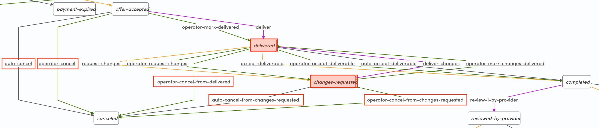

If the customer doesn't request changes, and the transaction has
remained in _state/delivered_ for 14 days, the transaction automatically
transitions to _state/completed_.

## Reviews

After the transaction is in _state/completed_, the participants can then
review each other similarly to other transaction processes. The review
phase does not have looping logic.

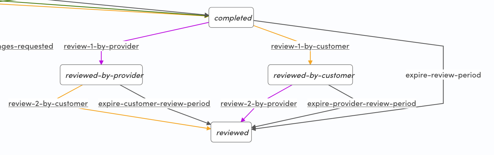

Both parties are invited to post a review once the transaction
completes. Whoever posts their review first, the other participant is
notified that they still need to post their review. Reviews are only
published once both parties have posted their review, or once the review
period expires and the participants can no longer submit a review.
