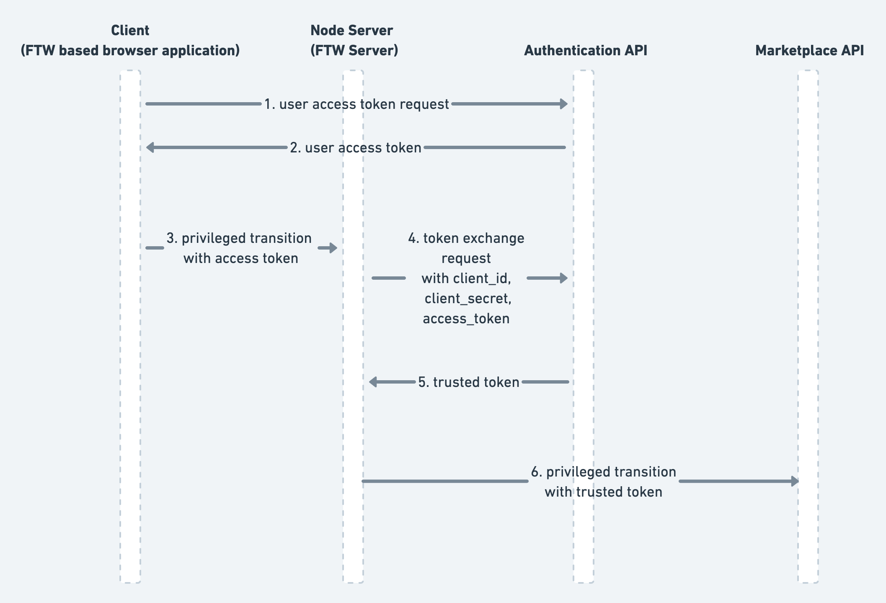

## What are privileged transitions?

In Sharetribe, a process transition is an edge between two states in the
transaction process graph. Invoking transitions is guarded in the
process definition by tying them to a specific state when they can be
transitioned and by defining who can perform the transition. This way
transition requests have built-in validation of who can invoke them and
in what state of the transaction flow.

<plan tier="launch">

Live transactions are available in the Launch plan and above.

</plan>

However, there are moments when more control is required on who can
initiate a transition and especially with what kind of parameters. Take
discounts on pricing by leveraging discount coupons managed by a 3rd
party service for example. A coupon code can be validated in the client
side by invoking the coupon service but this will not limit who will be
technically able to invoke a pricing related transition with discounted
price parameters.

This is where privileged transitions come into play. They are
transaction process transitions that can be invoked only from a trusted
context. In other words, this means that you can build your own server
side validation that sits between your marketplace UI and the Sharetribe
Marketplace API. In the discount coupon example, this means that the
discount coupon that a user has can be passed as a parameter in the
transition request. Server side transition request validation can invoke
a 3rd party service to verify a discount code, update pricing parameters
accordingly, and pass those to the transition that has pricing actions
tied to it.

## How do privileged transitions work?

Standard authenticated Marketplace API requests require a valid access
token obtained from the Authentication API. Privileged transitions
differ here by requiring a special kind of _trusted_ token to
authenticate properly. A trusted token can be obtained by exchanging a
valid access token to a trusted one in the Authentication API by
providing a client secret. The client secret is not to be exposed
publicly, securing that privileged transitions can only be invoked by a
trusted source, i.e. your own backend implementation.



The client secret is tied to a Marketplace API
[application](/concepts/applications/). When exchanging an access token
to a trusted one, the client secret needs to be from the same
application as the client ID that was used to obtain the access token.

Remember to never expose the client secret publicly. Doing so would
enable full control over requests that invoke privileged transitions.

## How to use a privileged transition

A privileged transition is defined by setting a `privileged?` attribute
to `true` for the given transition in a transaction process as follows:

```
{:name :transition/request-payment
 :actor :actor.role/customer
 :actions [{:name :action/create-pending-booking}
           {:name :action/privileged-set-line-items}
           {:name :action/stripe-create-payment-intent}]
 :to :state/pending-payment
 :privileged? true}
```

Privileged transitions are configured just like a normal transitions.
However, what's special about privileged transitions is that, unlike
normal transitions, they can contain _privileged actions_. Privileged
actions validate that they are always used in a _trusted context_ and
usually handle sensitive information. An example of such action is
[privileged-set-line-items](/references/transaction-process-actions/#actionprivileged-set-line-items)
which allows full control over the price of a transaction, including the
commission.

## Operator transitions in the Integration API

The Integration API
[makes it possible to invoke transitions](https://www.sharetribe.com/api-reference/integration.html#transition-transaction)
for which the `:actor` is set to `:actor.role/operator`.

<plan tier="extend" feature="Integration API access">
</plan>

As the Integration API authentication requires knowledge of the
integration application's client secret and is meant to be used only
from your own backend implementation, it is considered a trusted source
for invoking transitions. As a consequence, the operator transitions can
utilize any privileged actions. For instance,
[privileged-update-metadata](/references/transaction-process-actions/#actionprivileged-update-metadata)
action can be used to update the transaction's metadata.
