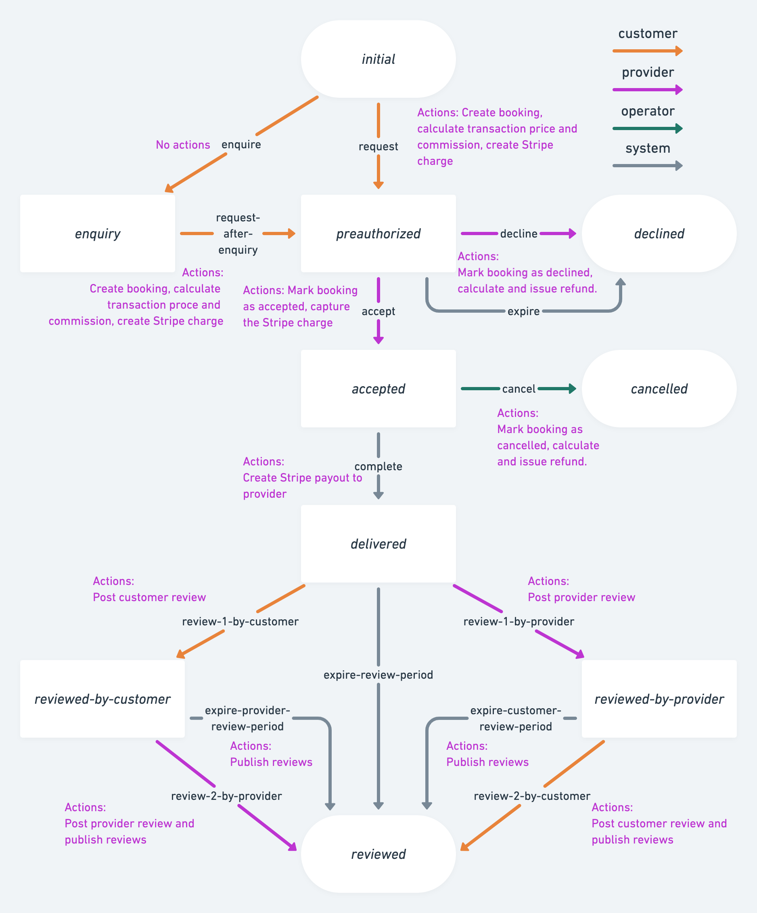

## What is a transaction process?

Your marketplace's transaction process (or order flow) defines how the
different parties in your marketplace (customers and providers) interact
to create value (typically this means the process of placing and
completing an order). A transaction process defines the possible
interactions between the customer and the provider (for instance, making
a booking request, accepting it, and leaving a review afterwards) and
outcomes that the transaction can have (for instance, a successful,
rejected, or a cancelled order). Your marketplace can have multiple
different transaction processes in use simultaneously. You can see the
transaction processes of your marketplace on
[Console](https://flex-console.sharetribe.com/transaction-processes).

In addition to the steps in the order flow, a transaction process also
describes notifications related to it. These include an invoice sent to
the customer after they've made a payment, or a notification sent to the
provider when there's a new booking.

Typically, all transaction processes are different. These differences
can be fundamental and change the logic of the order flow, or they can
be small and superficial.

An example of a fundamental difference is choosing whether the users
book by night or by day (booking a hotel room), by seat (booking tickets
to an event), by hour (booking a hairdresser), or not at all (booking is
handled outside the marketplace).

A smaller variation could be, for example, deciding if the provider has
to always accept the booking before it can be confirmed or if the
booking is automatically confirmed as soon as it is made (i.e. instant
booking), or a change of wording in a notification email sent to remind
the customer of their upcoming booking.

## Sharetribe Flex default transaction process

The Sharetribe Flex transaction engine allows each marketplace to define
its own transaction processes within certain platform-supported
boundaries. A transaction process consists of a set of _transitions_
between a set of _states_ and a list of _notifications_.

_Transitions_ define what happens at each step of the process as a list
of _actions_ (e.g. create booking, calculate transaction price, create
charge or payout, post a review or make a refund, etc). Each action
within a transition may or may not have certain parameters that need to
be provided for each action (e.g. what is the commission percentage of
the platform). Each action also has an actor i.e. the role who can
perform the given transition - the customer, the provider, the operator,
or the platform itself in case of delayed transitions. For the first
three actors, the transition is triggered by their activity in Flex.
Delayed transitions can be scheduled by
[time expressions](/references/transaction-process-format/#time-expressions-and-delayed-transitions).
However, only one delayed transition can be triggered from each state.

_States_ define the next possible transitions.

_Notifications_ specify which emails are sent out to transacting parties
at each step of the transaction process. Notifications can be sent
immediately after a transition occurs, or be scheduled for sending at a
specific time during the process. The email templates used for the
notifications are also considered part of the transaction process, and
can be fully customised to fit the needs of the marketplace.

Like delayed transitions, notifications can be scheduled for a specific
time in the transaction process. The time can be specified relative to
when a transition occurred or to some of the fixed times in the
transaction process, such as the start and end times of the booking
period. For example, it's possible to express times like "6 days after
'request'", "1 day and 12 hours before the booking start time" or "the
earliest of the booking start time and 3 days after 'request'". It is
good to note that if the process moves successfully on to a subsequent
transition, any scheduled notifications still pending get cleared.

The default transaction process for Flex marketplaces is visualized in
the graph above. In this flow, the user can either start with a booking
request or send the provider an enquiry, after which they can continue
with a booking request. After receiving a booking request, the provider
has to either accept or decline the request. If they accept, the credit
card of the customer is charged and the payment is held by the
marketplace. If the provider doesn’t do either one, the request expires
after a period of time. When the request has been accepted, it is still
possible for the provider to cancel the booking, in which case the
payment is refunded to the customer. If this doesn’t happen, the booking
will automatically move to state “delivered” after the booking period
ends. At this point, the provider will receive the money to their bank
account, after the commission of the marketplace is deducted. When the
booking has been completed, both the customer and the provider can
_review_ each other.

## What kind of transaction process customizations are possible?

As all marketplaces’ have their own characteristics, it is common to
need some customization to the default transaction process to make it
more suitable to the customers’ needs.

However, quite often it's helpful to start building your process by
making slight customizations to the default process. Typical minor
customizations for transaction process are adding the possibility for a
customer to cancel a booking or a booking request, changing the
marketplace commission percentage or editing the contents of the email
templates used for the notifications.

Another common example is to modify the process so that the provider has
to manually mark the booking as completed and the rented goods as
returned in good condition. This might be useful in rental marketplaces
where the goods that are rented are of high value. In another case, the
process could be modified so that the operator can close down the
transaction process in case that there is trouble in the order flow.
This could be done for example in cases where a customer has booked a
time from a professional, but doesn’t appear in the meeting.

Apart from the order flow, customizations can also affect the money
flow, storing
[protected data](/references/extended-data/#protected-data) or sending
notifications.

## How to change your transaction process

To customise the transaction processes of your marketplace, you can use
Flex CLI (Command-line interface). To get up and running with the tool,
see the
[Getting started with Flex CLI](/introduction/getting-started-with-flex-cli/)
tutorial. For more details of the transaction process format, see the
[Transaction process format](/references/transaction-process-format/)
reference. To customise the UI of your marketplace to match your process
changes, see the
[Change transaction process setup in FTW](/how-to/change-transaction-process-in-ftw/)
cookbook.
