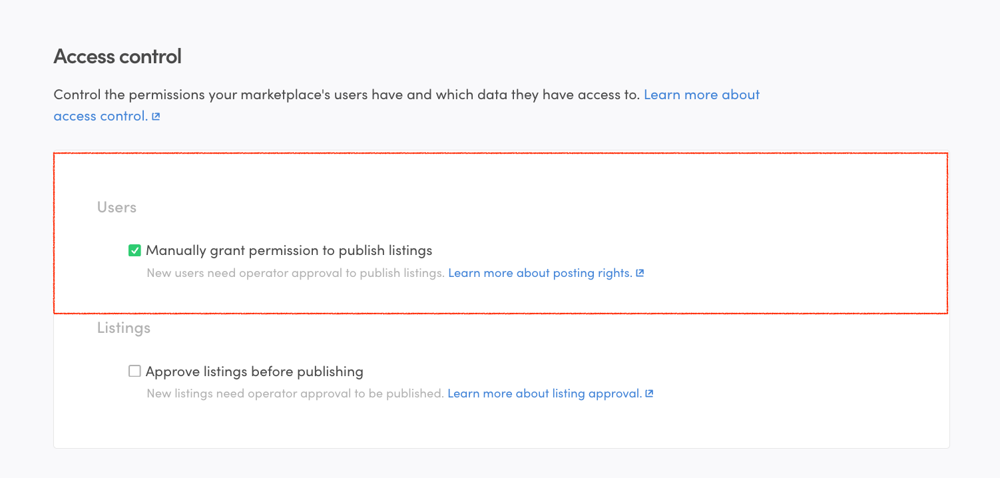
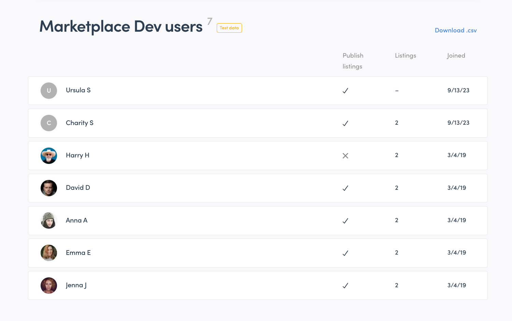
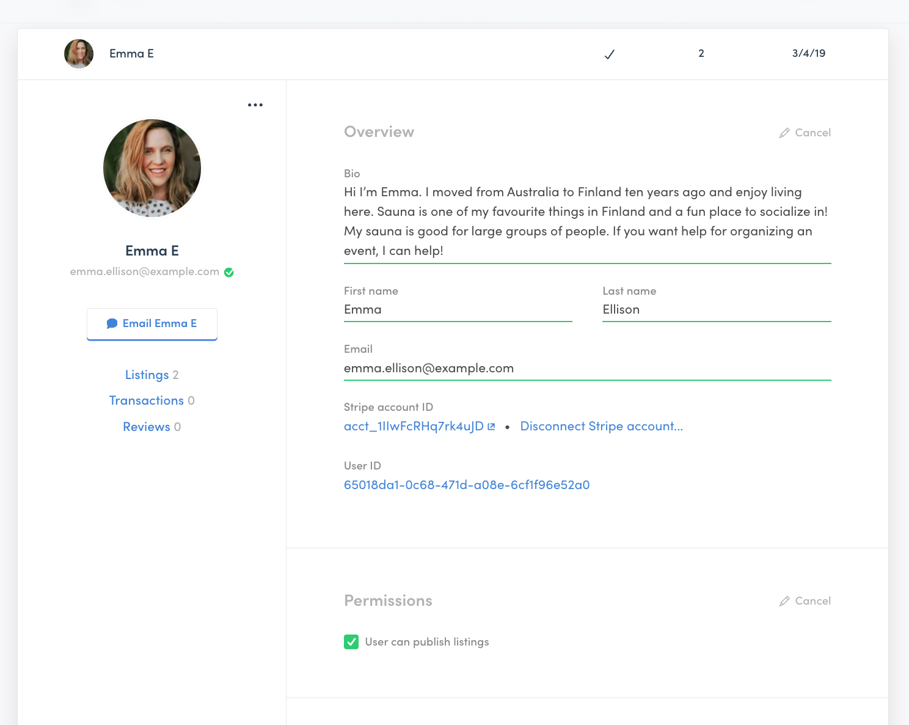

By default, all users in a Sharetribe marketplace have the same
permissions to join, post listings, and start transactions. However, you
can modify some of these permissions in Console, under the "Access
control" tab.

## Manually grant permission to publish listings

You might want to limit listing publishing rights to certain users only.
For example, if you have user types "Buyer" and "Seller", you might want
to grant listing publishing rights to sellers only. Or you might be
monetizing your marketplace with subscriptions, and therefore you only
want to grant publishing rights to users who have subscribed.

On the marketplace level, you can toggle the selection in the Access
control tab.

Once this checkbox is selected, you can see the permission status of
each user in the Console's Manage > Users view. A checkmark indicates
permission to post, a cross indicates that the user does not have
permissions to post listings.

You can grant or revoke publishing rights for an individual user in
their user details. Click the "Edit" link next to the "Permissions"
heading.

Now, you can check or uncheck the permissions checkbox for this user.

## Permissions in the currentUser resource

Permissions show up in the _currentUser_ resource in two ways:

- _currentUser_ has an attribute _permissions_, which contains the
  user-level permission setting

- _currentUser_ also has a related resource _effectivePermissionSet_,
  which contains the user's permissions based on the user level and
  marketplace level settings. You will need to explicitly
  [include this related resource](https://www.sharetribe.com/api-reference/#including-related-resources)
  in your _currentUser.show()_ API call to fetch it from the API.

This is an important distinction, because the
_currentUser.attributes.permissions_ value might be different from the
_effectivePermissionSet_ value.

For this reason, you should always use the _effectivePermissionSet_
value to determine the user's access in custom code, because it takes
into account both user-level and marketplace-level permissions.

Consider this example:

- A marketplace has enforced manual permission to publish listings
- User A has had their publishing rights revoked. Both their
  _attributes.permission_ value and their _effectivePermissionSet_ value
  for _postListings_ are _"permission/deny"_.
- Marketplace operator has a campaign where they want to grant all users
  posting rights for 24 hours, and they deselect the checkbox for
  requiring manual permission to publish listings.

Now, the _attributes.permission_ value for _postListings_ is still
_"permission/deny"_, because it persists on the user's profile.

The _effectivePermissionSet_ value for _postListings_, however, is
_"permission/allow"_, because now the marketplace level restriction has
been lifted. The marketplace level setting overrides the user level
setting.

