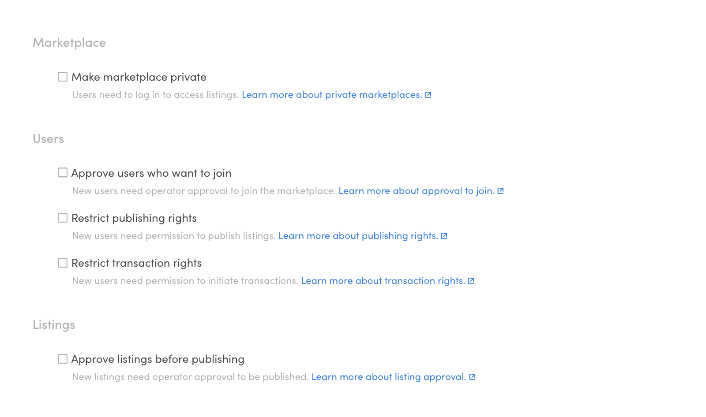
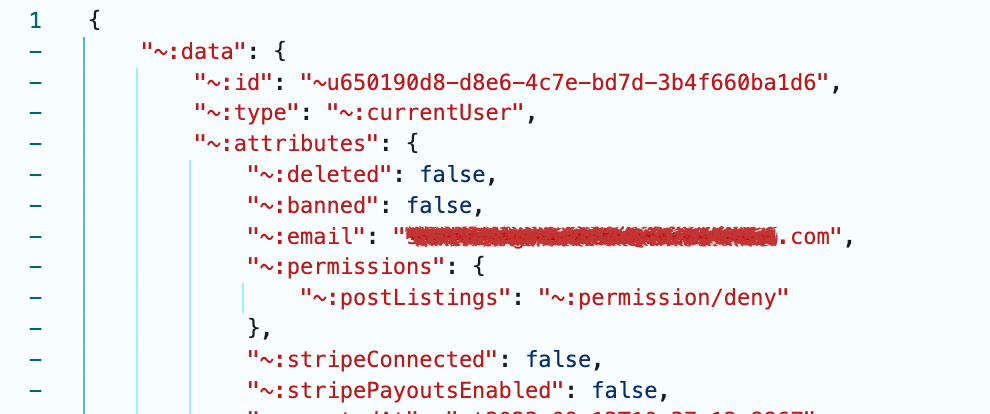
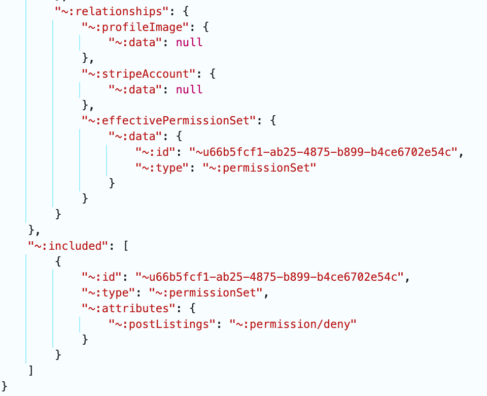
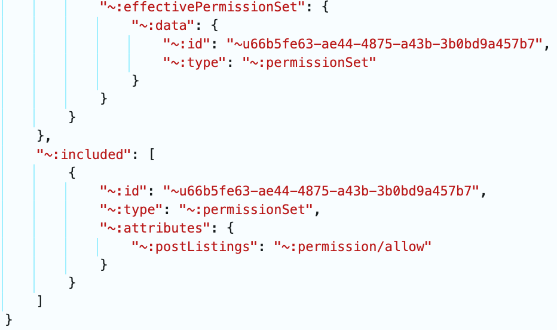

By default, all users in a Sharetribe marketplace have the same
permissions to join, post listings, and start transactions. However, you
can modify some of these permissions in Console, under the "Access
control" tab.



Access control features can be toggled on or off on the marketplace
level, and some permissions can also be modified per user. Certain
access control settings may also enforce authorization in certain API
endpoints.

When an operator makes a user-level change to a single user's
permissions, it triggers a _user/updated_ event that you can listen to
with Integration API. However, when an operator toggles a feature on or
off on the marketplace level, no event is triggered, even though the
effective permissions may change for some users.

## Make marketplace private

By default, Sharetribe marketplaces are public. This means that listings
and user profiles are visible to unauthenticated users. By making your
marketplace private, you allow only authenticated users to view listings
and users on your marketplace.

On a private marketplace, the only public Marketplace API endpoints are
user creation and password reset related. All other endpoints require an
authenticated user access token.

This setting can be turned on or off on the marketplace level.

See which endpoints are affected by this setting
[here](#making-marketplace-private).

Read more about this feature in the
[Help Center](https://www.sharetribe.com/help/en/articles/9503164-make-marketplace-private).

## Approve users who want to join

User approval means that when a user signs up, they need to be approved
by an admin before they have full access to the marketplace.

On **public marketplaces**, this means that users pending approval can
view listings and other users' profiles, but they cannot post listings
or initiate transactions.

On **private marketplaces**, users pending approval can only view their
own profile – they cannot view any other marketplace data.

You can enable this setting in the Access Control tab.

See which endpoints are affected by this setting
[here](#approve-users-who-want-to-join-1).

Read more about this feature in the
[Help Center](https://www.sharetribe.com/help/en/articles/9503152-approve-users-who-want-to-join).

## Restrict listing publishing rights

You might also want to limit listing publishing rights to certain users
only. For example, if you have user types "Buyer" and "Seller", you
might want to grant listing publishing rights to sellers only. Or you
might be monetizing your marketplace with subscriptions, and therefore
you only want to grant publishing rights to users who have subscribed.

On the marketplace level, you can toggle the selection in the Access
control tab.

See which endpoints are affected by this setting
[here](#restrict-publishing-rights).

Read more about this feature in the
[Help Center](https://www.sharetribe.com/help/en/articles/9503118-restrict-listing-publishing-rights).

## Restrict transaction rights

You might also want to restrict the ability to initiate transactions to
specific users only. For example, if you have a marketplace where users
can view listings but need to verify their identity before making
purchases, you can enable this feature to manually control who can
initiate transactions. Similarly, if your platform uses a subscription
model, you may want to allow only paying users to start transactions. In
some cases, you may run a marketplace that functions primarily as a
showroom, where users can browse but cannot buy until the operator
grants them permission.

You can toggle the setting in the Access control tab.

Once this checkbox is selected, similarly to how publishing rights are
granted, you can see the permission status of each user in the Console's
Manage > Users view.

See which endpoints are affected by this setting
[here](#restrict-transaction-rights-1).

Read more about this feature in the
[Help Center](https://www.sharetribe.com/help/en/articles/9790336).

## API level restrictions

Toggling permissions under the "Access Control" tab in the Console
directly impacts API behavior. When permissions are modified, endpoint
access is adjusted accordingly, ensuring that users cannot bypass the
restrictions imposed by these settings. This guarantees access control
policies are strictly enforced.

These restrictions only apply in the Marketplace API. Marketplace
end-users never access the Integration API directly, so Integration API
endpoints don't need to be similarly restricted. However, if you create
an integration where marketplace users indirectly utilize the
Integration API (e.g. proxying calls via the server), you'll need to
enforce restrictions based on the currentUser's effectivePermissionSet.
This might also be relevant if you have more complex customizations in
place that utilize the Integration API, e.g., you're allowing users to
post listings on behalf of other users using the Integration API.

### Making marketplace private

Toggling this setting in Console requires users to log in to access
listings.

Making the marketplace private from Console will restrict the following
endpoints:

- `GET /users/show`
- `GET /listings/query`
- `GET /listings/show`
- `GET /timeslots/query`
- `GET /reviews/query`
- `GET /reviews/show`
- `GET /sitemap_data/query_listings`

When this setting is toggeld, these endpoints will return a 403
Forbidden response, indicating that access is denied due to the
marketplace's private status.

### Approve users who want to join

Toggling this setting in Console will require users to be approved by an
operator to join the marketplace.

This will restrict the following endpoints:

Listings:

- `POST /own_listings/create`
- `POST /own_listings/create_draft`
- `POST /own_listings/publish_draft`
- `POST /own_listings/discard_draft`
- `POST /own_listings/open`
- `POST /own_listings/close`
- `POST /own_listings/update`
- `POST /own_listings/add_image`

Transactions:

- `POST /transactions/initiate`
- `POST /transactions/initiate_speculative`
- `POST /transactions/transition`
- `POST /transactions/transition_speculative`

Availability exceptions:

- `POST /availability_exceptions/create`
- `POST /availability_exceptions/delete`

Stock adjustments:

- `POST /stock_adjustments/create`
- `POST /stock_adjustments/compare_and_set`

When this setting is toggled, these endpoints will return a 403
Forbidden response, indicating that access is denied because the user
has not been approved.

Note that if the marketplace has been set to private, unapproved users
will be treated the same as non-registered users. See the endpoints that
are restricted in this case [above](#approve-users-who-want-to-join-1).

### Restrict publishing rights

Toggling this setting in the Console allows you to manually select which
users can publish listings.

- `POST /own_listings/create_draft`
- `POST /own_listings/publish_draft`
- `POST /own_listings/create`
- `POST /own_listings/open`

These endpoints will return a 403 Forbidden response if the user does
not have publishing rights.

### Restrict transaction rights

Toggling this setting in Console allows you to manually select which
users can initiate transactions.

When transaction rights have been revoked for a marketplace user, the
following Marketplace API endpoint will be restricted:

- `POST transactions/initiate`

This endpoint will return a 403 Forbidden response if the user doesn't
have permission to initiate transactions. Note that users can still call
the `transactions/transition` endpoint, allowing them to transition
existing transactions. This can be restricted in the client application;
for example, the web-template prevents users from transitioning existing
transactions that are in the inquiry state.

## Permissions in the access-control.json asset

On the marketplace level, the changes made in Console get recorded in
the asset _/general/access-control.json_.

```json
{
  "id": "66cc804f-b5ee-44f2-8c7e-ca3e950e534f",
  "type": "jsonAsset",
  "attributes": {
    "assetPath": "/general/access-control.json",
    "data": {
      "marketplace": {
        "private": false
      },
      "users": {
        "requireApprovalToJoin": false,
        "requireApprovalToJoinOptions": {
          "callToAction": {
            "type": "internal",
            "text": "Add a link to request approval to join",
            "href": "/p/about/"
          }
        },
        "requirePermissionToPostListings": true,
        "requirePermissionToPostListingsOptions": {
          "callToAction": {
            "type": "none"
          }
        },
        "requirePermissionToInitiateTransactions": false,
        "requirePermissionToInitiateTransactionsOptions": {
          "callToAction": {
            "type": "none"
          }
        }
      },
      "listings": {
        "requireApprovalToPublish": false,
        "requireApprovalToPublishOptions": {
          "callToAction": {
            "type": "none"
          }
        }
      }
    }
  }
}
```

In addition to permission data, the asset contains an options object,
which contains data on a Call To Action button. This feature is
implemented in the template, see the relevant
[PR here](https://github.com/sharetribe/web-template/releases/tag/v5.6.0).

## Permissions in the currentUser resource

Permissions show up in the _currentUser_ resource in two ways:

- _currentUser_ has an attribute _permissions_, which contains the
  user-level permission setting



- _currentUser_ also has a related resource _effectivePermissionSet_,
  which contains the user's permissions based on the user level and
  marketplace level settings. You will need to explicitly
  [include this related resource](https://www.sharetribe.com/api-reference/#including-related-resources)
  in your _currentUser.show()_ API call to fetch it from the API.



This is an important distinction, because the
_currentUser.attributes.permissions_ value might be different from the
_effectivePermissionSet_ value.

For this reason, you should always use the _effectivePermissionSet_
value to determine the user's access in custom code, because it takes
into account both user-level and marketplace-level permissions.

Consider this example:

- A marketplace has enforced manual permission to publish listings
- User A has had their publishing rights revoked. Both their
  _attributes.permission_ value and their _effectivePermissionSet_ value
  for _postListings_ are _"permission/deny"_.
- Marketplace operator has a campaign where they want to grant all users
  posting rights for 24 hours, and they deselect the checkbox for
  requiring manual permission to publish listings.

Now, the _attributes.permission_ value for _postListings_ is still
_"permission/deny"_, because it persists on the user's profile.


The _effectivePermissionSet_ value for _postListings_, however, is
_"permission/allow"_, because now the marketplace level restriction has
been lifted. The marketplace level setting overrides the user level
setting.


