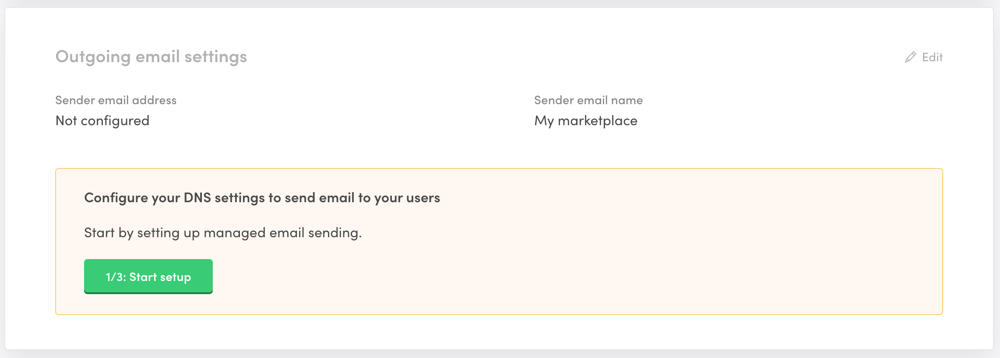
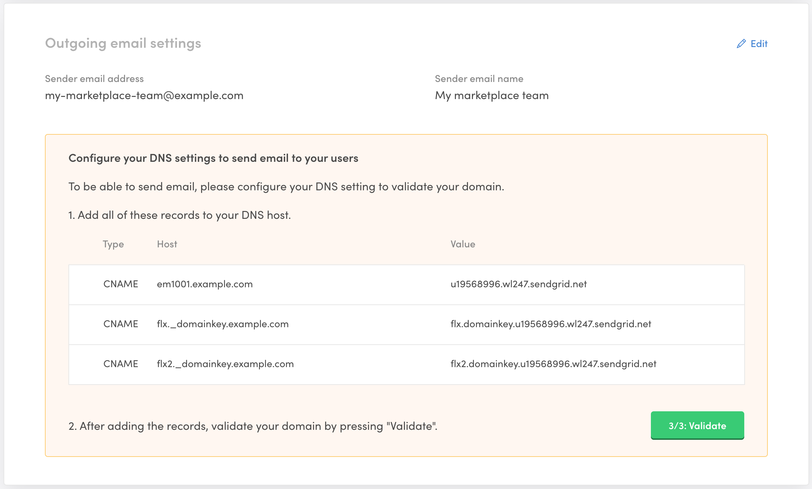

Setting up reliable email delivery is crucial for your marketplace to
work properly. It is also important to brand your email sending name and
address to look professional and polished.

Flex uses [SendGrid](https://sendgrid.com/) as an email service
provider. We manage your SendGrid account and settings automatically,
and the costs are included in your Flex subscription.

When you have your production environment created and you have bought
your custom domain for it, you should set up and validate the outgoing
email settings. Follow the steps below to enable email sending and
increase the chances that your emails will be delivered reliably.

## 1. Add sender name and address

Make sure you select your production environment in the top navigation
in Console. Then head on to the General settings page in the Build
section. You can see the outgoing email settings below the marketplace
information:

Click on the "1/3 Start setup" button to start the setup. Follow the
instructions in the UI.

When you have added your sender email information, you will be prompted
with DNS information:

At this point, we have created a SendGrid subuser for you, stored the
information, and authenticated the given sender domain to SendGrid. This
means that you have allowed this SendGrid subuser to send emails from
this domain.

## 2. Configure DNS

Next, you need to point your DNS entries from your DNS provider to
SendGrid. This is an important step for your sender reputation and your
email deliverability. You should add all the records in the table
visible in Console.

[These DNS provider video tutorials](https://sendgrid.com/docs/ui/account-and-settings/dns-providers/)
by SendGrid might be useful if you are not sure how to configure the DNS
records for your specific DNS provider.

If you still have trouble adding the records, see the SendGrid article
on
[Troubleshooting Sender Authentication](https://sendgrid.com/docs/ui/account-and-settings/troubleshooting-sender-authentication/).

## 3. Validate DNS

When you have configured your DNS, you still need to validate the
records for your emails to work. You can do that by clicking on the "3/3
Validate" button in Console. If everything is set up correctly, you
should see a success message in Console:

Whenever you change your DNS records, you can revalidate to check that
everything is set up correctly.

### Troubleshooting failing validation

Note that when you make changes to your DNS, the changes might take a
while to propagate. SendGrid recommends that you
[give up to 48 hours](https://sendgrid.com/docs/ui/account-and-settings/troubleshooting-sender-authentication/#allow-your-dns-records-to-propagate)
to make sure your latest changes are in use. Some of the records might
propagate faster than others, so be patient.

Some DNS providers append your top-level domain automatically to your
DNS records. For example, if you are using GoDaddy, Amazon Route 53, or
Namecheap, make sure that your domain isn't duplicated in the DNS
entries. For more information see
[the tip at the end of this section](https://sendgrid.com/docs/ui/account-and-settings/how-to-set-up-domain-authentication/#before-you-begin)
in the SendGrid documentation.

For more information, see SendGrid's
[Troubleshooting Sender Authentication](https://sendgrid.com/docs/ui/account-and-settings/troubleshooting-sender-authentication/)
documentation.

## Summary

In this article, we went through the setup to configure a custom email
address for your production marketplace. It is important to get all the
steps done and validated to ensure that emails are working reliably.

If you have any questions or need a more advanced setup, you can
[contact Sharetribe support](mailto:flex-support@sharetribe.com) and we
are happy to help you.
