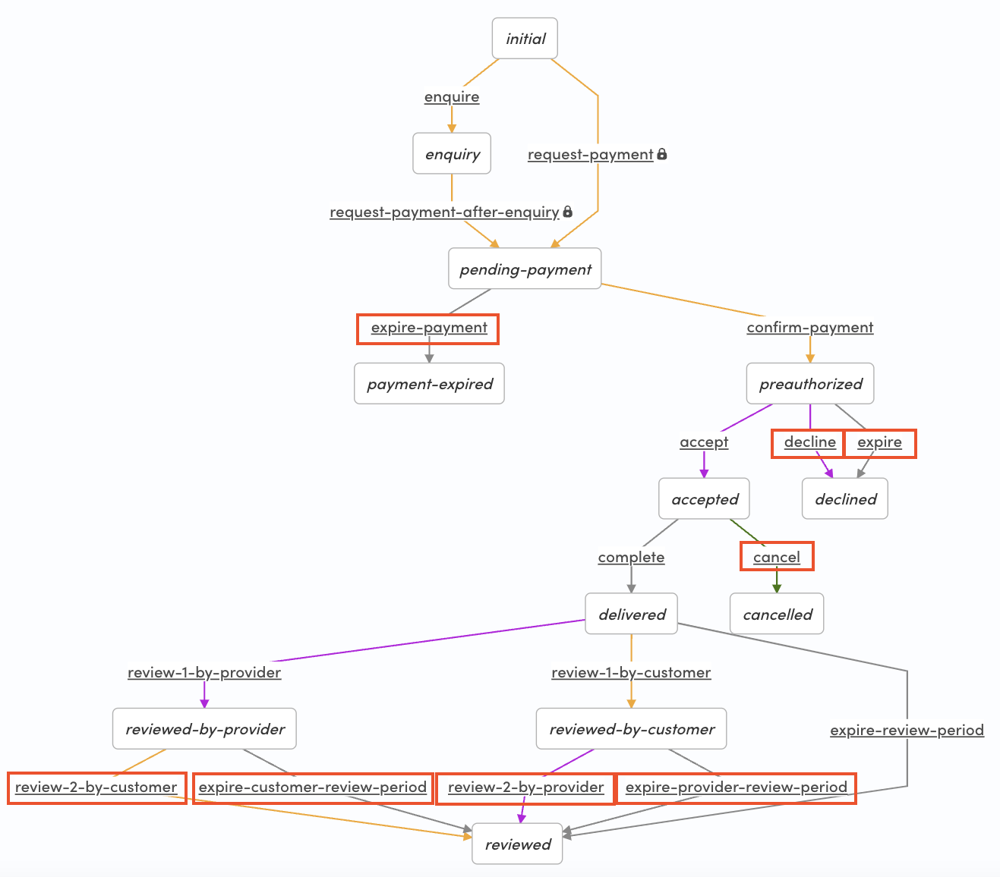
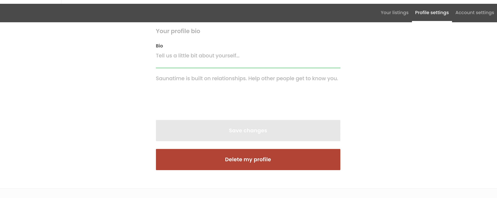
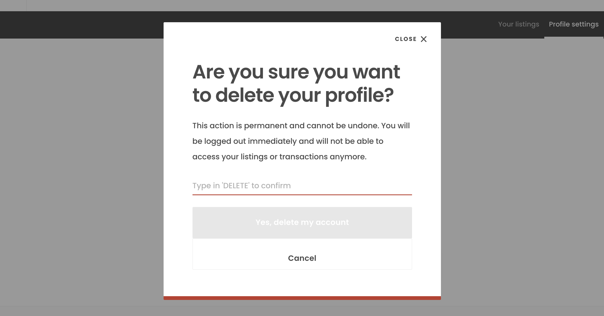
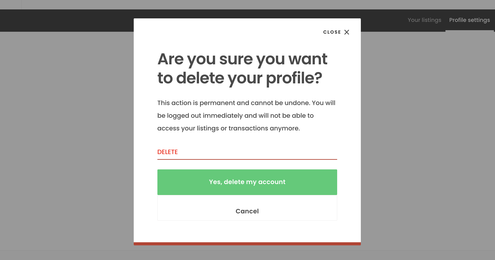
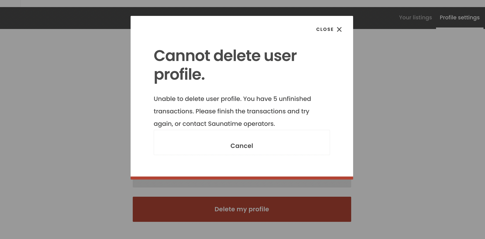

Starting from XXXX-XX, Sharetribe Flex Marketplace API has an endpoint
for deleting a user profile. You can find the documentation for the
endpoint in
[here (TODO: FIX ANCHOR TEXT AND LINK)](https://www.sharetribe.com/api-reference/changelog.html).
After the user has been deleted, any transactions where they are a
participant cannot transition forward, and no payouts will be made to
the user even if they are already scheduled.

This cookbook guides you in implementing a profile delete feature in the
FTW template Profile settings page. When the signed-in user clicks the
delete button, a modal opens where the user needs to confirm that they
do want to delete their account. An endpoint in the FTW server then gets
called, and the endpoint uses Integration API to check whether the user
has incomplete transactions.

Depending on the result the endpoint either returns the count of
incomplete transactions, or deletes the user's account through
Marketplace API. If the user cannot be deleted, the modal shows the
count of unfinished transactions, and if the user is deleted, they are
immediately logged out. TODO: CHECK WHETHER STILL APPLIES!

This cookbook is based on the FTW-daily template and
`flex-default-process`. As you implement the cookbook, you will need to
review the transaction processes used on your marketplace to see which
transitions count as last transitions i.e. ones that lead to a state
that has no further transitions.



In addition to final transitions, your marketplace transaction processes
may have payout considerations. If your transaction process uses the
default Stripe integration including payouts, it may take up to 7 days
from `stripe-confirm-payment-intent` action until the payout is
processed by Stripe, even if `stripe-create-payout` is called and the
payout has been scheduled.

In other words, if your transaction processes create a provider payout
close to the payment intent being confirmed, you may want to prevent
users from deleting their profile before 7 days have passed from payment
intent being confirmed. You can of course handle payouts manually for
deleted users, if the transactions have otherwise been completed.

## Add UI components

### Add "Delete my profile" button

To start off, we want to add a button to ProfileSettingsPage.js. that
opens a modal with the deletion UI.

```shell
└── src
    └── containers
         └── ProfileSettingsPage
              └── ProfileSettingsPage.js
          ...
```

First, import the component and add it to the page.

```diff
// Import the button component
import {
  Page,
  UserNav,
  LayoutSingleColumn,
  LayoutWrapperTopbar,
  LayoutWrapperMain,
  LayoutWrapperFooter,
  Footer,
  NamedLink,
+  Button
} from '../../components';

...

// Add component state and a function for opening the deletion modal
export class ProfileSettingsPageComponent extends Component {
+  constructor(props){
+    super(props);
+
+    this.state = {
+      deleteModalOpen: false,
+    };
+
+    this.handleModalOpen = this.handleModalOpen.bind(this);
+  }
+
+  handleModalOpen(){
+    this.setState({ deleteModalOpen: true });
+  }
+
  render() {

...

// Add the button component under the rest of the profile settings
  <LayoutWrapperMain>
    <div className={css.content}>
      <div className={css.headingContainer}>
      ...
      </div>
      {profileSettingsForm}
+      <Button
+        className={css.deleteButton}
+        onClick={this.handleModalOpen}
+      >
+        <FormattedMessage id="ProfileSettingsPage.deleteProfile"/>
+      </Button>
    </div>
  </LayoutWrapperMain>

```

Then, add a class for the button into the corresponding .css file.

```shell
└── src
    └── containers
         └── ProfileSettingsPage
              └── ProfileSettingsPage.module.css
          ...
```

```diff
+.deleteButton{
+  margin-top: 24px;
+}
+
```

Finally, we want to add the button text to the translation file.

```shell
└── src
    └── translations
        └── en.json
```

```diff
+  "ProfileSettingsPage.deleteProfile": "Delete my profile",
```

You can now see the button on the profile settings page.



### Add modal component

Next, we want to add the modal component that actually handles the user
deletion experience. For that, we create a new folder in the
ProfileSettingsPage folder for ProfileDeleteModal files.

```shell
└── src
    └── containers
         └── ProfileSettingsPage
              └── ProfileDeleteModal
                  └── ProfileDeleteModal.js
                  └── ProfileDeleteModal.module.css
          ...
```

You can find the complete ProfileDeleteModal.js file here:

// TODO: ADD FILE TO TUTORIAL-ASSETS - HOW?

Then, we'll add some relevant classes to the
ProfileDeleteModal.module.css file.

```diff
+@import '../../../styles/propertySets.css';
+
+.deleteButton{
+  margin-top: 24px;
+}
+
+.confirmDelete {
+  @apply --marketplaceButtonStylesPrimary;
+  margin-top: 24px;
+}
+
+.cancelDelete {
+  @apply --marketplaceButtonStylesSecondary;
+  margin-top: 24px;
+}
+
+.warningInput {
+  margin-top: 24px;
+  color: red;
+}
+
```

Next, we need to add the modal component to ProfileSettingsPage.js and
connect it to state.

```diff
 import css from './ProfileSettingsPage.module.css';
// Import the modal component and a [TODO: EXPLAIN manageDisableScrolling!]
+
+import { manageDisableScrolling } from '../../ducks/UI.duck';
+import { ProfileDeleteModal } from './ProfileDeleteModal/ProfileDeleteModal';

// Add a function for closing the modal
...
    this.handleModalOpen = this.handleModalOpen.bind(this);
+   this.handleModalClose = this.handleModalClose.bind(this);
  }

  handleModalOpen(){
    this.setState({ deleteModalOpen: true });
  }

+ handleModalClose(){
+   this.setState({ deleteModalOpen: false })
+ }
+

// Define scrolling prop TODO: WORDING!
  render() {
    const {
      currentUser,
      image,
      onImageUpload,
+     onManageDisableScrolling,
      onUpdateProfile,
      scrollingDisabled,
      updateInProgress,
      updateProfileError,
      uploadImageError,
      uploadInProgress,
      intl,
    } = this.props;
...
// Add modal component to be rendered
    {profileSettingsForm}
    <Button
      className={css.deleteButton}
      onClick={this.handleModalOpen}
    >
      <FormattedMessage id="ProfileSettingsPage.deleteProfile"/>
    </Button>
+   <ProfileDeleteModal
+     isOpen={this.state.deleteModalOpen}
+     onModalClose={this.handleModalClose}
+     onManageDisableScrolling={onManageDisableScrolling}
+   />
  </div>
...
// Add disable scrolling to props TODO: WORDING!

const mapDispatchToProps = dispatch => ({
  onImageUpload: data => dispatch(uploadImage(data)),
+ onManageDisableScrolling: (componentId, disableScrolling) =>
+   dispatch(manageDisableScrolling(componentId, disableScrolling)),
  onUpdateProfile: data => dispatch(updateProfile(data)),
});

```

Finally, we need to add some translation strings for the modal.

```diff
+  "ProfileDeleteModal.heading": "Are you sure you want to delete your profile?",
+  "ProfileDeleteModal.details": "This action is permanent and cannot be undone. You will be logged out immediately and will not be able to access your listings or transactions anymore.",
+  "ProfileDeleteModal.forbiddenHeading": "Cannot delete user profile.",
+  "ProfileDeleteModal.forbidden": "Unable to delete user profile. You have {transactionCount} unfinished transactions. Please finish the transactions and try again, or contact Saunatime operators.",

```

After these steps, you can click the button and see the modal. The
profile delete button within the modal is still disabled - we want the
user to confirm their intention to really delete the profile.



When you type `DELETE`, the button activates and the user can proceed
with deleting their account.


However, if you now click "Yes, delete my account", you will get an
error stating that we're still missing `this.props.onDeleteProfile` in
ProfileDeleteModal. Next, we will implement the logic that calls the FTW
server endpoint.

## Add logic to call server endpoint

Next, we want to add the logic that calls the server endpoint when we
click the button.

### Create logic in a thunk in the Redux file

First, we add the necessary elements to the Redux file related to the
profile settings page.

```shell
└── src
    └── containers
         └── ProfileSettingsPage
              └── ProfileSettingsPage.duck.js
          ...
```

We want to create a
[thunk](https://redux.js.org/usage/writing-logic-thunks) that can be
dispatched from ProfileSettingsPage.js. The FTW templates use thunks for
async data processing, and they follow a similar structure throughout
the application.

###### 1. Define action types

First, we need to define constants for the actions that the thunk will
call as it progresses.

```diff
  export const UPDATE_PROFILE_ERROR = 'app/ProfileSettingsPage/UPDATE_PROFILE_ERROR';

+ export const DELETE_USER_PROFILE_REQUEST = 'app/ProfileSettingsPage/DELETE_USER_PROFILE_REQUEST';
+ export const DELETE_USER_PROFILE_SUCCESS = 'app/ProfileSettingsPage/DELETE_USER_PROFILE_SUCCESS';
+ export const DELETE_USER_PROFILE_ERROR = 'app/ProfileSettingsPage/DELETE_USER_PROFILE_ERROR';
+
// ================ Reducer ================ //

```

###### 2. Add action types to reducer

Then, we need to define a few necessary properties in `initialState` and
define how each of our new actions will modify state as the actions get
called.

```diff

const initialState = {
  image: null,
  uploadImageError: null,
  uploadInProgress: false,
  updateInProgress: false,
  updateProfileError: null,
+ deleteInProgress: false,
+ deleteProfileError: null,
};

...
  case CLEAR_UPDATED_FORM:
    return { ...state, updateProfileError: null, uploadImageError: null };

+ case DELETE_USER_PROFILE_REQUEST:
+   return {
+     ...state,
+     deleteInProgress: true,
+     deleteProfileError: null,
+   };
+ case DELETE_USER_PROFILE_SUCCESS:
+   return {
+     ...state,
+     deleteInProgress: false,
+   };
+ case DELETE_USER_PROFILE_REQUEST:
+   return {
+     ...state,
+     deleteInProgress: false,
+     deleteProfileError: payload,
+   };
+
  default:
    return state;
```

###### 3. Create actions

Next, we want to actually create the actions that get called in the
thunk.

```diff
  export const updateProfileError = error => ({
    type: UPDATE_PROFILE_ERROR,
    payload: error,
    error: true,
  });

+ // Server endpoint: /api/deleteProfile
+ export const deleteProfileRequest = params => ({
+   type: DELETE_USER_PROFILE_REQUEST,
+   payload: { params },
+ });
+ export const deleteProfileSuccess = result => ({
+   type: DELETE_USER_PROFILE_SUCCESS,
+   payload: result.data
+ });
+ export const deleteProfileError = error => ({
+   type: DELETE_USER_PROFILE_ERROR,
+   payload: error,
+   error: true,
+ });
+
  // ================ Thunk ================ //
```

###### 4. Create the thunk

Finally, we will create the actual async logic of the thunk. **TODO:
Check whether we want to pass the success data to ProfileDeleteModal or
logout the user here already!**

```diff
+ export const deleteUserProfile = () => (dispatch, getState, sdk) => {
+   // The user can only delete their own profile, so we use
+   // the currentUser details saved in state.
+   const currentUser = getState().user.currentUser;
+   dispatch(deleteProfileRequest(currentUser));
+
+   // Call the endpoint with the current user's id.
+   return deleteProfile({id: currentUser.id.uuid })
+     .then(resp => {
+       dispatch(deleteProfileSuccess(resp));
+
+       // Since the endpoint controls whether or not the user gets
+       // deleted, return the response data for further processing.
+       return resp.data;
+     })
+     .catch(e => {
+       dispatch(deleteProfileError(storableError(e)));
+
+       // The server endpoint returns 409 Conflict when the user
+       // has unfinished transactions. This is relevant information
+       // for ProfileDeleteModal, so we return the error's data in this case.
+       if (e.status === 409) {
+         return e.data;
+       }
+     });
+ }
+
```

### Pass the exported thunk to ProfileDeleteModal

Now we can import the thunk on ProfileSettingsPage, where we can pass it
to ProfileDeleteModal.

```shell
└── src
    └── containers
         └── ProfileSettingsPage
              └── ProfileSettingsPage.js
          ...
```

To call the thunk, we map it to a new prop called `onDeleteProfile`. We
can then pass the prop to the modal. Calling the `onDeleteProfile` prop
dispatches the `deleteProfile` thunk in Redux store.

```diff
- import { updateProfile, uploadImage } from './ProfileSettingsPage.duck';

+ import {
+   updateProfile,
+   uploadImage,
+   deleteUserProfile
+ } from './ProfileSettingsPage.duck';

...

  render() {
    const {
      currentUser,
      image,
+     onDeleteProfile,
      onImageUpload,
...
  <ProfileDeleteModal
    isOpen={this.state.deleteModalOpen}
+   onDeleteProfile={onDeleteProfile}
    onModalClose={this.handleModalClose}
    onManageDisableScrolling={onManageDisableScrolling}
  />
...
  ProfileSettingsPageComponent.propTypes = {
    currentUser: propTypes.currentUser,
    image: shape({...}),
+   onDeleteProfile: func.isRequired,
    onImageUpload: func.isRequired,
...
  const mapDispatchToProps = dispatch => ({
+   onDeleteProfile: () => dispatch(deleteUserProfile()),
    onImageUpload: data => dispatch(uploadImage(data)),

```

### Add endpoint to client side

The thunk calls endpoint `deleteProfile`, so we still need to create it
in the client-side API file.

```shell
└── src
    └── util
        └── api.js
          ...
```

```diff

+  // Check if user can be deleted and then delete the user. Endpoint logic
+  // must be modified to accommodate the transaction processes used in
+  // the marketplace.
+  export const deleteProfile = body => {
+    return post('/api/delete-profile', body);
+  }
```

Finally, we import the endpoint in ProfileSettingsPage.duck.js.

```diff
+ import { deleteProfile } from '../../util/api';
```

Now, clicking the delete button in the modal should show a 404 error in
the dev tools console, since the endpoint does not yet exist on the
server side. Also, since the thunk is not returning anything, you will
see a "Cannot destructure" error in the UI. This is to be expected.

Next, we'll create the server side logic using Integration API.

## Add server endpoint logic

In the server endpoint, we want to check whether the user has any
transactions that have not completed. We will use Integration API to
achieve this. We never want to expose our application's client secret in
the browser, which is why we add this logic in the server-side endpoint
instead of e.g. the Redux thunk that calls the endpoint.

### Set up Integration API for your project

If your server does not already use Integration API, you will need to
set it up. First, add the Integration API SDK package to your project.

```shell
yarn add sharetribe-flex-integration-sdk
```

Then,
[set up an Integration API application](/integrations/getting-started-with-integration-api/#create-integration-api-application-in-flex-console)
in your Flex Console, and add the client ID and secret in your .env
file.

```shell
└── .env
  ...
```

```
# To implement the delete button check functionality, we need integration client vars
FLEX_INTEGRATION_CLIENT_ID=[your_client_id_here]
FLEX_INTEGRATION_CLIENT_SECRET= [your_client_secret_here]
```

### Add endpoint logic

Next, we'll set up the endpoint logic. You can use the
`delete-profile.js` file below as your starting point. However, you will
need to modify the logic to correspond to your own transaction
processes. For convenience, we've commented out the code that calls the
SDK, so you can test the actual flow of the user interface first, before
accidentally deleting any of your test users.

Save the file in the `server/api` folder.

```shell
└── server
    └── api
        └── delete-profile.js
  ...
```

TODO: ADD `delete-profile.js` TO TUTORIAL-ASSETS, HOW?

Each transaction process has its own logic and flow. Determine the
points at which you want to allow the user to delete their own profile.

```js
// The list of final transitions depends on the transaction processes
// being used on the marketplace. This list contains the final transitions
// of an unmodified flex-default-process.
const finalTransitions = [
  'transition/enquire',
  'transition/expire-payment',
  'transition/decline',
  'transition/expire',
  'transition/cancel',
  'transition/review-2-by-customer',
  'transition/expire-customer-review-period',
  'transition/review-2-by-provider',
  'transition/expire-provider-review-period',
  'transition/expire-review-period',
];
```

If your transaction process has other limitations related to deleting
users, e.g. payouts are often scheduled immediately after creating and
capturing a payment intent, you may want to create a logic that checks
whether the user has provider transactions where the payout transition
has been created less than seven days ago.

```diff
  integrationSdk.transactions.query({
    userId: id,
+   include: ['provider']
  })
  .then(resp => {
...
+  // In flex-default-process, payouts are created on "transition/complete". We want to
+  // determine the transactions where this transition has been created less than 7 days ago
+  // and the user being deleted is the provider i.e. the one receiving the payout.
+  const pendingPayouts = resp.data.data.filter(tx =>{
+      const providerId = tx.relationships.provider.data.id.uuid;
+
+      // For the transactions where the user is the provider, check the transitions
+      // to determine whether "transition/complete" was created less than 7 days ago.
+      return providerId === id && tx.attributes.transitions.some(tr => {
+          const today = new Date();
+          const sevenDaysFromCreated = new Date(tr.createdAt);
+          sevenDaysFromCreated.setDate(sevenDaysFromCreated.getDate() + 7);
+          return tr.transition == 'transition/complete' && today < sevenDaysFromCreated;
+      });
+  })
+
```

Finally, we'll add the endpoint to apiRouter in the server.

```shell
└── server
    └── apiRouter.js
  ...
```

```diff
  const transitionPrivileged = require('./api/transition-privileged');
+ const deleteProfile = require('./api/delete-profile');
...
  router.post('/transition-privileged', transitionPrivileged);
+ router.post('/delete-profile', deleteProfile);
```

## Test modal

You can now test the functionality! When you click the delete button in
the modal, depending on the user's transaction history you will either
see an error message in the modal or be logged out.



Once you are happy with the user flow without the deletion SDK call, you
can uncomment the code in `delete-profile.js` that calls the SDK
endpoint. After that, you can confirm the deletion of a user in your
Flex Console.

TODO: SCREENSHOT HERE?
