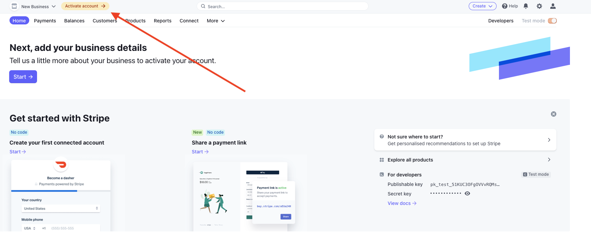
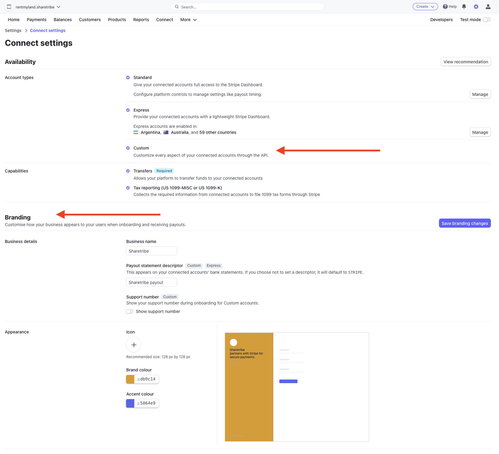
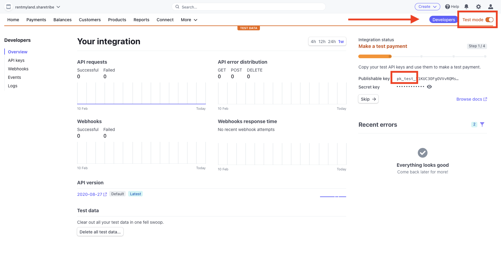
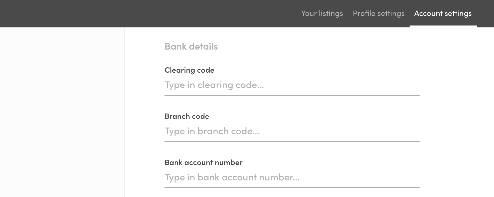

## 1. Create and confirm your free Stripe account

[Register to Stripe](https://dashboard.stripe.com/register). After
filling the form you will be asked the question "How do you want to get
started with Stripe?". You can click "Skip for now" link at the bottom
of the page to get directly to Stripe dashboard. Remember to confirm
your email address after the registration.

As you will receive money from your users via your Stripe account, you
have to provide some details such as your address and your bank account.
In the Stripe dashboard, click the "Activate your account" link in the
left menu and fill in all the fields according to the instructions. The
activation form varies based on your country.

## 2. Enable Stripe Connect in your platform

Sharetribe uses the Stripe Connect features with
[custom accounts](https://stripe.com/docs/connect/accounts#custom-accounts).

> **Note!** Stripe might need to review your platform account before you
> get access.   Check
> [this article](/cookbook-payments/stripe-connect-platform-review/) to
> learn how to apply for Stripe Connect review.

If you're in any another country, follow these instructions to enable
Stripe Connect:

- Click the _Connect_ left menu item.

- Click the _Get started_ button.

- After a few seconds, you should see your Connect dashboard. From the
  left sidebar, go to _Settings_ then _Connect settings_, at
  https://dashboard.stripe.com/settings

- Make sure that _Custom_ is enabled in the _Account types_ section

## 3. Enable Stripe Connect Onboarding in your platform

For enabling
[Stripe Connect Onboarding](/cookbook-payments/provider-onboarding-and-identity-verification/),
you need to navigate to
[Connect settings page](https://dashboard.stripe.com/account/applications/settings)
in your Stripe Dashboard. For the Connect onboarding to work, you need
to provide `name`, `color`, and `icon` for your marketplace.

Great! You now have to get your API keys and input them into your
marketplace.

## 4. Get your API keys from Stripe and add them to your Sharetribe marketplace

- Click the _Developers_ left menu item and go to _Developers_ → _API
  Keys_.
- In the section "Standard API keys" you will see two keys: publishable
  key and secret key. The publishable key (with prefix **pk**) is one
  used in frontend application (e.g. Flex Template for Web) and secret
  key (with prefix **sk**) is the one you need to add to Console. If you
  want to use test data make sure the value of the key is eg.
  **pk_test**\<somethinghere\> and not **pk_live**\<somethinghere\>

**Note:** If you want to use test data in development make sure that
"View test data" toggle is on. This way no real money will be used. In
production make sure that the toggle is off.

## 5. Add your Stripe secret API key to Console

- Log in to Console and go to _Build_ → _Payments_
- In the section _Stripe configuration_ paste your secret key to "Stripe
  secret key" field and save the changes.

## 6. Add you Stripe publishable key to your client application

In your client application, you need to use Stripe publishable key, when
you create accountTokens or call other Stripe API endpoints. If you are
using Flex Template for Web, calls to Stripe API are already there, but
you need to add the Stripe publishable key to your `.env` file. You can
do this by running `yarn run config` or editing the file directly in a
text editor.

Read more about configurations in FTW from
[Getting started with FTW](/introduction/getting-started-with-ftw-daily/#add-environment-variables)

## 7. Test the Stripe account in Flex Template for Web

If you are using Flex Template for Web (FTW) here is some instructions
how you can test you Stripe account.

**Note:** When testing Stripe, make sure you are using the test API
keys. To ensure that make sure the keys have prefix **sk_test** and
**pk_test**. When checking the Stripe dashboard, make sure "View test
data" toggle is on!

### Test adding payout details

Every provider needs to add payout details to their account before they
are able to publish listings. Stripe provides test values for
[identity verification](https://stripe.com/docs/connect/testing#identity-verification)
and [bank numbers](https://stripe.com/docs/connect/testing#payouts). In
FTW you can add payout details for the account in _Account Settings_ →
_Payments_. After filling the form you should see a new account when you
go to Stripe Dashboard and to _Connect_ → _Accounts_.

**Note:** After payout details are saved they can not be edited directly
from FTW so you might need to create multiple accounts for testing
purposes.

The form of the bank number and other required information depends on
which country you have chosen. For example, most of the countries in
Europe use IBAN form which is asked in one field. However, for example
in Hong Kong clearing code, branch code and bank account number are all
needed.

It's also good to know that in FTW these are all separate fields but in
Stripe clearing code and branch code are mapped together as routing
number.

With company accounts, Stripe might require information of every person
that owns at least 25% of the company or exercise significant control
over your company. This requirement is country specific. For more
information, see
[Stripe support](https://support.stripe.com/questions/company-ownership-and-director-requirement).

> Note: if a company/provider doesn't include enough owners to cover
> most of the shares, you might need to manually state that there are no
> more persons that own 25% or more.

### Test checkout

Stripe provides various
[test card numbers](https://stripe.com/docs/testing#cards) for testing
the checkout. There are also test numbers for
[specific responses and errors](https://stripe.com/docs/testing#cards-responses)
so e.g. testing different error scenarios is possible.

## 8. Advanced: Adding new country to supported Stripe countries

By default FTW already supports most of the countries that are available
when using
[Stripe custom accounts](https://stripe.com/docs/connect/accounts#custom-accounts).
If you are not sure if your country is already supported, please contact
to Stripe support before proceeding.

1. Add a new country to `stripe-config.js` file (use other country
   configurations as an example). See Stripe documentation for
   [minimum verification requirements](https://stripe.com/docs/connect/required-verification-information)
   and
   [bank account format](https://stripe.com/docs/connect/payouts#formats).

2. Add new translation keys to translation file you are using (e.g.
   `translations/en.json`). Add at least
   `PayoutDetailsForm.countryNames.COUNTRYCODE` and
   `PayoutDetailsForm.companyTaxIdLabel.COUNTRYCODE` keys but there
   might be also other keys needed.

3. If you add new fields or you want to edit the existing ones, see
   `forms/PayoutDetailsForm` and the subcomponents in the folder. E.g.
   to enable personal ID number field you need to add the new country in
   `forms/PayoutDetailsForm/PayoutDetailsPersonalDetails.js` file where
   showing the ID number field is handled.

<extrainfo title="Why are Brazil, India and Hungary not supported by default?">
The current FTW templates do not support Brazil (BR), India (IN) and Hungary (HU),
even though all three countries are mentioned as available Stripe countries in <a href="https://stripe.com/docs/connect/accounts#custom-accounts">Stripe's
documentation</a>. If you want to support one of these three regions, you will
need to do a fair amount of customization on top of the default Flex setup.
<ul>
  <li> The Flex transaction engine uses manual payouts, which are <a href="https://stripe.com/docs/payouts#manual-payouts">not supported for Brazil and India</a>.</li>
  <li>India has restrictions on <a href="https://support.stripe.com/questions/stripe-india-support-for-marketplaces">cross-border payments</a>.</li>
  <li>Stripe treats the Hungarian currency HUF as a <a href="https://stripe.com/docs/currencies#special-cases">zero-decimal currency for payouts</a>. This means that even though the Flex engine can create charges in two-decimal amounts (e.g. HUF 20.38), payouts can only be created in integer amounts evenly divisible by 100 (e.g. HUF 20.00). Additionally, if Stripe needs to do currency conversions from another currency to HUF, the resulting amount may have decimals which can cause the payout to fail.</li>
</ul>
</extrainfo>
