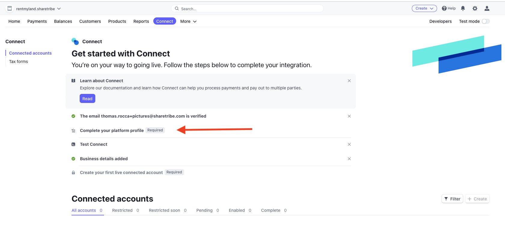
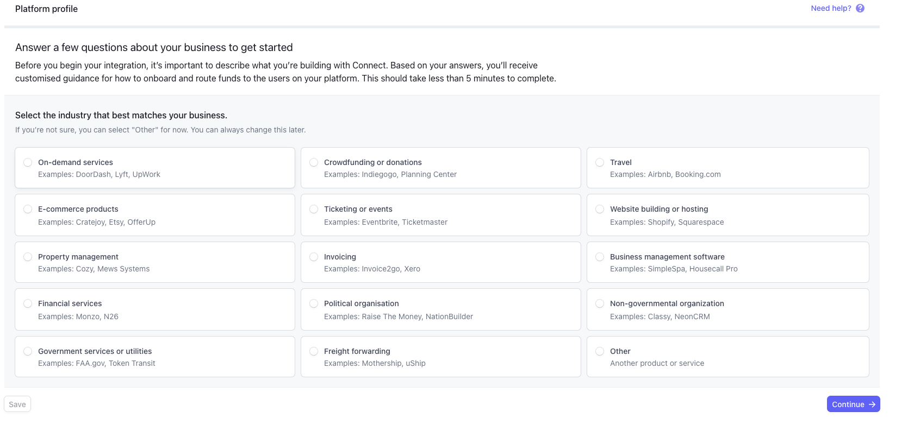
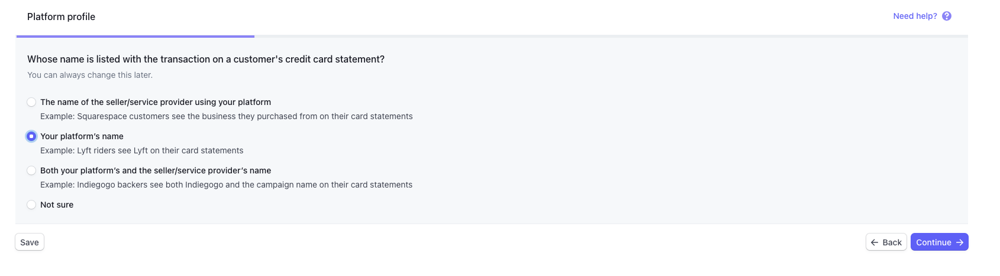
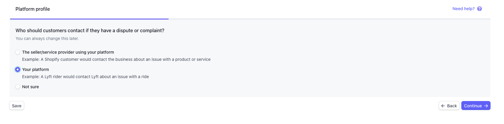
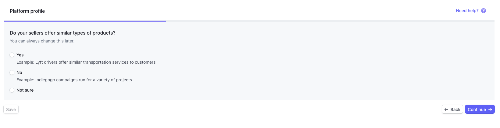

Starting from February 2019, Stripe started to review all new Connect
Platforms. They don't seem to review all of them, and they haven't
shared how they select which one to review, but it might happen. They've
said that this is because of recent regulations. You'll have to provide
some details about your business and Stripe promise they will review and
enable your Stripe Platform within one business day.

## How to apply for Connect review at Stripe

You should first [follow the regular instructions](/cookbook-payments/set-up-and-use-stripe/) to setup Stripe in your
Sharetribe marketplace. When enabling Stripe Connect and registering
your Platform, you may be prompted with some additional questions. The steps 1-4 show examples of what kind of questions you may be asked during the registration process.

Note that there may be some variations based on your country or
industry. Stripe advise to contact their support team however their
reply rate and quality hasn't been top notch, so let us know if you face
any issue, we'll be here to help.

You can reply easily: there is no character limit and no need for
attachments.

To get started with the Connect review, click on "Complete your platform profile" on the Connect page:

### 1. Select the industry that best matches your business

Pick the answer most suitable to your business.

### 2. Whose name is listed with the transaction on a customer’s credit card? 

You should pick "Your platform's name".

### 3. Who should customers contact if they have a dispute or complaint?

You should pick "Your platform".

### 4. Provide more details

Stripe may ask specific questions about your particular industry and business model. In this example, we've selected product/exommerce and received questions about the sale of products. Another industry selection may prompt different questions.

An example of a question that Stripe might ask about your marketplace:

#### I haven't heard from Stripe after one business day, what's next?

Stripe claims that they will review things within one business day. If
that takes any longer, you should:

- check your emails to make sure that Stripe didn't ask for more
  details. Don't forget to check your spam folder!
- contact us at [hello@sharetribe.com](mailto:hello@sharetribe.com) or
  via the chat widget in your admin panel, and share your Stripe account
  email and date you've applied. We'll be happy to contact our Stripe
  priority support line to move things forward faster!

#### Why is it required for most new Stripe Platforms?

This verification process is a requirement at Stripe, following recent
regulation changes (for example, in the US, the Financial Crimes
Enforcement Network (FinCEN) Customer Due Diligence (CDD) rule
[requires](https://www.fincen.gov/resources/statutes-and-regulations/cdd-final-rule)
the collection of information on companies’ ownership and management
when opening certain types of accounts with financial services
companies).

This is also after some updates to the own Stripe policies. New data
requirements represent an evolution of Stripe’s policies. These policies
are based on Stripe's experience (including Connect Platforms and
marketplaces).
