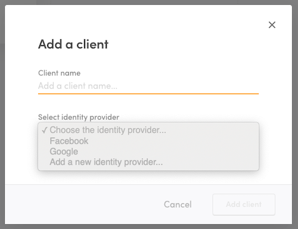

## OpenID Connect

[OpenID Connect](https://openid.net/specs/openid-connect-core-1_0.html)
is a specification built on OAuth2 that describes how a user
authenticated at an identity provider can be authorized to resources in
another service. This cookbook assumes that you already have an OpenID
Connect solution available and intend to use that as a login option in
your Flex marketplace.

## Identity provider requirements

### Discovery document and JSON Web keys

All identity providers should provide an
[OpenID Connect discovery document](https://openid.net/specs/openid-connect-discovery-1_0.html).
The document has to define a `jwks_uri` attribute which denotes the
location of public signing keys used by the identity provider. The
signing keys should be served in the `jwks_uri` location in
[JSON Web Key Set format](https://tools.ietf.org/html/draft-ietf-jose-json-web-key-41).

### Signing algorithms

Flex only supports ID tokens signed with asymmetric RS256 signing
algorithm. The identity provider should provide public signing keys as
mentioned above.

### Rotating signing keys

Flex relies heavily on the `kid` attribute of a JSON Web Key when
caching signing keys. We advice that every OpenID Connect identity
provider includes the `kid` attribute in signing keys and in ID token
header. Especially, when signing keys are rotated, it is critical to
have the `kid` attribute in JWKs and a corresponding `kid` header in the
ID token.

## Configure an identity provider client in Console

To take an OpenID Connect identity provider into use with Flex, you will
need to configure a new identity provider and an accompanying identity
provider client in Flex Console.

1. Go to the [Social logins & SSO]() page in Console and click "+ Add
   new" to add a new identity provider client.
2. Fill in a name for the client.
3. In the identity provider drowdown, select "Add a new identity
   provider..."

4. Fill in information regarding your OpenID Connect identity provider.
   This is the service that your users authenticate to in order to log
   into flex.
   - **Identity provider name**: A descriptive name for the identity
     provider that helps you to distinguish it from other providers.
   - **Identity provider ID**: IdP ID that is passed as a parameter to
     Flex API when authenticating using this client/IdP. It is generated
     based on the provider name
   - **Identity provider URL**: In OpenID Connect terms this is the
     _issuer location_ of the identity provider. It is used to resolve
     ID token signing keys used by the identity provider. See below
     _Discovery document and JSON Web keys_ for more details.
5. Fill in the Client ID. This is the identifier of your Flex
   marketplace at you identity provider. It will be the _audience_ of
   the ID token returned from the identity provider.
6. If you have multiple clients configured at your identity provider to
   be used to log into your Flex marketplace, list the additional client
   IDs as trusted client IDs. The idea is, that every client ID that is
   included as an audience (`aud` claim) in an ID token returned from
   your identity provider should be included as the client ID or trusted
   client ID in the client.

7. Click "Add client" to create the client and identity provider.

Now that you have created the identity provider, you can use it if your
login flow requires using another client or if you wish to remove the
client you added and create a new one. Just select the identity provider
from the dropdown when creating a new client.

## Add OpenID Connect login flow to FTW

OpenID Connect login flow can be added to FTW in multiple ways. One good
starting point is to take a look at OpenID Connect implementations in
[the passport.js packages](http://www.passportjs.org/packages/). Keep in
mind that you should get a hold of the ID token that is returned from
the identity provider so that you can pass it along to Flex's
[`/auth/auth_with_idp`](https://www.sharetribe.com/api-reference/authentication.html#issuing-tokens-with-an-identity-provider)
and
[`current_user/create_with_idp`](https://www.sharetribe.com/api-reference/marketplace.html#create-user-with-an-identity-provider)
endpoints.
