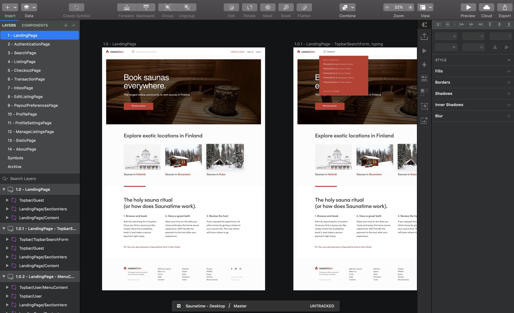

TODO UPDATE SKETCH FILES!

The Sharetribe Web Template designs are available as Sketch files. The
design files include complete designs for the template desktop and
mobile views, as well as wireframes for the template desktop. You can
use these files as the basis for your own designs. This approach can
dramatically speed up the design process, and it offers an easy starting
point for the developers.

## Wireframes

Wireframes are an excellent tool to design your marketplace at the
structural level. They are most often used to arrange content and
functionality and establish the basic structure of a page before moving
on to designing visual elements. Wireframes for our desktop layout are
available as Sketch files below.

## Design files

//TODO: Update design file description

Sharetribe offers three templates: one for daily bookings (e.g. booking
saunas or hiking tours), one for hourly bookings (e.g. booking yoga
lessons or renting kayaks), and one for product marketplaces (e.g.
selling and buying sneakers). The main difference between the daily and
hourly templates is the booking calendar, but also the outlooks differ
to show some of the flexibility that Flex offers. Both the hourly and
daily templates are provided in desktop and mobile layouts. The designs
are provided as .sketch files, which can be opened using the
[Sketch vector graphics editor](https://www.sketch.com/). Some other
design tools such as Adobe XD and Photoshop also offer support for
designs in the .sketch file format.

Once you have the design files installed, you can start working on
customizing the design to match the visual identity of your marketplace.
Not only should you concentrate on how your marketplace should look
like, but also on what kind of user interfaces are required for your
users to interact with each other.

If you don't want to do the design work yourself, you can always hire a
designer to do it for you. If you don't know any designers,
[contact Sharetribe support](mailto:flex-support@sharetribe.com) and
we'll connect you to a designer who can help you out.

## Assets

[Access design files in Google Drive](https://bit.ly/3miruCr).

Or download directly:    <b>FTW daily</b> 
[Sharetribe_Flex-DAILY-Desktop.sketch](https://bit.ly/3bfeKGb) 
[Sharetribe_Flex-DAILY-Mobile.sketch](https://bit.ly/3pKFbfl) 
[Sharetribe_Flex-DAILY-Wireframes.sketch](https://bit.ly/3vOZ1aB)

The design files can be used according to
[Creative Commons licence](https://creativecommons.org/licenses/by/4.0/).
The files can also be opened with Adobe XD and Figma. The font used is
Poppins, which can be downloaded through
[Adobe Fonts](https://fonts.adobe.com/fonts/poppins) or through
[Google Fonts](https://fonts.google.com/specimen/Poppins).

We are glad to receive ideas and improvements at
[flex-support@sharetribe.com](mailto:flex-support@sharetribe.com).
