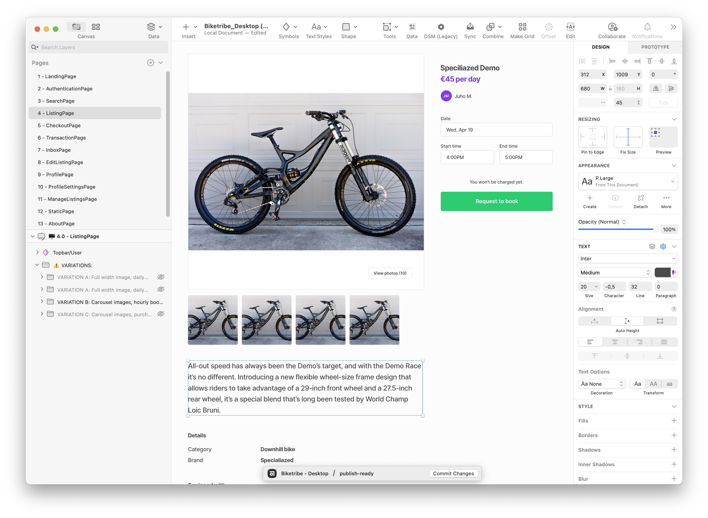

##### [> Download the design files here](https://github.com/sharetribe/design-resources)

The Sharetribe Web Template designs are available as Sketch files. The
files include the complete designs for the template in desktop and
mobile views, allowing you to visualize and better understand how the
various components fit together. These files are the starting point for
your custom marketplace design and using them can dramatically speed up
your design process.

## Design files

We created the design files in [Sketch](https://www.sketch.com/), which
saves files in the .sketch file format. You can also open .sketch files
in other digital design applications like Figma or Adobe XD. If you are
using Sketch, you have everything you need to get started, but for other
software, you might need to download the Inter font from
[Google Fonts](https://fonts.google.com/specimen/Inter).

Once you have the design files installed, you can start working on
customizing the design to match the visual identity of your marketplace.
Not only should you concentrate on how your marketplace should look but
also on what kind of user interfaces are required for your users to
interact with each other.

If you do not want to do the design work yourself, you can always hire a
designer to do it for you. If you don't know any designers, contact
[Sharetribe support](mailto:hello@sharetribe.com), and we'll connect you
to a designer who can help you. The design files are under the
[Creative Commons licence](https://creativecommons.org/licenses/by/4.0/).

##### [> Download the Design Files from our GitHub Repository](https://github.com/sharetribe/design-resources)
