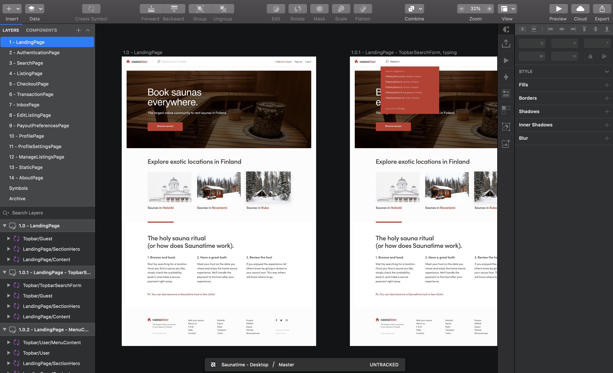

Saunatime Flex Template for Web (WTF) designs are available as Sketch
files. The design files include complete designs for FTW desktop and
mobile, as well as wireframes for FTW desktop. You can use these files
as the basis for your own designs. This approach can dramatically speed
up the design process, and it offers an easy starting point for the
developers.

Sharetribe offers two templates: one for daily bookings (e.g. booking
saunas or hiking tours) and one for hourly bookings (e.g. booking yoga
lessons or renting kayaks). The main difference between these templates
is in the booking calendar, but also the outlooks differ to show some of
the flexibility that Flex offers.

[Access design files in Google Drive](https://drive.google.com/drive/folders/171T-lYUGJURrAF5qCtTZ0298WPhhG0SG?usp=sharing).

Or download directly:    <b>FTW daily</b> 
[Sharetribe_Flex-DAILY-Desktop.sketch](https://drive.google.com/uc?export=download&id=1Lm7hVHB_i5mLDO5mtCuziyIJA1ZPNl4b) 
[Sharetribe_Flex-DAILY-Mobile.sketch](https://drive.google.com/uc?export=download&id=1FOVyXpNdt9eRM_hLMG8-lSZ-VdxJZv_k) 
[Sharetribe_Flex-DAILY-Wireframes.sketch](https://drive.google.com/uc?export=download&id=1__BvrIbpx1-C8EHT6nJdxjDrq8XomlrI)

<b>FTW hourly</b> 
[Sharetribe_Flex-HOURLY-Desktop.sketch](https://drive.google.com/uc?export=download&id=1OMPRdIypI3aIFzs5d9Vbx7EwVfz6B-Xu) 
[Sharetribe_Flex-HOURLY-Mobile.sketch](https://drive.google.com/uc?export=download&id=1ulr10ibQ60QUxLA6w62kS9hEx1Vgf8Y8) 

The design files can be used according to
[Creative Commons licence](https://creativecommons.org/licenses/by/4.0/).
The files can also be opened with Adobe XD and Figma. The font used is
Poppins, which can be downloaded through
[Adobe Fonts](https://fonts.adobe.com/fonts/poppins) or through [Google Fonts](https://fonts.google.com/specimen/Poppins).

We are glad to receive ideas and improvements at
[flex-support@sharetribe.com](mailto:flex-support@sharetribe.com).
