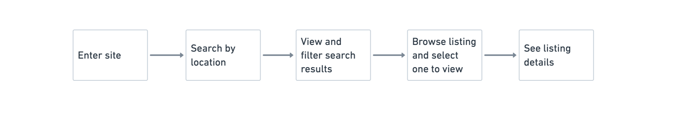
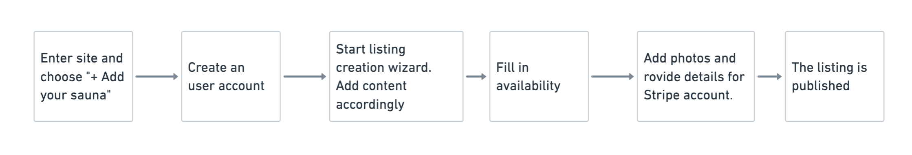
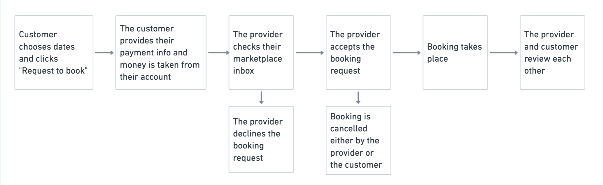

[Saunatime template](/background/concepts/#flex-templates-for-web-ftw)
is a great starting point for building rental marketplaces. Saunatime
providers list saunas for rent by day. Sauna lovers can search saunas by
location and book saunas by day using an availability calendar.

Saunatime, as any typical marketplace, has three distinct user journeys:

- **Search**: Search happens when customers search for listings on the
  marketplace using some combination of keywords, availability, filters,
  and sorting.
- **Listing creation**: Listings are created by providers to promote a
  product or service they are offering, with the exception of reverse
  marketplaces where the customer creates listings. What information
  providers enter into a listing, such a price or category, is usually
  the basis for the customer’s search experience.
- **Transactions**: The transaction process determines how a customer
  and providers interact on the marketplace, whether it is to rent, sell
  or interact otherwise.

In this article we’ll explore in depth how search, listing creation, and
transactions work in Saunatime.

## Search Journey

The discovery journey depicts how users search and find listings in your
marketplace. Starting on the landing page, users progressively narrow
their search to find the service, rental, or product they need. Users
might find what they need by searching nearby locations or via keywords.
Results should be filtered by relevant criteria, like price or category.

Click through the slideshow below to see the search steps and
capabilities that come with Flex out of the box with the Saunatime
template.

<discoverycarousel title="Discovery journey">

</discoverycarousel>

## Listing Creation Journey

A marketplace is defined by its content: the types of users and listings
communicate what your marketplace is all about. Listings, in particular,
are crucial. They are the description of the product or service that a
provider offers on the marketplace and, ultimately, serve as the
initiation point for a transaction on your marketplace. Listings can
take many forms, such as the storefront of a service provider, an
experience itinerary, or a product page.

<contentcreationcarousel title="Content creation journey">

</contentcreationcarousel>

## Transaction process

The transaction process concerns the booking or buying event that
happens between the listing provider and the purchasing customer.
Sharetribe Flex lets you extensively customize the rules and steps of
your transaction process to govern how providers and customers
capitalize on your marketplace.
[Saunatime’s default process](https://www.sharetribe.com/docs/operator-guides/transaction-process/)
mimics an Airbnb-style daily booking rental.

<transactionprocesscarousel title="Transaction process">

</transactionprocesscarousel>

## Designing your marketplace’s user journey

As the development starting point, Saunatime’s user journeys are the
default ways in which users create content, discover listings, and
transact in Flex. Designing your marketplace’s journeys helps developers
understand how to modify the template code to build your custom
marketplace.
[The next article](https://www.sharetribe.com/docs/design-toolkit/your-user-journey-a-guide/)
guides you in creating your own user journey.
