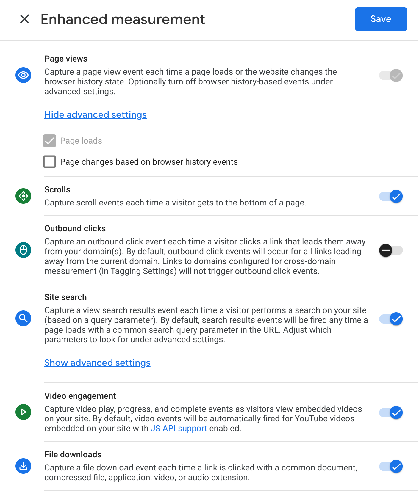

The Sharetribe Web Template comes with built-in support for Google
Analytics and supports tracking page views with a customizable analytics
handler. The template also supports using Plausible analytics for
tracking page views. This article explains how to enable Plausible or
Google Analytics and use and create custom analytics handlers.

## Configure Google Analytics

The template has built-in support for Google Analytics. All you need to
do is assign your Google Analytics Tracking ID to the environment
variable `REACT_APP_GOOGLE_ANALYTICS_ID`.

<info>

Google Analytics doesn't work in a hot-loading environment! The
analytics script is added server-side. You can test it in your local
environment by using the command `yarn run dev-server`.

</info>

### Google Analytics 4

Google recently released their new analytics service Google Analytics 4.
Support for Google Universal Analytics will end on October 1, 2023. New
versions of the template provide out-of-the-box support for Google
Analytics 4.

If you prefer to use Universal Analytics, you should look into how
Analytics was implemented in
[this pull request](https://github.com/sharetribe/ftw-daily/pull/1508).

<info>

The template will require a Tracking ID compatible with Google
Analytics 4. The ID needs to begin with the "G-" prefix.

</info>

#### Enhanced measurements

It is not recommended to use the Enhanced Measurements feature
introduced in Google Analytics 4, which is enabled by default. The
Enhanced Measurements feature injects code into link tags which can
break in-app navigation in the template. Therefore, we strongly
recommend disabling the Enhanced Measurements feature when using Google
Analytics 4 with the template.

<video>
    <source src='./turn-off-enhanced-measurements.mp4' type='video/mp4'>
    <source src='./turn-off-enhanced-measurements.webm' type='video/webm'>
    <source src='./turn-off-enhanced-measurements.ogv' type='video/ogg'>
</video>

If that's not an option, you can continue to use Enhanced Measurements
if you disable the _Outbound clicks_ and _page changes based on browser
history events_ features.

### Built-in handlers

The Sharetribe Web Template includes an
[event handler](https://github.com/sharetribe/web-template/blob/main/src/analytics/handlers.js#L9)
that sends `page_view` events to Google Analytics. These events need to
registered manually because the template is a single-page application,
meaning that in-app navigation does not render a page load.

The Google Analytics script registers a `page_view` event automatically
on every page load. The
[`trackPageView`](https://github.com/sharetribe/web-template/blob/main/src/analytics/handlers.js#L9)
function takes this into account and only sends a `page_view` event to
Google if a page is accessed through in-app navigation.

If you'd like to track something other than page views, you can
implement your custom handler using the `trackPageView` function as an
example.

## Configure Plausible Analytics

The template also includes built-in support for
[Plausible Analytics](https://plausible.io). Plausible is a GDPR
compliant open source web analytics service. You must assign the
data-domain value from the Plausible Analytics tracking script to the
environment variable `REACT_APP_PLAUSIBLE_DOMAINS`.

If this would be your Plausible analytics script:
``

You would assign example.com to the environment variable:
`REACT_APP_PLAUSIBLE_DOMAINS=example.com`

You can also assign multiple domains separated by a comma:
`REACT_APP_PLAUSIBLE_DOMAINS=example1.com,example2.com`

Without customising how Plausible is
[loaded into the template](https://github.com/sharetribe/web-template/blob/fd9596462c5979ca9e421b1ab69df92a7dd2056c/src/util/includeScripts.js#L102-L111),
you can only track page views using it.

## Custom analytics libraries

If you choose to add another analytics provider (e.g. Facebook Pixel),
you can follow these steps to import the third-party script and create a
custom handler. In some cases, it might also be worth looking into npm
packages instead of manually appending a third-party script.

### Add the analytics library script

If the analytics library has an external script, you can add the library
script tag to the
[src/util/includeScripts.js](https://github.com/sharetribe/web-template/blob/main/src/util/includeScripts.js)
file. You will also need to whitelist the corresponding URLs in the
[server/csp.js](https://github.com/sharetribe/web-template/blob/main/server/csp.js)
file.

### Create a handler

You can create a custom handler e.g. in
[src/analytics/handlers.js](https://github.com/sharetribe/web-template/blob/main/src/analytics/handlers.js).
If you want to track page views, you could create a class that
implements a `trackPageView(canonicalPath, previousPath)` method.

Note that the `canonicalPath` parameter passed to the function might not
be the same path as in the URL bar of the browser. It is the canonical
form of the URL.

**For example**: the listing page URL is constructed dynamically:
`l/{listing-slug}/{listing-id}`. The canonical form of that URL would
be: `l/{listing-id}`.

<info>

A "_slug_" is a web development term for a short, user-friendly string.
In the example above, the template generates the slug from the listing's
title, which is prone to frequent changes. Therefore, a canonical form
of that URL is needed to maintain a stable link which doesn't change
every time the name of the listing changes.

</info>

This approach allows unified analytics and correct tracking of pages
that can be accessed from multiple URLs.

If your analytics library tries to access the page URL directly through
the browser, you might need to override that behavior to use the
canonical URL that is given to the method.

### Initialise the handler

Finally, you only need to initialise the handler in the
`setupAnalyticsHandlers()` function in
[src/index.js](https://github.com/sharetribe/web-template/blob/main/src/index.js).
