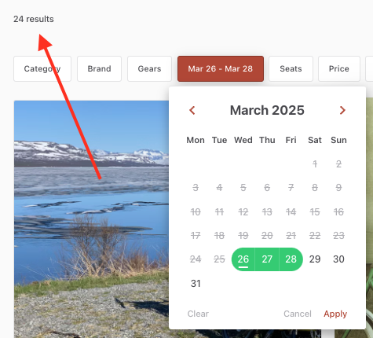
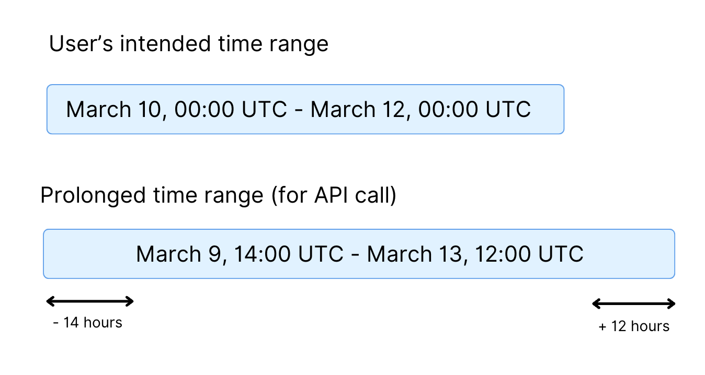
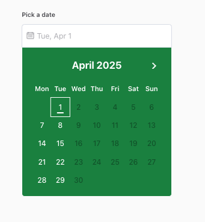

This article explains how listing availability is handled in the
Sharetribe Web Template, with a focus on technical details and
implementation. For a general overview of availability management, see
our
[Help Center](https://www.sharetribe.com/help/en/articles/8413212-how-availability-management-works).
See also the
[reference documentation for availability management](<(/references/availability)>).

## Availability plan types and timezone support

The Sharetribe APIs support creating availability plans with either type
`availabilityPlan/day` with day-level availability or type
`availabilityPlan/time` with time range level availability. When a user
creates a listing with the Sharetribe Web Template, the listing is
always created with type `availabilityPlan/time`, whether the calendar
booking type is daily, nightly, hourly or fixed.

Using the `availabilityPlan/time` type means that the template can
specify a certain time zone for the listing's availability plan, which
is asked when creating a bookable listing. The timezone is associated
with the availability plan and ensures that all booking times are
interpreted according to the local time of the listing, rather than the
time zone of the customer making the booking. The `availabilityPlan/day`
type always assumes UTC as the timezone.

However, there is a tradeoff. In order to
[query listings](https://www.sharetribe.com/api-reference/marketplace.html#query-listings)
that use `availabilityPlan/time`, the `availability` parameter needs to
be set to `time-full` or `time-partial`. Queries using this
`availability` parameter do not support pagination.

By default, the template will display the first 24 results when using
the date filter (and as pagination is not supported, the results will be
limited to 24). This value can be modified in
[SearchPage.duck.js file](https://github.com/sharetribe/web-template/blob/main/src/containers/SearchPage/SearchPage.duck.js#L21),
so you can allow displaying up to a 100 results.

## Availability management

### Availability plan

For daily and nightly listings, the template simplifies availability
management by allowing the listing author to select their daily
availability. Under the hood, availability is automatically set from
`00:00` to `00:00` (i.e., midnight to midnight), enabling bookings to
span for consecutive days.

For hourly and fixed booking length listings, the template exposes full
control over start and end times when adjusting availability entries.
These entries can be consecutive or non-consecutive and may have varying
seat counts. While it is technically possible to create a continuous
availability window from `00:00` to `00:00`, enabling bookings that span
entire days or overnight, the template does not have built-in support
for creating hourly bookings that span multiple calendar days.

### Availability exceptions

Listing authors can set availability exceptions on listings to override
the default plan for individual time ranges. Availability exceptions are
created based on the unit type:

- For daily bookings, exceptions are created per day, and the start and
  end dates can be the same date
- For nightly bookings, exceptions are created per night, and the end
  date needs to be at least one day later than the start date
- For hourly bookings and fixed-length bookings, exceptions are created
  with a start time and an end time, and the end time needs to be at
  least an hour later, and on the hour, e.g. 13:00 or 14:00.

Regardless of the unit type, all exceptions are made using the same
[endpoint](https://www.sharetribe.com/api-reference/marketplace.html#create-availability-exceptions).

Listing authors can also block availability by using seats. Setting 0
seats for the duration of the availability exception sets the listing as
unavailable for that period. If the period has existing bookings, the
availability exception will not affect them, so it only blocks future
bookings.

The availability plan, availability exceptions, and bookings are only
visible to the author of the listing. When other users view the
listing’s availability on the listing page, they only see whether the
listing is available, but they cannot see whether the availability
results from the availability plan, exceptions, or existing bookings.

## Listing search and timezone coverage

The operator can allow users to search for listings based on their
availability on certain dates. The date search cannot be restricted to
specific time zones. This means that to cover listings from all possible
time zones, the template prolongs the start and end times before sending
them to the Sharetribe API. See the relevant code
[in SearchPage.duck.js](https://github.com/sharetribe/web-template/blob/main/src/containers/SearchPage/SearchPage.duck.js#L185-L186).

To be exact, the start time is moved 14 hours earlier, and the end time
is moved 12 hours later. This means that the availability search results
may include listings that are available before or after the time frame
that the user enters.

## Filtering timeslot with intervals

When querying timeslots for a listing using the booking unit "fixed" or
"hourly", the template uses
[interval-based filtering](/references/availability/#interval-based-filtering).
This approach allows retrieving significantly less data from the API
than using regular timeslot queries (the API is restricted to 500
timeslots per page). A regular timeslot query can only fetch up to 500
time slots at once, and to fetch more than that you need to make
multiple queries. When using short fixed time slots, e.g. 15 minutes,
one day might have dozens of available time slots, so the first 500 time
slots of a month might only cover a few weeks worth of availability. The
date picker component needs to know whether there is availability on a
certain day, so the template makes a query that matches the first
available timeslot within the defined interval. See the full query in
[ListingPage.duck.js](https://github.com/sharetribe/web-template/blob/main/src/containers/ListingPage/ListingPage.duck.js#L495)
This information is used to display the availability of a listing in the
monthly calendar view when booking:

For listings using the fixed booking slot unit type, the template
extends the end time of the timeslot query. If the duration of the fixed
booking slot is e.g. 2 hours, the end time of the query is extended by 2
hours. This allows for the timeslot query to return availability
correctly for the last moments of the month. For example, to display
availability on the last day of the month at 23:55 for a 2 hour fixed
booking slot, the template needs to check if there is availability 2
hours onwards from 23:55, therefore extending the query into the next
month. See the
[relevant code in ListingPage.duck.js](https://github.com/sharetribe/web-template/blob/main/src/containers/ListingPage/ListingPage.duck.js#L488-L493).

Once the user selects a date from the calendar picker, the template
makes a subsequent timeslot query to retrieve all available timeslots
for the specific day, as the initial query only includes a subset of
available timeslots.
