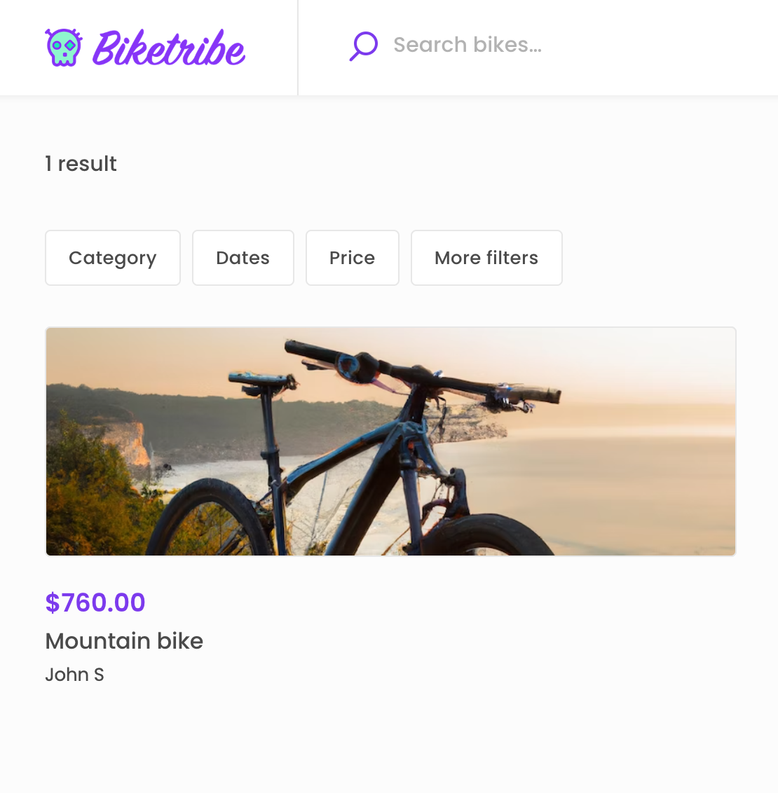
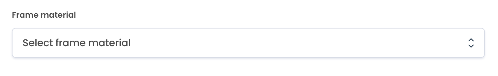
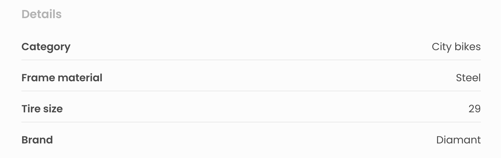
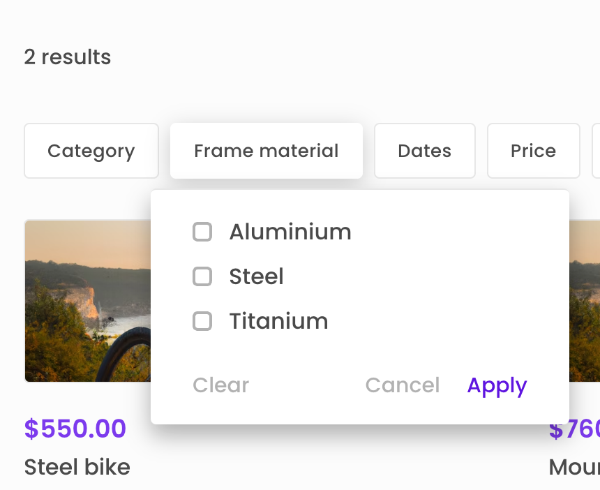

There are a lot of settings you can edit and configure through
configuration files. These settings are related to branding, layout,
listings, search, maps, payment and transactions. You can find all
configuration files in the
[config directory](https://github.com/sharetribe/web-template/tree/main/src/config).

## Using Console for configurations

Console allows users to configure many configuration variables through a
new no-code interface. The newest release of The Sharetribe Web Template
supports fetching the configuration data through the
[Asset Delivery API](https://www.sharetribe.com/api-reference/asset-delivery-api.html).
If you are using an older version of the web-template, follow the
instructions
[here](/ftw/how-to-customize-ftw/#pull-in-the-latest-upstream-changes)
to pull in the latest upstream changes.

<info>

Settings configured in local configurations files are overridden by any
fetched via the Asset Delivery API.

</info>

## Configuration files

All relevant configuration is split between the following files and the
environment variables. You can see the available environment variables
in the [template environment variables](/ftw/ftw-env/) article.

- [configBranding.js](https://github.com/sharetribe/web-template/blob/main/src/config/configBranding.js)
  - Marketplace colour, logos, Facebook and Twitter media
- [configDefault.js](https://github.com/sharetribe/web-template/blob/main/src/config/configDefault.js)
  - Change localization settings, marketplace currency and add social
    media links
- [configLayout.js](https://github.com/sharetribe/web-template/blob/main/src/config/configBranding.js)
  - Layout or the search and listing page and aspect ratio for listing
    image variants
- [configListing.js](https://github.com/sharetribe/web-template/blob/main/src/config/configListing.js)
  - You can define extended data variables and how they are displayed on
    both the listing and search page. Read more about the available
    settings in the
    [configListing.js](https://github.com/sharetribe/web-template/blob/main/src/config/configListing.js)
    file.
- [configSearch.js](https://github.com/sharetribe/web-template/blob/main/src/config/configSearch.js)
  - Change between keyword or location search and set default search
    filters and sorting options
- [configMaps.js](https://github.com/sharetribe/web-template/blob/main/src/config/configMaps.js)
  - Choose to load maps through Google or Mapbox and location-related
    search settings
- [configStripe.js](https://github.com/sharetribe/web-template/blob/main/src/config/configStripe.js)
  - The configuration that Stripe needs to function correctly
- [configDefaultLocationSearches.js](https://github.com/sharetribe/web-template/blob/main/src/config/configDefaultLocationSearches.js)
  - Specify a list of locations that are shown to the user as
    suggestions when they click on the search bar

## Branding

The
[configBranding.js](https://github.com/sharetribe/web-template/blob/main/src/config/configBranding.js)
file allows you to customize the branding and appearance of your
marketplace. The configurations you can change include the marketplace's
color, logos for desktop and mobile devices, a background image, and
default images for social media sharing.

The `marketplaceColor` constant defines the primary color for your
marketplace, which is used to style various elements throughout the
site.

The `logoImageDesktopURL` and `logoImageMobileURL` constants specify the
URL for the desktop and mobile logos.

The `brandImageURL` constant specifies the URL for a background image
that is used on several pages.

The `facebookImageURL` and `twitterImageURL` constants specify the
default images for social media sharing on Facebook and Twitter.

## Common configurations

You can find all common configurations in the
[configDefault.js](https://github.com/sharetribe/web-template/blob/main/src/config/configDefault.js)
file.

The `marketplaceName` setting specifies the name of your marketplace.
This name is used in various places throughout the site, such as in
microcopy and in meta tags for SEO and social media sharing.

### Currency and pricing

The currency setting specifies the currency used in your marketplace. It
must be in ISO 4217 currency code and should match one of the currencies
listed in the
[settingsCurrency.js](https://github.com/sharetribe/web-template/blob/main/src/config/settingsCurrency.js)
file.

The `listingMinimumPriceSubUnits` setting specifies the minimum price
for a listing in your marketplace, expressed in currency subunits (e.g.,
cents). A value of 0 means that there is no minimum price for listings.
Note that Stripe may charge a minimum fee that depends on factors such
as the country and currency.

You can read more about currency configurations in the
[currency configurations article](/ftw/how-to-set-up-currency-in-ftw/).

### Locale

You can use the localization setting to specify the locale and the first
day of the week used in calendars. This setting contains two properties:

- `locale`: The locale of your marketplace, expressed as a language
  code. The default value is 'en' for English.

- `firstDayOfWeek`: The first day of the week in your marketplace,
  expressed as a number between `0` (Sunday) and `6` (Saturday). The
  default value is `1` for Monday.

For example, to change the locale to French, you would set the `locale`
property to `'fr'`. To change the first day of the week to Sunday, you
would set the `firstDayOfWeek` property to `0`.

### Structured data

The `siteFacebookPage`, `siteInstagramPage`, and `siteTwitterHandle`
settings in the code specify the [Schema.org](https://schema.org/)
organization metadata and are used in the meta tags for social media
sharing.

The `siteFacebookPage`, `siteInstagramPage` and `siteTwitterHandle`
settings specify the social media pages associated with your marketplace
or organization. With the two first options, the pages should be
expressed as an URL (e.g., 'https://www.facebook.com/sharetribe/'). For
the `siteTwitterHandle` option, you should use a username (e.g.,
'@sharetribe').

You can also specify address information to be used in your site's
structured data. The address setting contains four properties:

- `addressCountry`: The country in which your marketplace or
  organization is located, expressed as an ISO 3166-1 alpha-2 country
  code (e.g., 'FI' for Finland).
- `addressRegion`: The region or state in which your marketplace or
  organization is located (e.g., 'Helsinki').
- `postalCode`: The postal code of the location of your marketplace or
  organization (e.g., '00130').
- `streetAddress`: The street address of the location of your
  marketplace or organization (e.g., 'Erottajankatu 19 B').

## Layout configuration

There are three layout options that you can toggle to change how the
search page is rendered and how listing images are displayed in your
marketplace. You can find all layout options in the
[configLayout.js](https://github.com/sharetribe/web-template/blob/main/src/config/configLayout.js)
file.

### Search page

The SearchPage component of the template has two layout variants: 'map'
and 'grid'.

```js
// There are 2 SearchPage variants that can be used:
// 'map' & 'grid'
export const searchPage = {
  variantType: 'map',
};
```

You can change the layout of the search page in the
[configLayout.js](https://github.com/sharetribe/web-template/blob/main/src/config/configLayout.js#L9)
file by toggling the `variantType` variable between 'map' and 'grid'.

The 'grid' layout does not contain a map but instead, displays a grid of
listings with filters shown in the sidebar. This layout is best suited
for cases where users are interested in browsing a list of search
results rather than selecting a location on a map.

The 'map' variant of the SearchPage component displays a map next to
search results. You can use the map to select a location to search from,
allowing users to browse listings in a specific area easily. This layout
is ideal for cases where users are interested in searching for listings
within a particular location or neighborhood.

### Listing images

You can toggle between two options on how listing images are displayed
on the listing page. The 'coverPhoto' layout option shows a hero section
with a cropped image at the beginning of the page.

The 'carousel' layout option displays an image carousel, which renders
images using their original aspect ratio.

You can change the layout of the search page in the
[configLayout.js](https://github.com/sharetribe/web-template/blob/main/src/config/configLayout.js#L16)
file by toggling the `listingPage` variable between 'coverPhoto' and
'carousel'.

```js
export const listingPage = {
  variantType: 'carousel',
};
```

### Listing image aspect ratio

Use the `listingImage` option to specify the aspect ratio and image
variants for listing images in your marketplace. The option defines the
aspect ratio of the listing image everywhere except on the listing page.
The aspect ratio of the image on the listing page can be defined by
toggling the listingPage option between 'coverPhoto' and 'carousel' (the
carousel option will display images in their original aspect ratio).

For example, to change the aspect ratio of the images to 3:1, you would
set the aspectRatio property to 3/1:

```js
export const listingImage = {
  variantType: 'cropImage',
  // Aspect ratio for listing image variants (width/height)
  // Note: This will be converted to separate aspectWidth and aspectHeight values
  // to make calculations easier.
  aspectRatio: '3/1',
  // Listings have custom image variants, which are named here.
  variantPrefix: 'listing-card',
};
```

Which would look like this on the search page:



## Listing configuration

### Extended data configuration

The `listingFields` is an array of configuration options for extended
data fields. [Extended data](/concepts/extended-data-introduction/)
fields are additional pieces of information that can be added to a
listing. Each object in the array represents a single extended data
field. You can find the full list of configuration options for extended
data fields in the
[configListing.js](https://github.com/sharetribe/web-template/blob/main/src/config/configListing.js#L11)
file.

Adding a new entry to the `listingFields` array will automatically add a
new input field to the listing creation wizard. Say we add a new
extended data field using the following options:

```js
  {
    key: 'frame',
    scope: 'public',
    schemaType: 'enum',
    enumOptions: [
      { option: 'aluminium', label: 'Aluminium' },
      { option: 'steel', label: 'Steel' },
      { option: 'titanium', label: 'Titanium' },
    ],
    filterConfig: {
      indexForSearch: false,
      filterType: 'SelectSingleFilter',
      label: 'Frame material',
      group: 'primary',
    },
    showConfig: {
      label: 'Frame material',
      isDetail: true,
    },
    saveConfig: {
      label: 'Frame material',
      placeholderMessage: 'Select frame material',
      isRequired: false,
    },
  },
```

When creating a new listing, we will see the new input field pop up:



And while the `isDetail` value in the `showConfig` object is toggled to
`true`, the extended data attribute will also be listed on the listing
page:



We will also be able to see the new extended data field on the search
page and use it to filter listings. If we change the `indexForSearch`
value to `true`, we will see a new filter component pop up, that can be
used to filter listings by frame material:



<info>

If you do enable the `indexForSearch` variable, you must also set a
search schema. Without setting a search schema for the extended data,
the filter component will not work. Learn how to set a search schema for
a extended data attribute in the
[manage search schemas article](/how-to/manage-search-schemas-with-flex-cli/).

</info>

### Listing type configurations

The
[configListing.js](https://github.com/sharetribe/web-template/blob/main/src/config/configListing.js)
file contains an array of listing type and their associated transaction
process configurations. Listing types contain information on the
transaction process the listing uses and what unit of time is used to
book the listing (e.g. daily or hourly). When creating a listing, the
user can select the listing type from a dropdown based on the listing
types defined in the configuration files. The listing type and
transaction process alias are stored in the public data of the listing.
Listing types can also be used to define whether listings of the type
should show available stock.

You can use this configuration to enable different listing types, either
using the same transaction processes or different ones. Each listing
type can have only one transaction process. However, since you can have
multiple listing types per marketplace, you can also have multiple
transaction processes in use at one time.

- Read more:
  [Change transaction process in Sharetribe Web Template](/how-to/change-transaction-process-in-ftw/).

## Search configuration

The
[configSearch.js](https://github.com/sharetribe/web-template/blob/main/src/config/configSearch.js)
file allows you to adjust the default search filters (price and dates)
and how listings are sorted on the search page.

### Search filters

In the configSearch.js file you can change if the search bar supports
location or keyword search by toggling the `mainSearch` variable between
'keywords' and 'location'.

This file allows you to configure or remove the dates and price filter.
To remove the filters, comment them out of the `defaultFilters` array.

You can adjust two variables within the date filter:
`entireRangeAvailable` and `mode`.

The `entireRangeAvailable` config is _true_ by default. When it is true,
filtering with a time range (e.g. May 1st-May 7th) only returns listings
with availability for the entire duration. If `entireRangeAvailable` is
_false_, filtering with the same dates returns listings with at least
some availability between the start and end dates.

The `mode` config can be assigned to either `day` or `night`. Using the
value `day` will allow your users to select a single day through the
datepicker element.

### Sorting

You can adjust sorting options through the `sortConfig` option. Here you
can disable the sorting element altogether. You can add or remove
existing sorting options by editing the options array. Extended data can
also be used to sort listings. See all the available sorting options in
the
[API reference](https://www.sharetribe.com/api-reference/marketplace.html#sorting).

## Map configurations

The
[configMaps.js](https://github.com/sharetribe/web-template/blob/main/src/config/configMaps.js)
file allows you to set up a map provider and adjust map-related
settings. See [this article](/ftw/configure-maps/) for a complete
overview of what map-related adjustments you can achieve through the
configuration files. If you are trying to change the map provider, see
the how to set up [Google Maps](/ftw/how-to-use-google-maps-in-ftw/) or
[Mapbox](/ftw/how-to-set-up-mapbox-for-ftw/) article.

## Stripe and transactions

### Stripe configurations

The
[configStripe.js](https://github.com/sharetribe/web-template/blob/main/src/config/configStripe.js)
file includes all countries supported by the Flex Stripe integration.
The list of countries is used during the Stripe onboarding process. In
most cases, no changes are required to this file.
