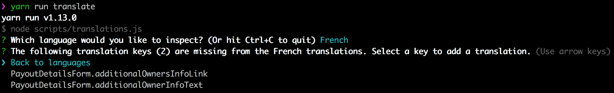

The Flex Template for Web supports having a single language for the UI.
Supported languages are English, French and Spanish, English being used
by default. For information about changing the language, see the
[Changing the language](/ftw/how-to-change-ftw-language) article.

We are using the [React Intl](https://github.com/yahoo/react-intl)
library to translate UI texts and to format dates, numbers, and money
values.

_**Note:** Starting in 2022-05, FTW template microcopy can also be
modified in Flex Console. If you want to implement this feature into
your pre-v8.5 FTW-daily template, you can see the necessary
modifications in the PR for
[ftw-daily](https://github.com/sharetribe/ftw-daily/pull/1510). Read
more:_

- _[Microcopy in Flex](/concepts/microcopy/)_
- _[How hosted microcopy work in the FTW templates](/ftw/hosted-microcopy/)_

<extrainfo title="FTW-hourly and FTW-product versions with hosted microcopy">
In FTW-hourly, hosted microcopy are available in v10.5. In FTW-product, they are available in v9.2.
</extrainfo>

## The translation file

All the bundled text microcopy can be found in the
[src/translations/en.json](https://github.com/sharetribe/flex-template-web/blob/master/src/translations/en.json)
file. The translation data is formatted as one JSON object with all the
microcopy as properties.

The key - value syntax is as follows:

```json
"<component name>.<translation key>": "<translation>"
```

For example:

```json
"ManageListingCard.viewListing": "View listing"
```

The keys are namespaced to the corresponding component. This is aligned
with the component driven paradigm that the application follows. It
might introduce duplication with same translation texts occurring
multiple times in the translation file but it also emphasizes how all
the components are independent, how a component can be used anywhere and
how modifications to a single component do not affect other components.

## Using the microcopy

React Intl provides multiple ways to access the translation data but the
most commonly used are the `formatMessage` function and the
`FormattedMessage` tag provided by React Intl.

To use the `formatMessage` function, component needs to be wrapped with
the `injectIntl` function which provides a render prop called `intl`.
`intl` then provides all the React Intl translation functions, like
`formatMessage`:

```js
import { intlShape, injectIntl } from 'react-intl';

const SomeComponent = props => {
  const { intl } = props;

  const translation = intl.formatMessage({
    id: 'SomeComponent.someKey',
  });

  // ...
};

SomeComponent.propTypes = {
  // from injectIntl
  intl: intlShape.isRequired,
};

export default injectIntl(SomeComponent);
```

As for the `FormattedMessage` it just needs to be imported from
`react-intl` and it takes the id prop:

```jsx
<FormattedMessage id="SomeComponent.someKey" />
```

Other functions and componets can be explored in the
[React Intl documentation](https://github.com/yahoo/react-intl/wiki).

## Formatting

React Intl uses the [FormatJS](https://formatjs.io/) formatters for
shaping the translation texts based on given arguments. Here are a few
examples on how to use FormatJS.

### Arguments

Pass a named argument to the format function/component. For the
following translation:

```json
"EnquiryForm.messageLabel": "Message to {authorDisplayName}",
```

Pass the author data in the `FormattedMessage` component:

```jsx
<FormattedMessage
  id="EnquiryForm.messageLabel"
  values={{ authorDisplayName: 'Jane D' }}
/>
```

Or the the `formatMessage` function:

```js
intl.formatMessage(
  { id: 'EnquiryForm.messageLabel' },
  { authorDisplayName: 'Jane D' }
);
```

### Pluralization

With pluralization a translation can be formatted to adapt to a number
argument.

```json
"ManageListingsPage.youHaveListings":
  "You have {count} {count, plural, one {listing} other {listings}}",
```

This translation takes the `count` argument and uses the `plural`, `one`
and `other` keywords to format the last word of the translation to be
_listing_ or _listings_ based on the `count`. The pluralized translation
can be used with the `FormattedMessage` component:

```jsx
<FormattedMessage
  id="ManageListingsPage.youHaveListings"
  values={{ count: 3 }}
/>
```

Or with the `formatMessage` function:

```js
intl.formatMessage(
  { id: 'ManageListingsPage.youHaveListings' },
  { count: 1 }
);
```

### Select an option

If you have two or more options that the translation needs to show
depending on another argument, you can use the `select` keyword to pass
the necessary information for the message.

When you use `select` in the translation string, you will need to
specify

- the variable determining which option to use (here: `mode`)
- the pattern we are following (here: `select`)
- the options matching each alternative you want to specify (here:
  `class` – there could be several options specified)
- an `other` option that gets used when none of the specified
  alternatives matches

```json
 "BookingBreakdown.description": "{mode, select, day {You are booking the following days:} night {You are booking the following nights:} other {You are booking the following {unitType}:}}"
```

You can then use the translation message in the code with the
`formatMessage` function:

```js
// mode: the types of bookings or products available
// on the listing page, e.g. class, package, day, night
const mode = 'class';
const unitType = 'yoga class'
// For { mode: 'class', unitType: 'yoga class' },
// the message will read "You are booking the following yoga class.".
const description = intl.formatMessage(
  { id="BookingBreakdown.description" },
  { mode, unitType }
);
```

You can also use the translation with the `FormatMessage` component

```jsx
<FormattedMessage
  id="BookingBreakdown.description"
  values={{ mode: 'day' }}
/>
```

More formatting examples can be found from the
[FormatJS message syntax documentation](https://formatjs.io/docs/core-concepts/icu-syntax/).

## Managing microcopy

In case you have added a new language translation file and are pulling
translation updates to `en.json` from the upstream repo there is a
command line tool to help keeping the translation files in sync. Running
the following command in the project root

```bash
yarn run translate
```

will start a command line application:



The command line application can be used to match a translation file
against the English microcopy. If your new microcopy file follows
the `<LANG CODE>.json` naming, the CLI will pick it up automatically. In
order to improve readability, you can add the language name to the
`TARGET_LANG_NAMES` map in `scripts/translations.js` if it is not yet in
there and the CLI will use the correct name for your language instead of
the language code when prompting about microcopy.

In case you wish to use something else than English as the source
language, modify the `SOURCE_LANG` object in `scripts/translations.js`
to match your needs.
