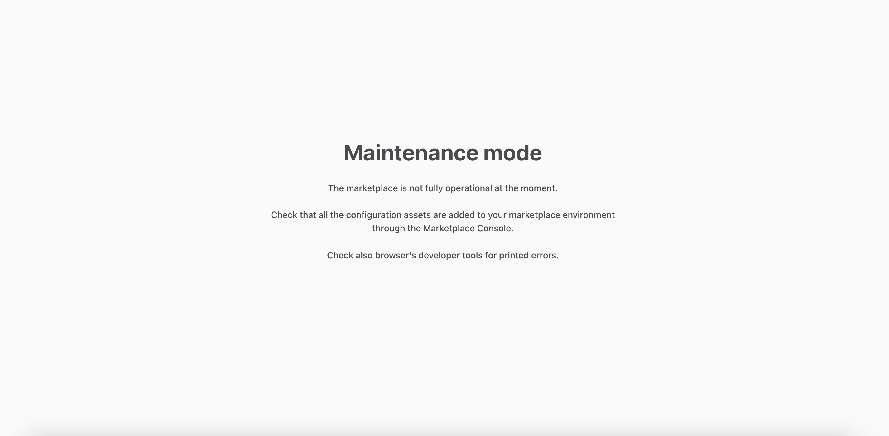

The Pages feature allows you to add, edit and manage content in Flex
Console. Once you have created content in Console, you can query it
through the Asset Delivery API, which returns the data structured as
JSON.
[Version 10.0.0](https://github.com/sharetribe/ftw-daily/releases/tag/v10.0.0)
of FTW introduces features that automatically render content pages from
Page Asset Data. This article will walk you through the logic used to
render these pages in FTW. Read more about the code-level changes
introduced to FTW from the release notes of
[version 10.0.0](https://github.com/sharetribe/ftw-daily/releases/tag/v10.0.0).

## What are content pages

A content page is a page type that is informational by nature with text
that does not frequently change. Typical content pages that you would
have on your website would be an “About us” page, a “Frequently asked
questions” page or a “Terms of Service” page. These pages have long
sections of written text that might include images, links and videos.

In older versions of FTW, the data on these content pages was hard-coded
into the corresponding page file. For instance, the content of the About
Page was
[written directly into the code](https://github.com/sharetribe/ftw-daily/blob/7a2f9b0557607533097761c063f7f98d7c8bfc1a/src/containers/AboutPage/AboutPage.js)
on the AboutPage.js file. Changes to the content required editing the
code and redeploying the client application. This required content
editors to work with developers to make simple changes to the copy text
of content pages.

With the introduction of Pages,
[versions 10.0.0](https://github.com/sharetribe/ftw-daily/releases/tag/v10.0.0)
and onwards of FTW now render content pages dynamically. Content can be
managed through the Pages feature, which provides the editor with a
graphical interface to input text, videos, links and images. FTW queries
the
[Asset Delivery API](https://www.sharetribe.com/api-reference/asset-delivery-api.html)
to retrieve the most recent version of the content and uses it to render
the content page. We refer to this data as
[Page Asset Data](#page-asset-data). It reflects the content’s structure
and is delivered in JSON.

On page load, FTW queries the Asset Delivery API to fetch the Page Asset
Data needed to render the requested page. The data is subsequently
stored in Redux state, which triggers a component called the PageBuilder
to render the Sections, Blocks and Fields defined in the data. The
[rendering pages section](#rendering-pages) explains how this happens in
further detail.

## Page Asset Data

Page Asset Data is a machine-readable format of the data inputted
through Pages in Console. It represents the content and structure of the
content page and is divided into Sections, Blocks and Fields.

A single query to the Asset Delivery API will provide you with the Page
Asset Data of a single content page, i.e. to render your landing page
and your FAQ page, the client will need to make two calls to the Asset
Delivery API and receive two separate JSON files. Page Asset Data is
always formatted in JSON.

Page Asset Data nests 3 levels of information:

- The Page Asset, which represents all data associated with an
  individual page
- The Page Asset can contain an array of Sections. Sections can have a
  type, and there are 4 different types available by default.
- Sections can contain an array of Blocks. Blocks can include text
  formatted in markdown.

The structure outlined above is hierarchical: Blocks are always nested
within Sections, and Sections are always nested within the Page Asset.
Both Sections and Blocks may include Fields, which are key-value pairs
encoding data such as title, ingress and background image.

- Read more: [Page asset schema](/references/page-asset-schema/)

It is up to the client application how it renders the data received
through the Asset Delivery API. Identical Page Asset Data can, for
example, be rendered using entirely different visual elements on two
different client applications.

## Rendering pages

### Routing and loadData calls

FTW uses React Router to [create routes](/ftw/how-routing-works-in-ftw/)
to different pages. This is best demonstrated through an example. When a
user navigates to the about page, it triggers the loadData function
specified in
[routeConfiguration.js](https://github.com/sharetribe/ftw-daily/blob/master/src/routeConfiguration.js#L66):

```js
  {
     path: '/privacy-policy',
     name: 'PrivacyPolicyPage',
     component: PrivacyPolicyPage,
     loadData: pageDataLoadingAPI.PrivacyPolicyPage.loadData,
   },
```

In older versions of FTW, no loadData function was defined for the
privacy policy path, as the page's content was hard coded. Now, as the
content of the page is fetched using an API call, a loadData function is
specified in
[PrivacyPolicyPage.duck.js](https://github.com/sharetribe/ftw-daily/blob/master/src/containers/PrivacyPolicyPage/PrivacyPolicyPage.js):

```js
export const loadData = (params, search) => dispatch => {
  const pageAsset = {
    privacyPolicy: `content/pages/${ASSET_NAME}.json`,
  };
  return dispatch(fetchPageAssets(pageAsset, true));
};
```

The function uses the fetchPageAssets function to fetch the Page Asset
Data for the privacy policy page. Once the data is loaded and stored in
state, the page can be fully rendered using the data stored in Page
Assets.

### Predefined routes

FTW has four predefined routes used to generate content pages:

- [PrivacyPolicy](https://github.com/sharetribe/ftw-daily/blob/master/src/containers/PrivacyPolicyPage/PrivacyPolicyPage.js)
- [TermsOfService](https://github.com/sharetribe/ftw-daily/blob/master/src/containers/TermsOfServicePage/TermsOfServicePage.js)
- [LandingPage](https://github.com/sharetribe/ftw-daily/blob/master/src/containers/LandingPage/LandingPage.js)
- [CMSPage](https://github.com/sharetribe/ftw-daily/blob/master/src/containers/CMSPage/CMSPage.js)

The first three are defined by default in Console and can not be
removed. Therefore, there is a dedicated component in FTW for each. For
any new page created through Console, a generic component called CMSPage
is used.

If we compare the loadData calls in the privacy policy page and CMSPage,
we can see that they differ slightly. The PrivacyPolicyPage.duck.js file
uses a predefined path for fetching the page asset
`content/pages/privacy-policy`

```js
import { fetchPageAssets } from '../../ducks/hostedAssets.duck';
export const ASSET_NAME = 'privacy-policy';

export const loadData = (params, search) => dispatch => {
  const pageAsset = {
    privacyPolicy: `content/pages/${ASSET_NAME}.json`,
  };
  return dispatch(fetchPageAssets(pageAsset, true));
};
```

Whereas the CMSPage uses a dynamic ID that is passed through the URL

```js
import { fetchPageAssets } from '../../ducks/hostedAssets.duck';

export const loadData = (params, search) => dispatch => {
  const pageId = params.pageId;
  const pageAsset = { [pageId]: `content/pages/${pageId}.json` };
  const hasFallbackContent = false;
  return dispatch(fetchPageAssets(pageAsset, hasFallbackContent));
};
```

FTW can use hardcoded asset names for Pages included by default in
Console, as the paths are static and not subject to change. The Pages
included by default are the Landing Page, Terms of Service page and
Privacy Policy page.

The CMSPage component, on the other hand, is used to render any new
Pages created by the user, which are assigned an ID on creation.

### PageBuilder

FTW uses a React component called the PageBuilder to dynamically render
content pages using Page Asset Data. You can find the PageBuilder in the
containers directory:

```shell
└── src
    └── containers
        └── PageBuilder
            └── PageBuilder.js
```

The PageBuilder component receives the Page Asset Data as a prop, and
uses it to render the content page. If no Page Asset Data is available,
it renders a fallback page.

```jsx
const PageBuilder = props => {
  const { pageAssetsData, inProgress, fallbackPage, options, ...pageProps } = props;

  if (!pageAssetsData && fallbackPage && !inProgress) {
    return fallbackPage;
  }
```

The PageBuilder will invoke the SectionBuilder component if Sections are
present in the Page Asset Data.

```jsx
const data = pageAssetsData || {};
const sectionsData = data?.sections || [];

<SectionBuilder sections={sectionsData} options={options} />;
```

Subsequently, the SectionBuilder will pass data on to the BlockBuilder
if an array of Blocks is present.

To render e.g. headers, links and images, FTW defines a Field component
that is used in both the BlockBuilder and SectionBuilder. Fields are the
most granular form of data in Page Asset Data. The Field component
validates and sanitises any data before it is rendered.

## Section and Block types

Using the Pages feature in Console, you can define a section type. FTW
recognises all Section types and renders each using a different
presentational component.

There are four Section types:

- Articles, meant for copy text and uses a narrow one column layout
  optimized for reading
- Carousel, an image carousel consisting from images uploaded through
  Console
- Columns, content blocks rendered in a 1, 2, 3 or 4 column grid
- Features, text and media displayed side by side in alternating order

The corresponding Section component is selected using the getComponent
function in the SectionBuilder:

```js
const Section = getComponent(section.sectionType);
```

The getComponent function uses the defaultSectionComponents object to
select the correct React component:

```jsx
const defaultSectionComponents = {
  article: { component: SectionArticle },
  carousel: { component: SectionCarousel },
  columns: { component: SectionColumns },
  features: { component: SectionFeatures },
};
```

Each section component is wrapped in a SectionContainer. You can use it
to apply styling that should be present in each component.

Default components can be overridden or edited. Remember that the
changes will be global and reflected on each content page. If you want
to change a Section component on a specific page, you can use the
options prop to override a page-level component [link to how-to].

Blocks also have a type property. Currently, Page Asset Data only
supports a single Block type.

## Fallback pages

As the content of the page is retrieved over a network connection, it is
important to prepare for a scenario where data is unavailable due to
e.g. a network issue. FTW uses fallback data if loading the Page Asset
Data through the Asset Delivery API fails. Fallback pages are specified
for page-level components and are included out of the box for the
Landing page, Terms of Service page and Privacy Policy page.

A fallback page is constructed similarly to how a dynamic content page
is. It uses the PageBuilder component, but instead of dynamically
retrieving Page Asset Data, it is given the pageAssetsData prop as a
predefined JSON asset. That data can be defined inline or in a separate
file. The fallback data should adhere to the structure and format used
in Page Asset Data.

A fallback page is defined in the same directory that the page level
component is defined in. For example, you will find the fallback page of
the Privacy Policy page under
containers/PrivacyPolicyPage/FallbackPage.js:

```shell
└── src
    └── containers
        └── PrivacyPolicyPage
            └── FallbackPage.js
```

## How to take Pages into use if you are using an older version of FTW

You can either follow these instructions, or
[pull the latest upstream changes](/ftw/how-to-customize-ftw/#pull-in-the-latest-upstream-changes).
If you've made a lot of customisations to your application, it may be
easier to implement the changes manually.

This section will outline the steps to incorporate the PageBuilder
feature into an older version of FTW. The PageBuilder feature
automatically renders pages based on data fetched through the Asset
Delivery API, allowing content editors to manage data in the Flex
Console. Please note that the steps outlined in this section may not
apply to the letter if you have made a lot of customizations to the
template.

The example in this section enables a dynamic version of the Privacy
Policy page, and the exact steps can also be applied to other content
pages.

1. Copy the
   [pageBuilder directory](https://github.com/sharetribe/ftw-daily/tree/master/src/containers/PageBuilder)
   (and its contents) in its entirety to src/containers/PageBuilder
2. Copy the
   [hostedAssetsDuck.js](https://github.com/sharetribe/ftw-daily/blob/master/src/ducks/hostedAssets.duck.js)
   file to src/ducks/hostedAssetsDuck.js
3. Copy over all the new utility files to src/util:
   [util/string.js](https://github.com/sharetribe/ftw-daily/blob/master/src/util/string.js)
   [util/sanitize.js](https://github.com/sharetribe/ftw-daily/blob/master/src/util/sanitize.js)
4. Copy over the
   [aspectRatioWrapper component](https://github.com/sharetribe/ftw-daily/tree/master/src/components/AspectRatioWrapper)
   directory to src/components/aspectRatioWrapper
5. Add an export statement in
   [components/index.js](https://github.com/sharetribe/ftw-daily/blob/master/src/components/index.js)
   for aspectRatioWrapper:

```js
export { default as AspectRatioWrapper } from './AspectRatioWrapper/AspectRatioWrapper';
```

6. Install all the required packages using either yarn or npm:

```shell
yarn add rehype-react@6.2.1 rehype-sanitize@4.0.0 remark-parse@9.0.0 remark-rehype@8.1.0 unified@9.2.2
```

7. Overwrite the contents of src/util/data.js with the
   [new data.js](https://github.com/sharetribe/ftw-daily/blob/master/src/util/data.js)
   file
8. Copy the
   [PrivacyPolicyPage directory](https://github.com/sharetribe/ftw-daily/tree/master/src/containers/PrivacyPolicyPage)
   (and its contents) to src/containers/PrivacyPolicyPage (overwriting
   any existing files)
9. Add a loadData call to where PrivacyPolicyPage is defined in
   [routeConfiguration.js](https://github.com/sharetribe/ftw-daily/blob/master/src/routeConfiguration.js):

```js
     {
      path: '/privacy-policy',
      name: 'PrivacyPolicyPage',
      component: PrivacyPolicyPage,
      loadData: pageDataLoadingAPI.PrivacyPolicyPage.loadData,
    },
```

10. Add the following import to
    [pageDataLoadingAPI.js](https://github.com/sharetribe/ftw-daily/blob/master/src/containers/pageDataLoadingAPI.js):

```js
import { loadData as PrivacyPolicyPageLoader } from './PrivacyPolicyPage/PrivacyPolicyPage.duck';
```

11. Also add the following code to the
    [pageDataLoadingAPI.js](https://github.com/sharetribe/ftw-daily/blob/master/src/containers/pageDataLoadingAPI.js)
    file:

```js
    PrivacyPolicyPage: {
      loadData: PrivacyPolicyPageLoader,
    },
```

To enable all new components that use the Pages feature (the About page,
Landing page, Terms of Service page and the CMSPage), repeat steps 8 and
onward, replacing PrivacyPolicyPage with the component you want to
enable.

After these steps, you should be able to see the default pages in your
template.

<info>

In case you have not yet added the default page assets in your Flex
Console, you will see a fallback page with a default "Maintenance mode"
text. If this is the case, you will need to go to your
[Flex Console > Build > Content > Pages](https://flex-console.sharetribe.com/content/pages)
and add the default content pages.



</info>

In addition, Flex Console allows you to preview content pages in the
template app. To enable this feature, you'll also need to copy over the
[PreviewResolverPage](https://github.com/sharetribe/ftw-daily/blob/master/src/containers/PreviewResolverPage/PreviewResolverPage.js)
to src/containers/PreviewResolverPage/PreivewResolverPage.js, and import
the component in
[routeConfiguration.js](https://github.com/sharetribe/ftw-daily/blob/master/src/routeConfiguration.js):

```js
import PreviewResolverPage from './containers/PreviewResolverPage/PreviewResolverPage';
```

You'll also need to add a route configuration for the preview page in
[routeConfiguration.js](https://github.com/sharetribe/ftw-daily/blob/master/src/routeConfiguration.js):

```js
   {
      path: '/preview',
      name: 'PreviewResolverPage',
      component: PreviewResolverPage ,
    },
```
