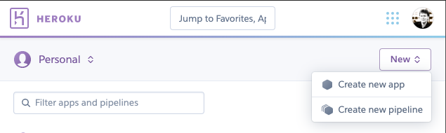
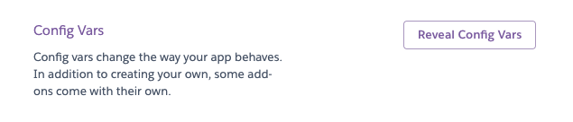
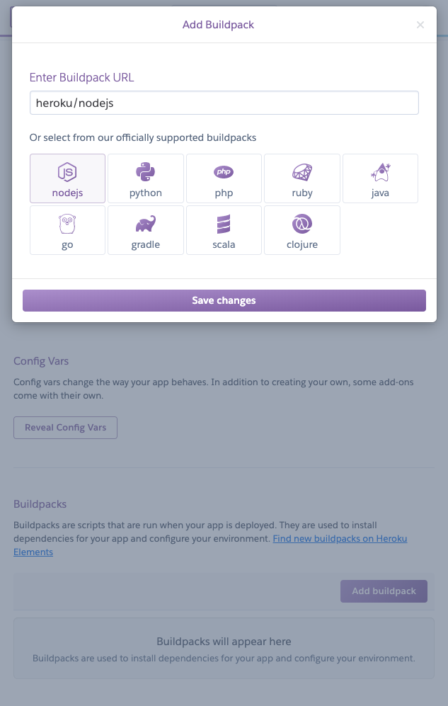
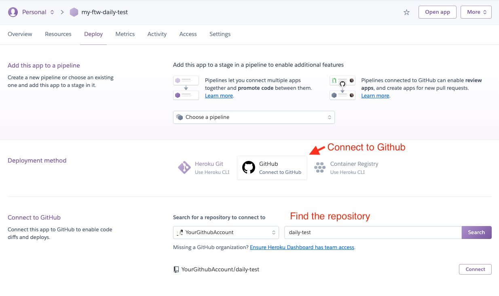
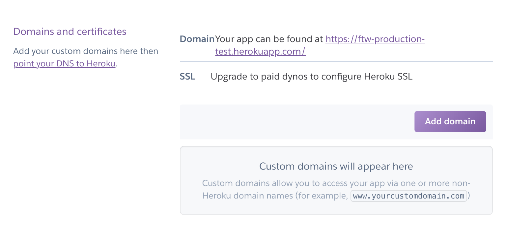
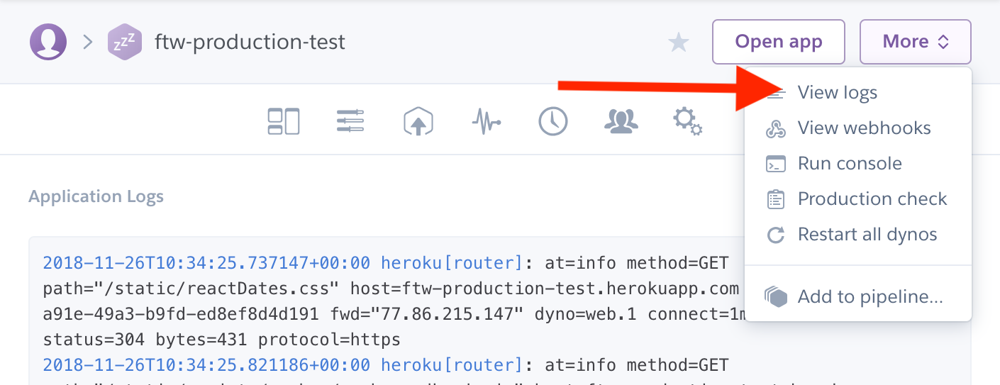

This guide provides a practical demonstration of how to deploy the
Sharetribe Web Template to Heroku. Heroku is one of the most popular
cloud hosting service providers, and because of that, there is a lot of
information online that can help you solve and debug potential problems
with your deployment. Unlike [Render](https://www.render.com), Heroku
does not provide a free tier.

Before deploying your marketplace to Heroku, you need to create three
accounts:

- [Heroku](https://www.heroku.com/)
- [Stripe](https://stripe.com/)
- [Mapbox](https://www.mapbox.com/)

## Deploying the template to Heroku

**Step 1: Create a Heroku account**

Go to [Heroku](https://www.heroku.com/pricing) and create a new account
if you do not have one.

**Step 2: Create a new app**

Create a new app in the Heroku dashboard.

**Step 3: Change the environment variables**

In Heroku, you can configure environment variables from the
[Heroku dashboard](https://devcenter.heroku.com/articles/config-vars#using-the-heroku-dashboard).

Go to the Settings page of your new app and reveal Config Vars:

Then add the following environment variables as Config Vars:

- `REACT_APP_SHARETRIBE_SDK_CLIENT_ID`

  Flex client ID. Check this from
  [Console](https://flex-console.sharetribe.com/applications).

- `SHARETRIBE_SDK_CLIENT_SECRET`

  Flex client secret. Check this from
  [Console](https://flex-console.sharetribe.com/applications).

- `REACT_APP_STRIPE_PUBLISHABLE_KEY`

  Stripe publishable API key for generating tokens with Stripe API. Use
  the test key (prefix `pk_test`) for development.

- `REACT_APP_MAPBOX_ACCESS_TOKEN`

  If you are using Mapbox instead of Google Maps

- `REACT_APP_MARKETPLACE_ROOT_URL`

  Canonical root URL of the marketplace. Remove trailing slash from the
  domain. E.g. _`https://<the-name-of-your-app>.herokuapp.com`_

- `NODE_ENV`

  Defines whether the application is run in production or development
  mode. Use 'development' for development and 'production' for
  production.  Use value: 'production'

- `REACT_APP_ENV`

  A more fine-grained env definition than `NODE_ENV`. For example, this
  sends environment info to the logging service Sentry. (If you have
  enabled it with `REACT_APP_SENTRY_DSN`).  For this setup, use
  value: 'development'

- `REACT_APP_SHARETRIBE_USING_SSL`

  Redirect HTTP to HTTPS?  Use value: true

- `SERVER_SHARETRIBE_TRUST_PROXY`

  Set this when running the app behind a reverse proxy, e.g. in
  Heroku.  Use value: true

- `REACT_APP_CSP`

  Content Security Policy (CSP). Read more from
  [this article](/ftw/how-to-set-up-csp-for-ftw/).  Accepts values:
  _block_ and _report_. The recommended value is _block_.

If you change these values later on, _you need to deploy the app again_.
Environment variables are baked into the static build files of the web
app - so a new build is required.

**Step 4: Add a Node.js buildpack**

Go to the Settings page of your new app and add the official buildpack:
_heroku/nodejs_

**Step 5: Connect the Heroku app to Github**

Go to the Deploy page of your new app and
[connect the app with Github](https://devcenter.heroku.com/articles/github-integration#enabling-github-integration).

After that, you can deploy the app manually or enable automatic deploy
from your default branch (usually named as _main_ or _master_).

If everything works, your app should be available in a URL that looks a
bit like this: `HTTPS://<your-app-name>.herokuapp.com`

## Set up domains and certificates

Heroku manages SSL certificates automatically for new applications. You
can change your domain and SSH settings in the _Settings tab_.

Read more from Heroku docs:

- [Custom Domain Names for Apps](https://devcenter.heroku.com/articles/custom-domains)
- [Automated Certificate Management](https://devcenter.heroku.com/articles/automated-certificate-management)

## Heroku logs

You can find your application's logs by clicking button _"More"_ in the
upper right corner and selecting _"View logs"_ from the opening
dropdown. Logs can be useful if there are problems when deploying the
app.

## Troubleshooting Heroku

By default, Heroku will use latest Long-Term-Support (LTS) version of
Node.js. So, you might want to specify that your dev and production
environments use the same Node version as your local machine when you
run `yarn run dev-server`.

This can be done by adding an `engines` section to the `package.json`.
Read more from Heroku's
[Node.js Support guide](https://devcenter.heroku.com/articles/nodejs-support#specifying-a-node-js-version).

You should also check that the _environment variables_ in your local
environment matches with _Config Vars_ in Heroku app settings.
