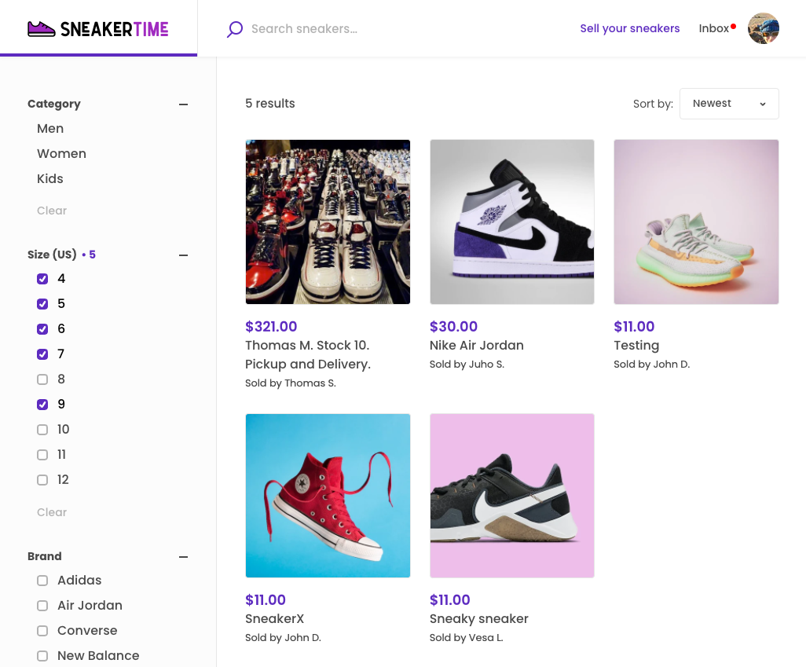
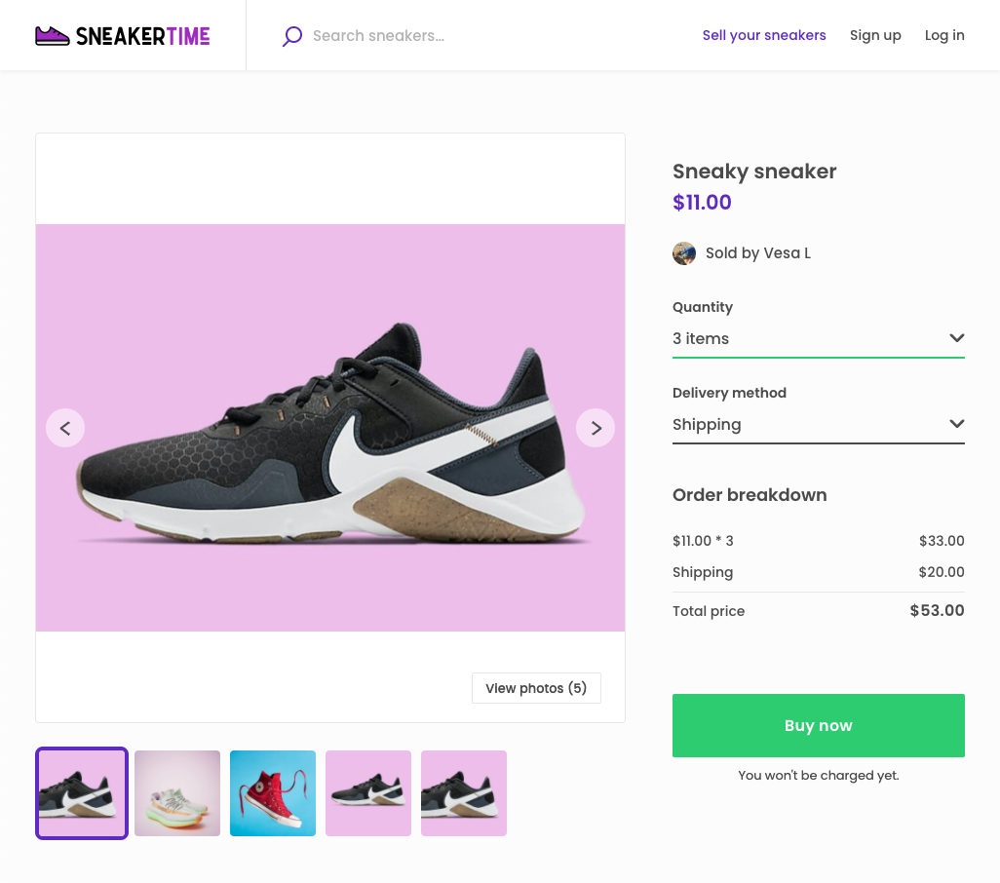
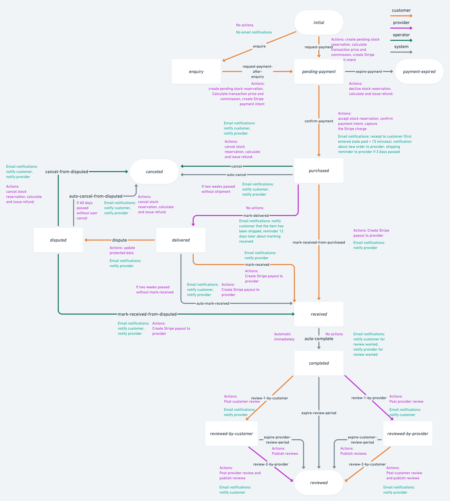
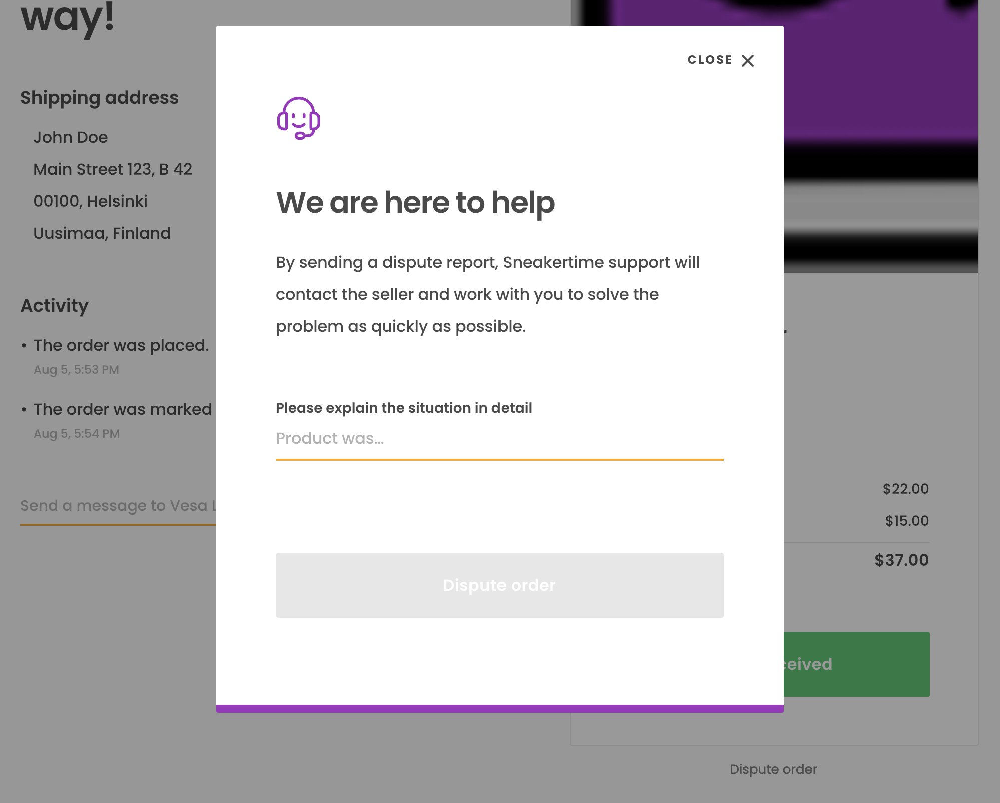

FTW-product is a new Flex Template for Web. It's built with product
marketplaces in mind.

While FTW daily was about renting saunas and FTW hourly was about
booking Yoga teachers, FTW product is a conceptual marketplace called
Sneakertime to buy sneakers.

You can find the repository from here:<br />
https://github.com/sharetribe/ftw-product

## Differences in directory structure

With this template, we decided to take advantage of the possibilities
that code-splitting made possible. FTW-daily and FTW-hourly were created
before code-splitting was possible, and pushing most of the components
to a specific _src/components/_ directory made sense. It was a clear
place where customizers could start looking for components they wanted
to customize. This setup also improved developer experience a bit since
it allowed us to use index file to export all those components:

```js
import { Avatar, Button, Logo } from ‘../../components’;
```

The alternative is to import everything one-by-one, which can be a
pretty long list of imports.

```js
Import Avatar from ‘../../components/Avatar/Avatar.js’;
Import Button from ‘../../components/Button/Button.js’;
Import Logo from ‘../../components/Logo/Logo.js’;
```

Code-splitting changed the dynamics of this setup a bit. Everything that
is imported through a single file, is likely to end up into a main
code-chunk. That means that everything in that file is going to slow
down page rendering - when the page is fully loaded. That also affects
search engine optimization (SEO).

With FTW-product, we have decided to move certain page-specific files
under page-directories. Here are some of the relevant changes in the
directory structure:

- _**src/config/**: Generic configuration files are moved to this
  directory_<br /> Extra configs:

  - **mainSearchType** in Topbar. It's either _'keywords'_ or
    _'location'_.
  - **searchPageVariant**: _'list'_ & _'map'_.
  - **listingPageLayout**: _'full-image'_ & _'hero-image'_
  - **listing.aspectWidth**: config to define width of aspect ratio
  - **listing.aspectHeight**: config to define height of aspect ratio
  - **listing.variantPrefix**: listing-specific image variants

  <br />
  Renamed configs:

  - **transactionProcessAlias** (in other templates:
    _bookingProcessAlias_)
  - **lineItemUnitType** (in other templates: _bookingUnitType_)

- **src/routing/**: Route configuration and UI components related to
  routing are moved to this directory

- UI components that are only used in a single page or within a more
  complex component are nested within that page or component.<br /> For
  example:

  - _EditListingWizard_ is moved under **EditListingPage**
  - _Search map and filters_ are moved under **SearchPage**
  - **TransactionPage** got subcomponents like _ActivityFeed_,
    _ReviewModal_, _ReviewForm_, _SendMessageForm_, and
    _TransactionPanel_.
  - **LandingPage** got subcomponents like _SectionHero_,
    _SectionHowItWorks_, and _SectionFilteredSearches_.

- **src/forms/**: this directory was removed as there was only one form
  that was truly shared between pages: _StripeConnectAccountForm_. It's
  moved to _src/components/_.

## SearchPage

SearchPage component has got 2 variants: **SearchPageWithList** and
**SearchPageWithMap**. One of these is taken into use by changing
_searchPageVariant_ configuration in _src/config/config.js_.

### SearchPageWithList

This variant is the new default layout that FTW-product uses. It doesn't
contain a map at all but only listings with a layout where filters are
shown in a sidebar.



### SearchPageWithMap

This variant is a similar layout to what FTW-daily and FTW-hourly use.
However, it has been made easier to select a map provider. This can be
done through configuration change:

```shell
└── src
    └── config
        └── config.js
```

```js
const maps = {
  mapboxAccessToken: process.env.REACT_APP_MAPBOX_ACCESS_TOKEN,
  googleMapsAPIKey: process.env.REACT_APP_GOOGLE_MAPS_API_KEY,

  // Choose map provider: 'MAPBOX', 'GOOGLE_MAPS'
  // Note: you need to have REACT_APP_MAPBOX_ACCESS_TOKEN or REACT_APP_GOOGLE_MAPS_API_KEY
  //       set depending on which one you use in this config.
  mapProvider: 'MAPBOX',
```

## ListingPage

Also ListingPage component has got 2 variants: **ListingPageFullImage**
and **ListingPageHeroImage** These are configured through
_listingPageLayout_ configuration in _src/config/config.js_.

```js
// ListingPage has 2 layout options: 'hero-image' and 'full-image'.
// - 'hero-image' means a layout where there's a hero section with a cropped image at the beginning of the page
// - 'full-image' shows an image carousel, where listing images are shown with the original aspect ratio
const listingPageLayout = 'full-image';
```

Other considerable changes are that both versions use **OrderPanel**
component instead of _BookingPanel_. In addition, _BookingBreakdown_
component has been renamed as **OrderBreakdown**. In FTW-product, you
are selecting a quantity and delivery method instead of booking dates.

### ListingPageFullImage

This layout is the default in FTW-product. It has a bit different layout
than what other templates use. The biggest difference is that there is
no hero-style image but instead there's an image gallery component that
shows scaled versions of listing images. So, uploaded product images are
not cropped in that gallery.



### ListingPageHeroImage

Hero-styled image layout is a similar layout to what FTW-daily and
FTW-hourly use. There's a hero-image at the beginning of the page.
However, this is not exactly the same layout as what the other templates
use.

## Differences in transaction process

FTW-product has a different transaction process graph than what
FTW-daily and FTW-hourly use. Visually, the biggest changes are after
the checkout page and before the review period. E.g. FTW-product has a
**dispute** state there. However, the defining difference is actually in
actions: FTW-product doesn't use bookings (and availability management
of time-slots). Instead, it has actions to deal with stock management.

Roughly, the transaction process graph looks like this:



## Managing stock

Stock management is pretty straightforward. On EditListingWizard, (which
is a component to create and update listings), a provider can set the
stock quantity for the listing. Under the hood, FTW-product calls API
with _`sdk.stock/compareAndSet()`_ with the value provider is trying to
set ("**newTotal**") and also the previous value ("**oldTotal**"). At
the time of update, if the assumed old total still matches with the
current stock, the **currentStock** entity is updated to the value
passed through with "newTotal" parameter. This check is done to prevent
race conditions, where someone orders a listing while the provider is
updating its stock.

Listing entity has a relationship to "currentStock" entity - so,
currentStock info can be included listing queries. Then on ListingPage,
a customer can order as many listings as there is stock left for it.

> Note: Flex API and FTW-product don't yet support listing variants (the
> stock of yellow t-shirts vs red t-shirts). So, listing variants need
> to be modeled with separate listings.

## Shipping the product

For product marketplaces, it's usually necessary to ask for a shipping
address from a customer. FTW-product asks shipping method on ListingPage
and if 'shipping' is chosen, shipping address is asked on CheckoutPage.
The address is saved to transaction's protected data in transitions:
_request-payment_ and _request-payment-after-enquiry_.

On TransactionPage (the page opened by clicking inbox items), the
shipping address or pickup address is shown to both parties of the
transaction. The provider has 2 weeks to mark the item shipped
(_transition/mark-delivered_) or the automatic expiration happens
(_transition/auto-cancel_) and the customer is refunded. If needed, the
customer can dispute the order from the "Delivered" state.



## Handling time zones

FTW-product doesn't really need to print dates and times, but we have
refactored `src/util/dates.js` so that it uses "moment-timezone" library
and it is, therefore, ready to convert and render timestamps in
different time zones if needed.

## Summary

This template works as a starting point for marketplaces that need to
use stock management instead of booking. We have added more
configuration options to this template, but naturally, not everything has a
configuration option. You can however change anything you want by making
changes to the code directly. You should think of this as a starting point
for your customization journey - a starting point to get your
[Minimum Viable Product](https://www.sharetribe.com/academy/how-to-build-a-minimum-viable-platform/)
(MVP) up and running.
