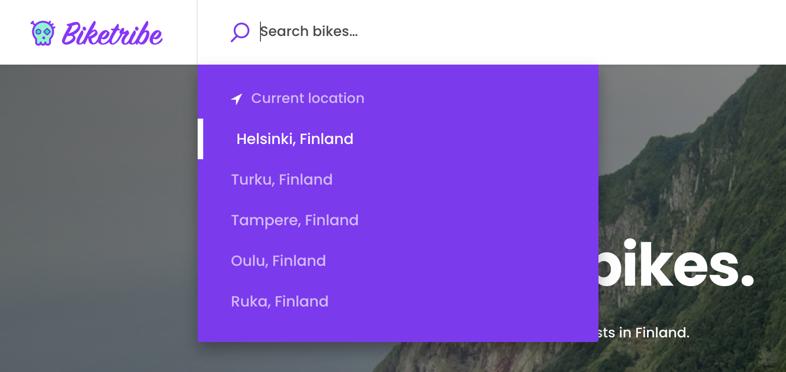

## Generate a Mapbox access token

[Sign up to Mapbox](https://account.mapbox.com/auth/signup/) and go to
the [account page](https://account.mapbox.com/). Then copy the
`Default public token`.

If you wish to create a new one, click `+ Create a token`, give it a
name and make sure all Public scopes are selected. Create the token and
copy its value.

You can make access tokens in your web applications more secure by
adding URL restrictions. When you add a URL restriction to a token, that
token will only work for requests that originate from the URLs you
specify. See the Mapbox documentation for
[URL restrictions](https://docs.mapbox.com/accounts/overview/tokens/#url-restrictions).

## Assign the access token to an environment variable

SWT uses the `REACT_APP_MAPBOX_ACCESS_TOKEN` environment variable for
the token value. For local development, you can add the variable in the
gitignored `.env` file in the project root:

```bash
REACT_APP_MAPBOX_ACCESS_TOKEN=my-access-token-here
```

## Configure default locations

You can configure the search field on the landing page to show the user
a predefined list of locations from which to search. Enabling this
feature can make searching for common locations faster for your users
and reduce the need to call the Mapbox Geolocation API.



This feature is not enabled by default. To enable it, you need to add
the locations to the
[configDefaultLocationSearches.js](https://github.com/sharetribe/ftw-x/blob/main/src/config/configDefaultLocationSearches.js#L14)
file.

To disable the first result on the list to search for the user's
"Current location", you can change the configuration variable
[`suggestCurrentLocation` in the configMaps.js file](https://github.com/sharetribe/ftw-x/blob/main/src/config/configMaps.js#L23)
to false. The
[`currentLocationBoundsDistance`](https://github.com/sharetribe/ftw-x/blob/main/src/config/configMaps.js#L27)
variable (found in the same file) defines the distance in meters for
calculating the bounding box around the current location.

## Configure fallback bounding boxes

The Mapbox Geocoding API does not always return a bounding box with the
results. The
[SearchMap](https://github.com/sharetribe/ftw-x/blob/main/src/containers/SearchPage/SearchMap/SearchMap.js)
component needs a bounding box to adjust the zoom level of the map when
displaying a location.

Suppose the Geocoding API does not return a bounding box. In that case,
the map uses the default values defined in
[GeocoderMapbox.js](https://github.com/sharetribe/ftw-x/blob/main/src/components/LocationAutocompleteInput/GeocoderMapbox.js).
The configuration specifies a default distance to generate the bounding
box with for all different Mapbox Geocoding
[data types](https://docs.mapbox.com/api/search/geocoding/#data-types).

## Restrict location autocomplete to specific country or countries

If your marketplace works only in a specific country or countries it
might be a good idea to limit the location autocomplete to those
countries. You can specify whether to use the limitation in
[config/configMaps.js](https://github.com/sharetribe/ftw-x/blob/main/src/config/configMaps.js#L48).
Search for variable `countryLimit` and uncomment the line to make it
active. Provide the country or countries in an array using
[ISO 3166 alpha 2](https://en.wikipedia.org/wiki/ISO_3166-1_alpha-2)
format (eg. GB, US, FI). If there are multiple values, separate them
with commas.

## Using Google Maps

It is possible to use Google Maps instead of Mapbox. Read more in the
[How to configure Google Maps](/ftw/how-to-use-google-maps-in-ftw/)
guide.

### How to use other map providers

The default map setup of SWT uses library called
[mapbox-gl-js](https://docs.mapbox.com/mapbox-gl-js/api/). It supports
quite many other map providers too. Thus, if you wish to use a map
provider other than Google Maps or Mapbox, first check if the map
provider you are considering is supporting this library. If they are,
the change might be quite easy. Note: if you change the map tile
provider you should also change geocoding API too (i.e. the API endpoint
for `LocationAutocompleteInput` component).
