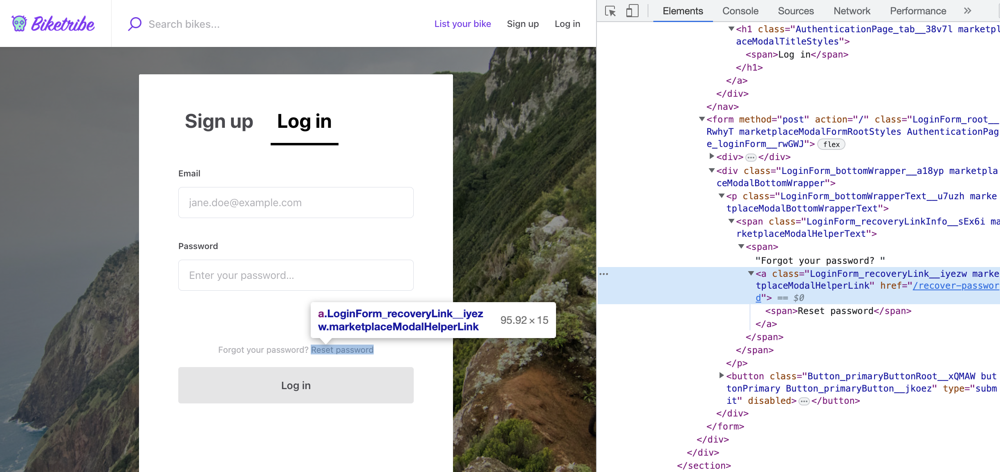

The goal for creating styling for FTW was to keep styling as close as
possible to plain CSS while still trying to avoid the mess that comes
along with globally defined cascading behavior that CSS is all about.

To tackle this goal, we have split the styling into two levels in this
template application:

- [Marketplace level styling](#marketplace-level-styling) with 3 global
  stylesheets:
  - _src/styles/**marketplaceDefaults.css**_ (contains CSS variables and
    element styles)
  - _src/styles/**customMediaQueries.css**_ (contains breakpoints for
    responsive layout)
  - _src/styles/**propertySets.css**_ (contains CSS Property Sets aka
    @apply rules)
- [Component level styling](#styling-components) using
  [CSS Modules](https://github.com/css-modules/css-modules)

## Marketplace level styling

```shell
└── src
    └── styles
        ├── propertySets.css
        ├── customMediaQueries.css
        └── marketplaceDefaults.css
```

We have created marketplace-level styling variables with CSS Properties
(vars) and CSS Property Sets (@apply rules).

The concept behind CSS Properties is quite straightforward - they are
variables that can be defined in root-element level (`<html>`) and then
used inside some CSS rule.

```css
/* in src/styles/marketplaceDefaults.css */
:root {
  --marketplaceColor: #ffff00;
}
```

```css
/* in component.module.css */
.linkToHomePage {
  color: var(--marketplaceColor);
}
```

(Read more about CSS Properties from
[MDN](https://developer.mozilla.org/en-US/docs/Web/CSS/Using_CSS_custom_properties))

### marketplaceDefaults.css

This is a good place to start customizing marketplace styles. For
example, we define our color scheme here using CSS Property variables:

```css
/* ================ Colors ================ */

--marketplaceColor: #c0392b;
--marketplaceColorLight: #ff4c38;
--marketplaceColorDark: #8c291e;

/* Used with inline CSS SVGs */
--marketplaceColorEncoded: %23c0392b;

--successColor: #2ecc71;
--successColorDark: #239954;
--failColor: #ff0000;
--attentionColor: #ffaa00;

--matterColorDark: #000000;
--matterColor: #4a4a4a;
--matterColorAnti: #b2b2b2;
--matterColorNegative: #e7e7e7;
--matterColorBright: #fcfcfc;
--matterColorLight: #ffffff;
```

Changing `--marketplaceColor: #c0392b;` to `--marketplaceColor: tomato;`
will change the default marketplace color to tomato color. (It's a
certain kind of red color.)

The `--marketplaceColorEncoded` variable holds the same value as
`--marketplaceColor` but with the _#_ URL encoded. This value can be
used to maintain a consistent color scheme with inline SVG icons.

`--successColor` (green) is used in form inputs for showing that the
input value is valid. Sometimes, submit buttons (`<PrimaryButton>`) are
also using that color to highlight the fact that user has entered valid
information to the form at hand.

Similarly `--failColor` is used to style errors and `--attentionColor`
is used to draw user's attention to certain UI components (e.g. required
form inputs, or important info in Inbox)

Our greyscale colors (for borders and background colors) are named with
prefix _"matter"_.

Similar pattern is also used to create more consistent UI components by
providing variables for box-shadows, border-radiuses, transitions, and
so on. Our current plan is to parameterize styling even more using this
concept.

In addition, this file provides default styles for plain elements like
`<body>`, `<a>`, `<p>`, `<input>`, `<h1>`, `<h2>`, and so on.

### customMediaQueries.css

Breakpoints for media queries are defined in separate file.

```css
@custom-media --viewportSmall (min-width: 550px);
@custom-media --viewportMedium (min-width: 768px);
@custom-media --viewportLarge (min-width: 1024px);
// etc.
```

These custom media query breakpoints can be used in a similar way as CSS
Properties. However, these variable are converted to real media queries
on build-time.

```css
@media (--viewportMedium) {
  /* CSS classes */
}
```

On a live site, the CSS file contains:

```css
@media (min-width: 768px) {
  /* CSS classes */
}
```

### propertySets.css

Fonts are specified in this files using CSS Property Sets. They provide
us a solid way of creating a fixed set of CSS rules for a specific font.

For example, our default font is defined as:

```css
--marketplaceDefaultFontStyles: {
  font-family: var(--fontFamily);
  font-weight: var(--fontWeightMedium);
  font-size: 14px;
  line-height: 24px;
  letter-spacing: -0.1px;
  /* No margins for default font */

  @media (--viewportMedium) {
    font-size: 16px;
    line-height: 32px;
  }
}
```

And created property set can be used as:

```css
p {
  @apply --marketplaceDefaultFontStyles;
}
```

> ⚠️ **Note**: template app is following a pattern where the height of
> an element should be divisible by **6px** on mobile layout and **8px**
> on bigger layouts. This affects line-heights of font styles too.

> ⚠️ **Note**: the **@apply** rule and custom property sets most likely
> won't get any more support from browser vendors as the spec is yet
> considered deprecated and alternative solutions are being discussed.

## Fonts

**marketplaceDefaults.css** and **propertySets.css** files are mostly
responsible of what font styles are used. The font-family itself is
defined in CSS Property `--fontFamily` and by default, FTW templates use
Poppins. This is a Google Font, but for performance reasons we have
served them from Sharetribe's CDN.

The actual font files are loaded in _public/index.html_. If you want to
change the font or loading strategy, you need to edit those 3 files. To
read more about font-loading strategies, check these links:

- https://www.zachleat.com/web/comprehensive-webfonts/
- https://css-tricks.com/the-best-font-loading-strategies-and-how-to-execute-them/

## Styling components

Styling a web UI is traditionally quite a messy business due to the
global nature of stylesheets and especially their cascading specificity
rule. `.card {/*...*/}` will affect every element on a web page that has
a class **"card"** - even if the different UI context would like to use
a different set of rules.

Our goal has been to create independent components that can be reused in
the UI without paying too much attention to the global CSS context. To
achieve this, we have used
[CSS Modules](https://github.com/css-modules/css-modules), which keeps
the syntax close to plain CSS, but it actually creates unique class
names to remove the problems caused by the global nature of CSS. In
practice, this means that a class with name **card** is actually renamed
as **_ComponentName_card\_\_3kj4h5_**.

To use styles defined in SectionHero.module.css, we need to import the
file into the component:

```jsx
import css from './SectionHero.module.css';
```

and then select the correct class from imported style object (in this
case **heroMainTitle**):

```jsx
<h1 className={css.heroMainTitle}>Book saunas everywhere</h1>
```

### Find the component

Quite often one needs to find a component that is responsible for
certain UI partial in order to change the styles. In this case, the
easiest way to pinpoint a component is to open the inspector from
browser's dev tools. (Right-click on top of the correct element, and
select _Inspector_, or something of the sort depending on the browser,
from the context menu.)



Here we have opened title on LandingPage and the styles for the
**heroMainTitle** heading:

```html
<h1 class="SectionHero_heroMainTitle__3mVNg">
  <span>Book saunas everywhere.</span>
</h1>
```

Styles are defined in a "class" called
**`SectionHero_heroMainTitle__3mVNg`**. As stated before, the first part
of a class name is actually giving us a hint about what component is
defining that style - in this case, it's _SectionHero_ and its styles
can be found from the file: **SectionHero.module.css**.

```shell
└── src
    └── components
        └── SectionHero
            └── SectionHero.module.css
```

There's only two groups of components that break that rule:

- **src/containers**

  These components are connected to Redux store: Pages and
  TopbarContainer

- **src/forms**

<extrainfo title="FTW-product has moved components and removed 'src/forms/' directory">

FTW-product has moved most of the components that are only used in a
single page, inside the directory of that page-level component. In
addition, _src/forms_ directory became obsolete and it was removed
altogether.

This was done to reduce the size of code-chunks (JavaScript files
containing part of the source code) that are shared between different
pages. It improves performance since individual pages need to load less
code before they can render themselves.

</extrainfo>

### Styling guidelines

We have a practice of naming the outermost class of a component as
`.root { /* styles */ }`. So, if the component is just rendering single
element it only has **.root** class, and if there's more complex inner
DOM structure needed, additional classes are named semantically.

`<SectionHero>` could contain classes named as **.root**,
**.heroMainTitle**, **.heroSubtitle**.

Some guidelines we have tried to follow:

- **Use semantic class names**<br/> They improve readability and
  decouples style changes from DOM changes.
- **Use CSS Properties defined in marketplaceDefaults.css**<br/> and
  create new ones when it makes sense.
- **Use classes**, don't style DOM elements directly.<br/> Element
  styles are global even with CSS Modules.
- **Avoid nesting styles**.<br/> CSS Modules makes specificity rules
  unnecessary.
- **Group and comment style rules** inside declaration block if that
  improves readability.
- **Parent component is responsible for allocating space** for a child
  component (i.e. dimensions and margins).
- **Define `@apply` rules early enough** inside declaration block.<br/>
  Rules inside those property sets might overwrite rules written above
  the line where the set is applied.
- **Align text and components** to horizontal baselines. I.e. they
  should be a multiple of **_6px_** on mobile layout and **_8px_** on
  bigger screens.
- **Component height should follow baselines too**.<br/> I.e. they
  should be a multiple of **_6px_** on mobile layout and **_8px_** on
  bigger screens. _(Unfortunately, we haven't been strict with this
  one.)_

### Parent vs child

One important aspect of a component-based UI is the fact that a
component is usually only responsible for what happens inside its
outermost element boundary. In parent-child context this means that the
parent component is responsible for its own layout and therefore it
usually needs to be able to give some dimensions to its child components
(and naturally margins between them).

This creates a need for the parent to have means to pass **className**
to its child as props. One example could be a component that shows a
circle component inside itself and makes it 50px wide.

Style definitions of the (`<Circle />`) child component:

```css
.root {
  background-color: tomato;
  border-radius: 50%;
}
```

Parent component could render something like:

```jsx
<div className={css.root}>
  <Circle className={css.circleDimensions} />
</div>
```

and it uses classes:

```css
.root {
  min-width: 60px;
  min-height: 60px;
  display: flex;
  align-items: center;
  justify-content: center;
}

.circleDimensions {
  flex-grow: 0;
  width: 50px;
  height: 50px;
  margin: 5px;
}
```

Sometimes the child component needs to be styled even further than just
allocating space to it. If the parent component wants to change the
theme of child component there are generally two concepts available:

- Create themed components (e.g. `<PrimaryButton>`, `<SecondaryButton>`,
  `<InlineButton>`)
- Pass in a **class** property that is able to overwrite original
  styling rules.

For the latter option, we have created a prop type concept called
**_rootClassName_**. If you pass **rootClassName** through props to a
component, it will use that instead of component's own style rules
defined in **.root**. This ensures that the order of style declarations
inside final CSS bundle doesn't affect the final styles. (CSS bundle is
generated in an import order, therefore we want to avoid situations
where `<Component className="classA classB"/>` could end up overwriting
each others depending on the order they are imported.)

```jsx
import React from 'react';
import css from './MyComponent.module.css';

export const MyComponent = props => {
  const { className, rootClassName } = props;
  const classes = classNames(rootClassName || css.root, className);
  return <div className={classes}>Hello World</div>;
};
```

In some complex cases, we have also created props for overwriting some
inner classes of child components. In these cases, child component is
also replacing its own styling class with the class passed-in through
props. For example, `<LocationAutocompleteInput>` can take a prop called
**iconClassName**, which (if given) replaces **.icon** class defined
inside _LocationAutocompleteInput.module.css_.

## Using vanilla CSS

FTW templates don't use vanilla CSS, but it is possible to take vanilla
CSS into use just by creating CSS file that doesn't use `*.module.css`
pattern in its file name.

Read more about using vanilla CSS from Create React App's docs:<br/>
https://create-react-app.dev/docs/adding-a-stylesheet

<extrainfo title="Before FTW-daily@v7.0.0 or FTW-hourly@v9.0.0">

Old template version before FTW-daily@v7.0.0 or FTW-hourly@v9.0.0 are
expecting all `*.css` files to contain CSS Modules markup. Adding
vanilla CSS in those setups required that the file was uploaded outside
of the build process.

In practice, the files using plain CSS could be added to
_public/static/_ directory and then linked them inside _index.html_:

```html
<link rel="stylesheet" href="%PUBLIC_URL%/static/myStylesheet.css" />
```

</extrainfo>
