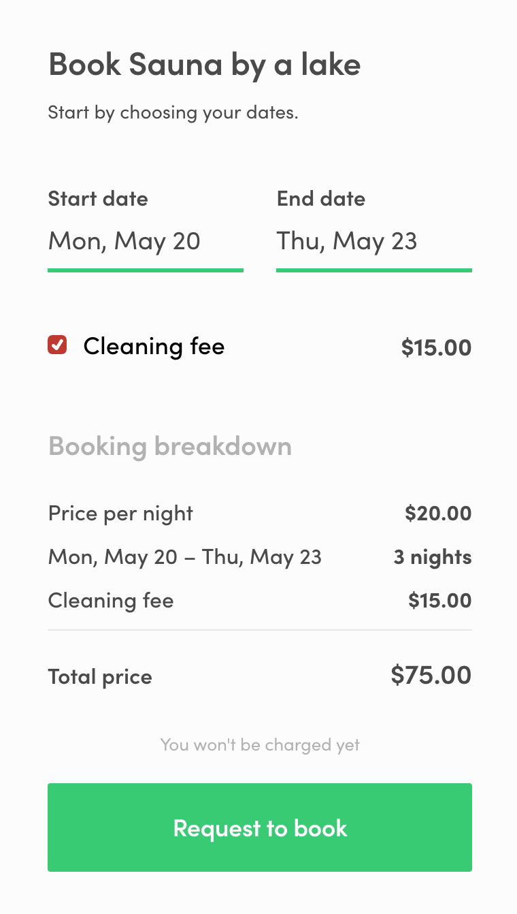

This guide walks you through the process of taking custom pricing into
use by using the example of a common pricing adjustment: adding the
ability to charge an optional cleaning fee on top of the regular nightly
price of the accommodation. For more information about custom pricing
and pricing in Flex in general, refer to
[the custom pricing background article](/background/custom-pricing/).

## 1. Process change

To get started, the transaction process needs to be updated to support
custom pricing. The requierd change is to add the
`set-line-items-and-total` action to all the transitions that create a
booking. For this, you need to
[contact Sharetribe support](mailto:flex-support@sharetribe.com) and ask
them to make the process adjustment for you. In this guide, we're
assuming that the `set-line-items-and-total` action has been added to
the `transition/request` and `transition/request-after-enquiry`
transitions in the default transaction process.

> Note: `set-line-items-and-total` cannot be combined with other pricing
> actions that rely on the booking length or the quantity of units. In
> order to take custom pricing into use, price calculations that rely on
> booking length or quantity of units also need to be converted into
> using custom pricing. Commissions and price negatiation however don't
> require any changes as they can be combined with custom pricing.

## 2. Listing extended data

Custom pricing can be based on a lot of variables but one practical way
to build it is to base it on information stored as extended data in
listings. See the
[How to extend listing data in FTW](/guides/how-to-extend-listing-data-in-ftw/)
guide to read how to extend the listing data model with extended data.

## 3. Change current booking model to use custom pricing

The first step to do in FTW is to modify the current booking creation so
that custom pricing is used instead of the nightly or daily pricing. For
custom pricing, the booking is not constructed in the API based on
`bookingStart` and `bookinEnd` but it's based on line items that the
client sends in the booking initiation request.

Instead of the just listing ID, now we're going to pass the actual line
items in the transaction initiate request. To achieve this
`CheckoutPage` has to be modified a bit. Add the following lines to the
current imports at the top of the `CheckoutPage.js` file:

```js
import { nightsBetween, daysBetween } from '../../util/dates';
import { types as sdkTypes } from '../../util/sdkLoader';

const { Money } = sdkTypes;
```

Then add the following method to the `CheckoutPageComponent` class:

```js
/**
 * Constructs a request params object that can be used when creating bookings
 * using custom pricing.
 * @param {} params An object that contains bookingStart, bookingEnd and listing
 * @return a params object for custom pricing bookings
 */

customPricingParams(params) {
  const { bookingStart, bookingEnd, listing, ...rest } = params;
  const { amount, currency } = listing.attributes.price;

  const unitType = config.bookingUnitType;
  const isNightly = unitType === LINE_ITEM_NIGHT;

  const quantity = isNightly
    ? nightsBetween(bookingStart, bookingEnd)
    : daysBetween(bookingStart, bookingEnd);

  return {
    listingId: listing.id,
    bookingStart,
    bookingEnd,
    lineItems: [
      {
        code: unitType,
        unitPrice: new Money(amount, currency),
        quantity,
      },
    ],
    ...rest,
  };
}

```

When it's in place the method can be used to resolve new kind of request
params.

In the `loadInitialData` method:

```js
fetchSpeculatedTransaction(
  this.customPricingParams({
    listing,
    bookingStart: bookingStartForAPI,
    bookingEnd: bookingEndForAPI,
  })
);
```

And in `handleSubmit`:

```js
const requestParams = this.customPricingParams({
  listing: this.state.pageData.listing,
  cardToken,
  bookingStart: speculatedTransaction.booking.attributes.start,
  bookingEnd: speculatedTransaction.booking.attributes.end,
});
```

## 4. Add cleaning fee to the listing page UI

Next step is to modify the listing page UI so that a user can add a
cleaning fee to an order. After these changes the booking section of the
listing page in your marketplace looks like this:



This guide expects that the cleaning fee price is stored in listing
public data in an object with two keys: `amount` and `currency`. The
`amount` attribute holds the price in subunits whereas `currency` holds
the currency code. For example, with a cleaning fee of 20€ the subunit
amount is 2000 cents:

```js
publicData: {
  cleaningFee: { amount: 2000, currency: 'EUR' }
}
```

Begin with making a few changes to the `util/types.js` and `en.json`
files (or some other transaltion file in case English is not the
language of your marketplace). In `util/types.js`, add a new line item
code and add it to the array of line items:

```js
export const LINE_ITEM_CLEANING_FEE = 'line-item/cleaning-fee';

const LINE_ITEMS = [
  LINE_ITEM_NIGHT,
  LINE_ITEM_DAY,
  LINE_ITEM_UNITS,
  LINE_ITEM_CUSTOMER_COMMISSION,
  LINE_ITEM_PROVIDER_COMMISSION,
  LINE_ITEM_CLEANING_FEE,
];
```

We'll be adding an "Add cleaning" checkbox to the booking section on
listing page and a "Cleaning fee" line item to the booking breakdown.
Therefore, add the following transalations to `en.json`:

```json
"BookingDatesForm.cleaningFee": "Add cleaning",
"BookingBreakdown.cleaningFee": "Cleaning fee",
```

In order to add the cleaning fee option to the booking form on listing
page, first add the following lines to the bottom of the imports in the
`BookingPanel` component:

```js
import { types as sdkTypes } from '../../util/sdkLoader';
const { Money } = sdkTypes;
```

In the same `BookingPanel` component add the following code to the top
of the component, right under where the props object is destructured. It
will resolve the the price of the cleaning fee if one is defined for the
current listing:

```js
const cleaningFeeData = listing.attributes.publicData.cleaningFee;
const { amount: cleaningAmount, currency: cleaningCurrency } =
  cleaningFeeData || {};
const cleaningFee =
  cleaningAmount && cleaningCurrency
    ? new Money(cleaningAmount, cleaningCurrency)
    : null;
```

Also in `BookingPanel` add a submit handler function that converts a
checkbox form value into the actual cleaning fee of this listing:

```js
const handleSubmit = values => {
  const selectedCleaningFee =
    values &&
    values.additionalItems &&
    values.additionalItems[0] === 'cleaningFee'
      ? cleaningFee
      : null;
  onSubmit({
    ...values,
    cleaningFee: selectedCleaningFee,
  });
};
```

Pass `cleaningFee` and `handleSubmit` to the `BookingDatesForm`
component as follows:

```js
<BookingDatesForm
  className={css.bookingForm}
  submitButtonWrapperClassName={css.bookingDatesSubmitButtonWrapper}
  unitType={unitType}
  onSubmit={handleSubmit}
  price={price}
  isOwnListing={isOwnListing}
  timeSlots={timeSlots}
  fetchTimeSlotsError={fetchTimeSlotsError}
  cleaningFee={cleaningFee}
/>
```

In the `BookingDatesForm` component file import the `FieldCheckbox`
component and the `formatMoney` utility function:

```js
import {
  Form,
  PrimaryButton,
  FieldDateRangeInput,
  FieldCheckbox,
} from '../../components';
import { formatMoney } from '../../util/currency';
```

Add a new entry to the component props map: `cleaningFee`. It holds the
price of the listing's cleaning fee in a `Money` object. Also we need to
resolve the current value for an `additionalItems` input in the form and
a label from the translations so that we can add an input for cleaning
fee to the form.

To resolve the cleaning fee input's value from the form's value object,
add the following lines to the `render` function of the `FinalForm`
element in `BookingDatesForm`:

```js
const selectedCleaningFee =
  values &&
  values.additionalItems &&
  values.additionalItems.find(i => i === 'cleaningFee')
    ? cleaningFee
    : null;
```

Add the resolved `selectedCleaningFee` as a `cleaningFee` attribute to
the bookingData object:

```js
const bookingData =
  startDate && endDate
    ? {
        unitType,
        unitPrice,
        startDate,
        endDate,

        // NOTE: If unitType is `line-item/units`, a new picker
        // for the quantity should be added to the form.
        quantity: 1,
        cleaningFee: selectedCleaningFee,
      }
    : null;
```

Also add the following line inside the `BookingDatesForm` component
before the `return` statement:

```js
const cleaningFeeLabel = intl.formatMessage({
  id: 'BookingDatesForm.cleaningFee',
});
```

Now we can add an input for selecting a cleaning fee to be added to a
booking, for example right after the `FieldDateRangeInput` inside the
`Form` element:

<!-- prettier-ignore -->
```js
{cleaningFee ? (
  <div className={css.cleaningFee}>
    <FieldCheckbox
      className={css.cleaningFeeLabel}
      id={`${form}.cleaningFee`}
      label={cleaningFeeLabel}
      name={'additionalItems'}
      value={'cleaningFee'}
    />
    <span className={css.cleaningFeeAmount}>{formatMoney(intl, cleaningFee)}</span>
  </div>
) : null}
```

The input can be styled by adding the following style definitions to
`BookingDatesForm.css`:

```css
.cleaningFee {
  margin: 0 24px 38px 24px;
  display: flex;
  flex-direction: row;
  justify-content: space-between;
  flex-shrink: 0;

  @media (--viewportMedium) {
    margin: 0 0 38px 0;
  }
}

.cleaningFeeAmount {
  @apply --marketplaceListingAttributeFontStyles;
  font-weight: 600;
  margin: 0 0 0 10px;

  @media (--viewportMedium) {
    font-weight: 700;
    margin: 0 0 0 10px;
  }
}
```

The next task is to modify the
[EstimatedBreakdownMaybe](https://github.com/sharetribe/flex-template-web/blob/master/src/forms/BookingDatesForm/EstimatedBreakdownMaybe.js)
component to support the cleaning fee and add a new line item type to
the booking breakdown. In the `EstimatedBreakdownMaybe` component:

- Import `LINE_ITEM_CLEANING_FEE` from `util/types.js`
- Add a new property to the component: `cleaningFee`
- Add `cleaningFee` to the parameter list in the `estimatedTransaction`
  function definition and invocation.

Now the `estimatedTotalPrice` function can be written as follows:

```js
const estimatedTotalPrice = (unitPrice, unitCount, cleaningFee) => {
  const numericPrice = convertMoneyToNumber(unitPrice);
  const cleaningFeePrice = cleaningFee
    ? convertMoneyToNumber(cleaningFee)
    : null;
  const numericTotalPrice = cleaningFeePrice
    ? new Decimal(numericPrice)
        .times(unitCount)
        .plus(cleaningFeePrice)
        .toNumber()
    : new Decimal(numericPrice).times(unitCount).toNumber();
  return new Money(
    convertUnitToSubUnit(
      numericTotalPrice,
      unitDivisor(unitPrice.currency)
    ),
    unitPrice.currency
  );
};
```

And the function invocation respectively:

```js
const totalPrice = estimatedTotalPrice(
  unitPrice,
  unitCount,
  cleaningFee
);
```

The line items list can now be resolved as follows inside the
`estimatedTransaction` function:

```js
const cleaningFeeLineItem = {
  code: LINE_ITEM_CLEANING_FEE,
  includeFor: ['customer', 'provider'],
  unitPrice: cleaningFee,
  quantity: new Decimal(1),
  lineTotal: cleaningFee,
  reversal: false,
};

const cleaningFeeLineItemMaybe = cleaningFee
  ? [cleaningFeeLineItem]
  : [];

const lineItems = [
  ...cleaningFeeLineItemMaybe,
  {
    code: unitType,
    includeFor: ['customer', 'provider'],
    unitPrice: unitPrice,
    quantity: new Decimal(unitCount),
    lineTotal: totalPrice,
    reversal: false,
  },
];
```

Add the `lineItems` array to the object returned by the function.

Now that the estimated transaction is updated with the cleaning fee, the
next thing to do is to add a corresponding line to the booking
breakdown. You can achieve this by creating a new file called
`LineItemCleaningFeeMaybe.js` in the `src/components/BookingBreakdown`
directory:

```js
import React from 'react';
import { FormattedMessage, intlShape } from 'react-intl';
import { formatMoney } from '../../util/currency';
import { LINE_ITEM_CLEANING_FEE, propTypes } from '../../util/types';

import css from './BookingBreakdown.css';

const LineItemCleaningFeeMaybe = props => {
  const { transaction, intl } = props;

  const cleaningFee = transaction.attributes.lineItems.find(
    item => item.code === LINE_ITEM_CLEANING_FEE
  );

  return cleaningFee ? (
    <div className={css.lineItem}>
      <span className={css.itemLabel}>
        <FormattedMessage id="BookingBreakdown.cleaningFee" />
      </span>
      <span className={css.itemValue}>
        {formatMoney(intl, cleaningFee.lineTotal)}
      </span>
    </div>
  ) : null;
};

LineItemCleaningFeeMaybe.propTypes = {
  transaction: propTypes.transaction.isRequired,
  intl: intlShape.isRequired,
};

export default LineItemCleaningFeeMaybe;
```

Now the `LineItemCleaningFeeMaybe` can be imported to `BookingBreakdown`
and added to the top level `div` element, below `LineItemUnitsMaybe`:

```js
return (
  <div className={classes}>
    <LineItemUnitPrice transaction={transaction} unitType={unitType} intl={intl} />
    <LineItemBookingPeriod transaction={transaction} booking={booking} unitType={unitType} />
    <LineItemUnitsMaybe transaction={transaction} unitType={unitType} />
    <LineItemCleaningFeeMaybe transaction={transaction} intl={intl} />
    ...
```

While we're working on the booking breakdown, let's also modify the sub
total and refund calculations so that the cleaning fee is taken into
consideration. Sub total is shown to a user in the booking breakdown if
the transaction process is configured to charge commission from the
mentioned user's role in a given transaction. So if a provider
commission is configured then providers will see a subtotal line in the
booking breakdown.

To take the cleaning fee into account when calculatin the subtotal, in
the `LineItemSubTotalMaybe.js` file, import `LINE_ITEM_CLEANING_FEE`
from `util/types.js` and add the following lines to the bottom of the
imports:

```js
import Decimal from 'decimal.js';
import { types as sdkTypes } from '../../util/sdkLoader';
const { Money } = sdkTypes;
```

Modify the component so that `formattedSubTotal` is resolved as follows:

```js
const unitPurchase = transaction.attributes.lineItems.find(
  item => item.code === unitType && !item.reversal
);

if (!unitPurchase) {
  throw new Error(
    `LineItemSubTotalMaybe: lineItem (${unitType}) missing`
  );
}

const cleaningFeePurchase = transaction.attributes.lineItems.find(
  item => item.code === LINE_ITEM_CLEANING_FEE && !item.reversal
);

const unitAmount = unitPurchase.lineTotal.amount;
const cleaningFeeAmount = cleaningFeePurchase
  ? cleaningFeePurchase.lineTotal.amount
  : null;
const totalAmount = cleaningFeeAmount
  ? new Decimal(unitAmount).plus(cleaningFeeAmount).toNumber()
  : new Decimal(unitAmount).toNumber();
const currency = unitPurchase.lineTotal.currency;
const subTotal = new Money(totalAmount, currency);

const formattedSubTotal = formatMoney(intl, subTotal);
```

As for refund, it's shown in the booking breakdown in case a booking is,
for example, canceled or declined in which case every line item in a
transaction has a reversal counterpart. The states in which the reversal
line items appear depends on the transaction process.

To the `LineItemRefundMaybe.js` file add the following lines right below
the imports:

```js
import Decimal from 'decimal.js';
import { LINE_ITEM_CLEANING_FEE } from '../../util/types';
import { types as sdkTypes } from '../../util/sdkLoader';
const { Money } = sdkTypes;
```

Edit the component function as follows:

<!-- prettier-ignore -->
```js
const LineItemRefundMaybe = props => {
  const { transaction, unitType, intl } = props;

  const unitRefundLineItem = transaction.attributes.lineItems.find(
    item => item.code === unitType && item.reversal
  );

  if (!unitRefundLineItem) {
    return null;
  }

  const cleaningFeeRefundLineItem = transaction.attributes.lineItems.find(
    item => item.code === LINE_ITEM_CLEANING_FEE && item.reversal
  );

  const unitAmount = unitRefundLineItem.lineTotal.amount;
  const cleaningFeeAmount = cleaningFeeRefundLineItem
    ? cleaningFeeRefundLineItem.lineTotal.amount
    : null;
  const totalAmount = cleaningFeeAmount
    ? new Decimal(unitAmount).plus(cleaningFeeAmount).toNumber()
    : new Decimal(unitAmount).toNumber();
  const currency = unitRefundLineItem.lineTotal.currency;
  const refund = new Money(totalAmount, currency);

  return (
    <div className={css.lineItem}>
      <span className={css.itemLabel}>
        <FormattedMessage id="BookingBreakdown.refund" />
      </span>
      <span className={css.itemValue}>{formatMoney(intl, refund)}</span>
    </div>
  );
};
```

Now also the refund line will take the possible reversal cleaning fee
line item into account. The next step will be to pass the cleaning fee
data to the transaction initiation request.

## 5. Add the cleaning fee to the transaction

Now it's time to add the cleaning fee line item to the transaction
initiation request and then we're all set!

Import `LINE_ITEM_CLEANING_FEE` from `util/types.js` to the
`CheckoutPage.js` file and update the `customPricingParams` method we
added in step 3. to resolve the cleaning fee line item based on a
`cleaningFee` value passed in the method params:

```js
customPricingParams(params) {
  const { bookingStart, bookingEnd, listing, cleaningFee, ...rest } = params;
  const { amount, currency } = listing.attributes.price;

  const unitType = config.bookingUnitType;
  const isNightly = unitType === LINE_ITEM_NIGHT;

  const quantity = isNightly
    ? nightsBetween(bookingStart, bookingEnd)
    : daysBetween(bookingStart, bookingEnd);

  const cleaningFeeLineItem = cleaningFee
    ? {
        code: LINE_ITEM_CLEANING_FEE,
        unitPrice: cleaningFee,
        quantity: 1,
      }
    : null;

  const cleaningFeeLineItemMaybe = cleaningFeeLineItem ? [cleaningFeeLineItem] : [];

  return {
    listingId: listing.id,
    bookingStart,
    bookingEnd,
    lineItems: [
      ...cleaningFeeLineItemMaybe,
      {
        code: unitType,
        unitPrice: new Money(amount, currency),
        quantity,
      },
    ],
    ...rest,
  };
}
```

Resolve the cleaning fee passed to `customPricingParams` before calling
it in `loadInitialData` and `handleSubmit` methods:

In `loadInitialData`:

```js
const cleaningFee = pageData.bookingData.cleaningFee;

fetchSpeculatedTransaction(
  this.customPricingParams({
    listing,
    bookingStart: bookingStartForAPI,
    bookingEnd: bookingEndForAPI,
    cleaningFee,
  })
);
```

In `handleSubmit`:

```js
const cleaningFeeLineItem = speculatedTransaction.attributes.lineItems.find(
  item => item.code === LINE_ITEM_CLEANING_FEE
);
const cleaningFee = cleaningFeeLineItem
  ? cleaningFeeLineItem.unitPrice
  : null;

const requestParams = this.customPricingParams({
  listing: this.state.pageData.listing,
  cardToken,
  bookingStart: speculatedTransaction.booking.attributes.start,
  bookingEnd: speculatedTransaction.booking.attributes.end,
  cleaningFee,
});
```

## 6. Validate booking price on transaction page

Custom pricing is a powerful tool that can be used for a plethora of
different pricing schemes. However, because the client side code can
freely construct the line items we can't fully trust that the price
calculation follows the model intended in the marketplace. In theory, a
marketplace user could make a direct API call to the Flex Marketplace
API and start a transaction with modified line items. To guard against
this, we recommend that you add a price validation component that will
notify the provider on the transaction page in case it seems that the
total payout of the booking does not follow the listing pricing.

Add the price validatio component by creating a new file named
`InvalidPriceMessageMaybe.js` in the `src/componets/TransactionPanel`
directory:

```js
import React from 'react';
import Decimal from 'decimal.js';
import {
  LINE_ITEM_NIGHT,
  LINE_ITEM_PROVIDER_COMMISSION,
} from '../../util/types';
import { nightsBetween, daysBetween } from '../../util/dates';
import { convertMoneyToNumber } from '../../util/currency';
import { types as sdkTypes } from '../../util/sdkLoader';
import config from '../../config';

import css from './TransactionPanel.css';

const { Money } = sdkTypes;

const InvalidPriceMessageMaybe = props => {
  const { transaction, listing, transactionRole, intl } = props;
  const loaded =
    transaction &&
    transaction.id &&
    transaction.booking &&
    transaction.booking.id;
  if (!loaded) {
    return null;
  }

  const unitType = config.bookingUnitType;

  const isProvider = transactionRole === 'provider';
  const isNightly = unitType === LINE_ITEM_NIGHT;
  const { start, end } = transaction.booking.attributes;
  const quantity = isNightly
    ? nightsBetween(start, end)
    : daysBetween(start, end);

  // expected booking total
  const listingUnitPrice = listing.attributes.price;
  const listingNumericUnitPrice = convertMoneyToNumber(
    listingUnitPrice
  );
  const listingUnitTotal = new Decimal(listingNumericUnitPrice)
    .times(quantity)
    .toNumber();

  // expected cleaning fee total
  const listingCleaningFeeData =
    listing.attributes.publicData.cleaningFee;
  const { amount: cleaningAmount, currency: cleaningCurrency } =
    listingCleaningFeeData || {};
  const listingCleaningFeePrice =
    cleaningAmount && cleaningCurrency
      ? new Money(cleaningAmount, cleaningCurrency)
      : null;
  const listingCleaningFeeTotal = listingCleaningFeePrice
    ? convertMoneyToNumber(listingCleaningFeePrice)
    : null;

  // provider commission
  const providerCommissionLineItem = transaction.attributes.lineItems.find(
    item =>
      item.code === LINE_ITEM_PROVIDER_COMMISSION && !item.reversal
  );
  const providerCommissionTotal = providerCommissionLineItem
    ? convertMoneyToNumber(providerCommissionLineItem.lineTotal)
    : 0;

  // check that the expected booking total + cleaning fee + provider commission
  // match the payout total of the transaction
  const payoutTotal = convertMoneyToNumber(
    transaction.attributes.payoutTotal
  );
  const expectedPayoutTotal = new Decimal(listingUnitTotal)
    .plus(listingCleaningFeeTotal)
    .plus(providerCommissionTotal)
    .toNumber();
  const priceInvalid = expectedPayoutTotal !== payoutTotal;

  const message = intl.formatMessage({
    id: 'BookingBreakdown.invalidPrice',
  });
  const showMessage = isProvider && priceInvalid;
  return showMessage ? (
    <p className={css.invalidPriceMessage}>{message}</p>
  ) : null;
};

export default InvalidPriceMessageMaybe;
```

For styling and translations add the following styling to
`TransactionPanel.css`:

```css
.invalidPriceMessage {
  color: var(--failColor);

  margin: 16px 24px 0 24px;

  @media (--viewportLarge) {
    margin: 0 48px 32px 48px;
    padding: 5px 0 0 0;
  }
}
```

and the following line to `en.json`:

```json
"BookingBreakdown.invalidPrice": "The booking price does not match the listing. Please, check that the prices are correct!",
```

Take the component into use by importing it into `TransactionPanel` and
using it in two locations:

Inside the `<div className={css.bookingDetailsMobile}>` element, below
`BreakdownMaybe` for mobile screens:

<!-- prettier-ignore -->
```js
<div className={css.bookingDetailsMobile}>
  <AddressLinkMaybe
    rootClassName={css.addressMobile}
    location={location}
    geolocation={geolocation}
    showAddress={stateData.showAddress}
  />
  <BreakdownMaybe transaction={currentTransaction} transactionRole={transactionRole} />
  <InvalidPriceMessageMaybe
    transaction={currentTransaction}
    listing={currentListing}
    transactionRole={transactionRole}
    intl={intl}
  />
</div>
```

And the same snippet again under `BreakdownMaybe` inside the
`<div className={css.asideDesktop}>` element for larger viewports.

And that's it! Now the a cleaning fee line item can be added to a
transaction and it is treated just like the other line items when it
comes to cancellations and refunds.
