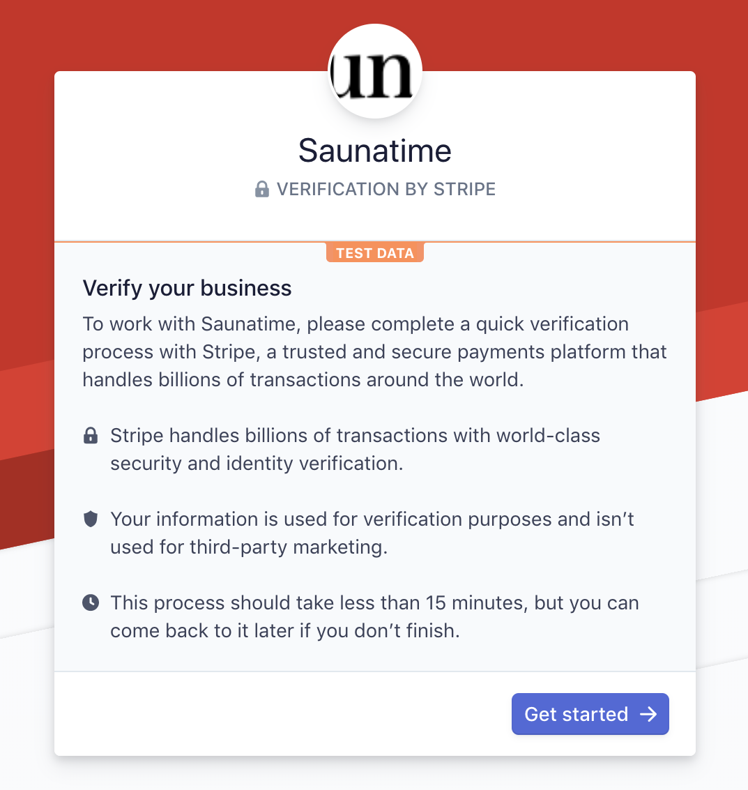
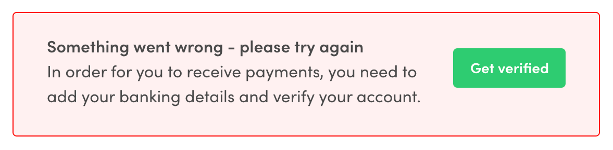

---
title:
  How to handle provider onboarding and identity verification on FTW
slug: provider-onboarding-and-identity-verification
updated: 2019-12-19
category: guides
ingress:
  This article describes how to take Stripe Connect Onboarding into use
  in your frontend application or how to implement your own flow.
published: true
---

## Introduction

Flex offers two different mechanisms for creating a provider
verification process where providers can enter all necessary and
required information for them to receive payments. You can either choose
to use ready-made tools provided by Stripe
([Stripe Connect Onboarding](https://stripe.com/en-fi/connect/onboarding))
or implement your own flow.

This article describes these two approaches.

## Stripe Connect Onboarding

Regulatory aspects of provider onboarding can be challenging and
changing rapidly. Stripe Connect Onboarding provides ready tools for
meeting the requirements and reducing the operational complexity of
self-managing the onboarding flow and identity verification. Below are
listed the changes required to implement Stripe Connect Onboarding. If
you are using the latest Flex Template for Web, you need to complete
only the first step - if you are upgrading your own implementation,
follow the rest of the instructions.

### 1. Enable Stripe Connect Onboarding in Stripe Dashboard

You need to navigate to
[Connect settings page](https://dashboard.stripe.com/account/applications/settings)
in your Stripe Dashboard. For the Connect onboarding to work, you need
to provide `name`, `color`, and `icon` for your marketplace.


**Following steps are already implemented in FTW-daily v4.0.0 and
FTW-hourly v5.0.0 or later**

In FTW there are new
[StripePayoutPage](https://github.com/sharetribe/ftw-daily/tree/master/src/containers/StripePayoutPage),
[StripeConnectAccountForm](https://github.com/sharetribe/ftw-daily/tree/master/src/forms/StripeConnectAccountForm),
and
[stripeConnectAccount.duck.js](https://github.com/sharetribe/ftw-daily/tree/master/src/ducks/stripeConnectAccount.duck.js)
where the Connect onboarding is mostly handled. You can also check out
[PR #1234](https://github.com/sharetribe/ftw-daily/pull/1234) where you
can find all the code changes we did to default FTW.

### 2. Creating provider Stripe Account

With Stripe Connect Onboarding, you need to collect minimum information
from your providers when creating a
[Stripe Account](https://www.sharetribe.com/api-reference/marketplace.html#create-stripe-account)
for them. It's recommended for you to pass in for the
`create-stripe-account` call the following information:

- `country`: A mandatory field determining the country of residence for
  the provider.
- `bankAccountToken`: Stripe
  [bank account token](https://stripe.com/docs/api#create_bank_account_token)
  for the user. Recommended to pass in at this phase to minimize the
  steps in the onboarding process.
- `requestedCapabilities`: Required capabilities for payments to work in
  Flex are `card_payments` and `transfers`. You can read more about
  capabilities from
  [How Capabilities work?](/background/how-capabilities-work/)


**Note:** On the `EditListingWizard`, the modal with
`StripeConnectAccountForm` is shown if the user doesn't have a Stripe
account yet or if there is some information missing from the account.
The modal will be shown only if the user is publishing the listing. This
means that users can update already published listing even if their
Stripe account is in the restricted state but the can't publish new
listings.

### 3. Fetching the information about Stripe account

If the user already has the Stripe account you need to fetch the
up-to-date account data from through Flex API. This way we can warn the
users if there is some required information missing from their Stripe
account.

The account data is returned after each create and update Stripe account
API calls so there is no need for separate API call in these cases.

In FTW the Stripe account is fetched in `loadData` function on
`StripePayoutPage` and on `EditListingPage`.

### 4. Creating Stripe Account Link

Stripe Account Links are a mechanism for enabling your providers to
access Stripe Connect Onboarding UI. You need to
[create an account link](https://www.sharetribe.com/api-reference/marketplace.html#create-stripe-account-link)
and provide the return URLs for success and failure cases. After
creating an account link the user will be redirecet to Connect
onboarding.



If there are any requirements missing from the Stripe account we will
create `custom_account_verification` link. Otherwise, we will create
`custom_account_update` link. By default, we will use `currently_due` as
a colelct type. A new Account Link is created only when the user clicks
the link to go to Connect onboarding to make sure the link will not
expire. When the Account Link is returned the user is redirected to
Connect Onboarding.

When creating the Account Link we need to provide success and failure
URLs where user will be redirected after onboarding. There routes with
URL parameter need to be added to `routeConfiguration.js`.

E.g. StripePayoutPage with URL parameter

```
    {
      path: '/account/payments/:returnURLType',
      name: 'StripePayoutOnboardingPage',
      auth: true,
      authPage: 'LoginPage',
      component: props => <StripePayoutPage {...props} />,
      loadData: StripePayoutPage.loadData,
    }
```

If the user returns to the success URL, we still need to check the
status of the Stripe account again. Returning to success URL doesn't
automatically mean that the account has all the required information.

- If there are no requirements missing from the Stripe account, the
  status box is in `verificationSuccess` mode

  

- If there is still something missing from the Stripe account, the
  status box is in `verificationNeeded` mode

  

- If the user returned to failure URL, the status box is in
  `verificationError` mode. Failure can happen e.g. if the Connect
  onboarding page was refreshed or if the Account Link was already
  expired

  

### 5. Updating provider Stripe account

Most of the information related to Stripe account like email or address
can be updated from Stripe's Connect onboarding. For updating this
information we need to
[create a new Account Link](https://www.sharetribe.com/api-reference/marketplace.html#create-stripe-account-link)
and redirect user back to Connect onboarding.

Only thing we manage on the FTW side is updating the `bankAccountToken`
of the Stripe account. This means that if the provider want's to update
their bank account number (e.g. IBAN), it's handled by passing a new
bankAccountToken to
[update Stripe account](https://www.sharetribe.com/api-reference/marketplace.html#update-stripe-account)
API endpoint.

**Note:** Currently, Stripe doesn't support updating the counrty of the
account after the account has been created.

## Using custom flow

It's also possible to implement the onboarding flow in your own
application. This way the user will stay on your application through the
whole onboarding. The downside with this approach is that you are
responsible for collecting all the required information and keeping the
UI up-to-date also with the possible future changes.

Before FTW-daily v4.0.0 and FTW-hourly v5.0.0 the Stripe onboarding was
implemented like this also in FTW. There are some now deprecated
components you can use as a starting point if you want to implement your
own flow. You should keep in mind that these components will not be
updated by our team since FTW will use Connect Onboarding by default.

### Collecting required information

When onboarding Custom accounts, you need to collect the required
information for each account (which Stripe verifies). The information
you need to collect depends on factors such as the capabilities and the
country the account is based in. You can find the requirements from
Stripe's
[Required verification information](https://stripe.com/docs/connect/required-verification-information)
documentation. You should keep in mind that depending on the situation,
you might need to collect a scan of an ID document, an address document,
or both to enable payouts so you need to implement way to download these
files.

After you have collected the information you need to obtain a new
[account token](https://stripe.com/docs/connect/account-tokens) via
Stripe API, through the same Stripe platform account as the one used by
the marketplace. This account token should be passed to Flex API when
creating or updating the Stripe account.

### Updating the Stripe account

Before FTW-daily v4.0.0 and FTW-hourly v5.0.0 it was not possible to
update the Stripe account through the user's account settings. However,
if you decide to use your own custom flow you should concider
implementing the way to check the status of Stripe account and
collecting more information about the user when it's required.
Otherwise, the Stripe account might get restricted and payouts to the
provider will fail.

### Using deprecated PayoutDetailsForm and PayoutDetailsPage as a starting point

We have deprecated the old `PayoutDetailsForm` and
`PayoutPreferencesPage` where the custom flow for onboarding was
implemented. Also, functions related to deprecated form has been removed
from `stripe.duck.js`. If you want to keep using the custom form in your
own application, you can take these deprecated components as a starting
point but you should keep in mind that **they will not be updated** by
our team.

You can find the deprecated files still from v.3.7.0

- [PayoutDetailsForm](https://github.com/sharetribe/ftw-daily/tree/v3.7.0/src/forms/PayoutDetailsForm)
- [PayoutPreferencesPage](https://github.com/sharetribe/ftw-daily/tree/v3.7.0/src/containers/PayoutPreferencesPage)
- [stripe.duck.js](https://github.com/sharetribe/ftw-daily/blob/v3.7.0/src/ducks/stripe.duck.js).
