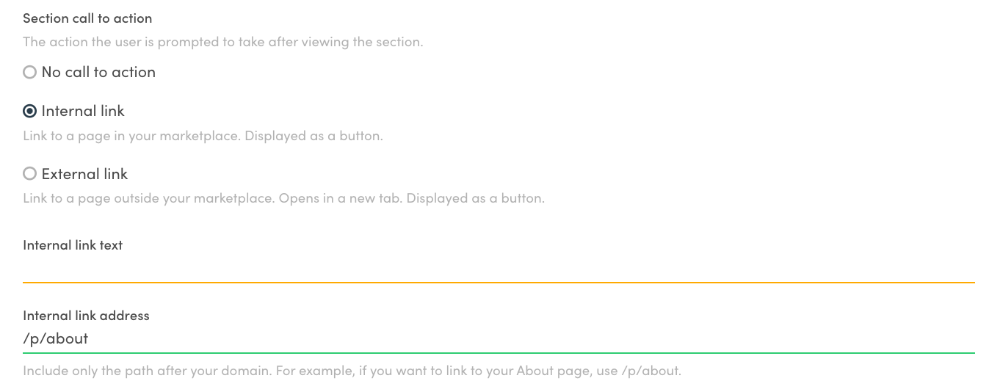

The Pages feature allows you to create different types of content. Using
the different content elements – article, feature, column – you can
build a wide range of different types of pages.

One use case for creating content is to have a library of articles
related to your marketplace topic. This guide shows you how to create an
interlinked library of content using the Pages feature.

This article assumes that your client app can handle
[hosted content assets](/concepts/content-management/). You can
[update your client according to these instructions](/ftw/page-builder/#how-to-take-pages-into-use-if-you-are-using-an-older-version-of-ftw).

## Why an article library?

An article library functions as a channel for
[content marketing](https://www.sharetribe.com/academy/how-to-do-local-content-marketing-for-marketplaces/).
You can educate your marketplace users and provide value,
[build a community around your marketplace](https://www.sharetribe.com/academy/turn-marketplace-community/),
as well as improve your
[marketplace SEO ranking](https://www.sharetribe.com/academy/marketplace-seo/opportunities-and-challenges/).

If you want more blog-like features on your article library, e.g.
comments, or articles displayed in a reverse chronological order, you
can add them with custom development.

## Decide your article content

The first step in building an article library is to
[decide on your content strategy](https://www.sharetribe.com/academy/marketplace-business-slows-down/#double-down-on-content),
and create an initial list of articles you will feature on your
marketplace. For instance a cottage rental marketplace could have
articles on

- The history of cottages in the marketplace location
- Types of cottages: level of amenities such as electricity and running
  water, and considerations related to each for guests and hosts
- Reasons to rent out your cottage to others
- Reasons to hire a cottage for your vacation
- Cottage rental etiquette
- What to pack for a cottage trip
- Cottage cooking favorites, such as grilled sausages and fireside
  s'mores ... and so forth

For the best reader and SEO experience, you want to have articles that
can be linked to at least two or three other articles within your
article base. You can start with e.g. half a dozen article topics, and
then build your content library as you go.

## Build your library page and article pages

To add a page, you need to navigate to
[Flex Console > Build > Content > Pages](https://flex-console.sharetribe.com/content/pages).
By default, this page contains an about page, a landing page, a privacy
policy page, and a terms of service page. Under those pages you can see
a link with text "+ Create new page...". Click this link.


### Build your library page

As the page ID for this first page, enter "articles". This will be the
collection page where you will link all your individual articles, and
you can see the page in _[your-marketplace-url.com]/p/articles_.

After you create the page, you can start adding new sections.

Let's add the following sections to this main page:

- Introduction section with _article_ template. You can use this section
  to explain more about the focus of your marketplace and your article
  collection.
- Featured articles with _features_ template. You can use this section
  to highlight your most important content, best performing articles, or
  an interesting series of posts.
- List of all articles with _carousel_ template. You can use this
  section to list all your articles, either ordered chronologically or
  in some other way you prefer.


In each section, you can define a title, ingress content, and blocks for
your copy text. After you save the changes you made, you can click the
"View page" link in the top right corner of the page editor to see your
changes.

### Build your article pages

You have now created your main article collection page. Next, you will
create a few article pages with your actual article content. If you were
creating a marketplace about cottages, you could first write articles
with the following page IDs:

- history
- packing-list
- amenities

You can create these article pages in a similar manner to how you
created the collection page. Depending on the design of your pages, you
may want to use _article_ sections for the main part of the text, and
e.g. _features_ sections to highlight quotes or other key information.

<info>

Flex currently has a limit of **100 content pages** across your
marketplace, including the pages included by default:

- About
- Landing page
- Privacy policy
- Terms of service

</info>

## Link to other pages

Once your articles have been created, you need to link the articles to
each other.

For instance, in your article on _amenities_ you could link to the other
two articles in the following way:

```
...
For a wood-heated cottage, it makes sense to bring your woollen socks – even in summer,
the cottage may be cool inside, and [having the right gear](/p/packing-list) reduces
the need for heating during the cooler months.

For [older cottages](/p/history), amenities will likely be more modest.
...
```

The example above uses the
[Markdown](https://www.markdownguide.org/getting-started/) style of
creating links:

- The link text is wrapped in [square brackets]
- The link address is added immediately after the closing bracket in
  (curved brackets).

In addition to adding links in the text in Markdown, you can add calls
to action in both sections and blocks. A call to action can be either an
internal link or an external one.


