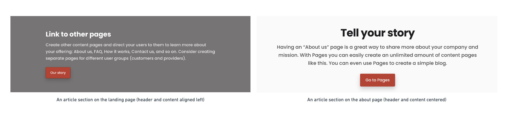
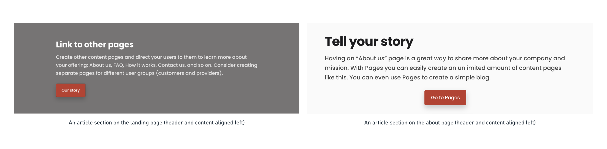
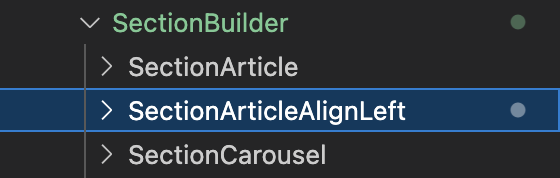
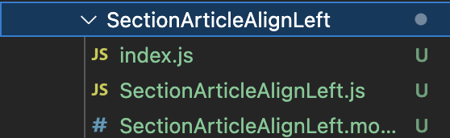

## Introduction

The Sharetribe Web Template renders content pages using data from Pages,
the Flex headless content management system. This how-to article assumes
a basic understanding of the Pages feature and how the template renders
content pages using the PageBuilder. We suggest reading the following
articles before proceeding:

- [Content management in Flex](/concepts/content-management/)
- [Assets reference](/references/assets/)
- [How the template renders content pages](/ftw/page-builder/)

This guide will introduce you to best practices for styling and
customising components used by the PageBuilder.

## Customising components

Sharetribe Web Template uses a component called the PageBuilder to
render content pages. You will likely want to change the style and
structure of content pages, and the PageBuilder is where you should make
those changes. It is good to note that changes to the PageBuilder will
affect how **all content pages** are rendered. If you only want to
customise a specific section on an individual content page, you need to
take a different approach.

Let’s lay out a more concrete example of this scenario: say you want to
define that for all Sections on the landing page using the template
section-article, the title and ingress should be aligned left, and on
all other pages they should adhere to the default styling, i.e. be
centred:



Making these changes directly in the SectionArticle component will
result in changes across all content pages. Let’s demonstrate. We will
create a new rule set in SectionArticle.module.css that does not apply
any centering:

```css
.title {
  max-width: 30ch;
}
.ingress {
  max-width: 65ch;
}
```

Next, let’s use these rulesets in the SectionArticle.js component:

```diff
 <SectionContainer
     id={sectionId}
     className={className}
     rootClassName={rootClassName}
     background={background}
     options={fieldOptions}
   >
     {hasHeaderFields ? (
       <header className={defaultClasses.sectionDetails}>
-        <Field data={title} className={defaultClasses.title} options={fieldOptions} />
+        <Field data={title} className={css.title} options={fieldOptions} />
-        <Field data={ingress} className={defaultClasses.ingress} options={fieldOptions} />
+        <Field data={ingress} className={css.ingress} options={fieldOptions} />
```

We’ll now see that the rule set is applied to all Sections using the
section-article template, on all content pages:



However, our goal is to be able to apply the styling to a single content
page. Let’s see how that happens next.

## Using the options prop

The best way to accomplish this is by using the _options_ prop to
override the section on a specific page. Options is a prop that can be
passed to the _pageBuilder_ component. The prop takes an object used to
map either a **Section**, **Block** or **Field** component to a custom
component.

Let's first create a new component based on the original
**SectionArticle** component. The easiest way to do this is to duplicate
the **SectionArticle** directory. Let’s rename the duplicate
**SectionArticleAlignLeft**:



Remember to also rename all files within the new directory from
**SectionArticle** to **SectionArticleAlignLeft**:



We can now reapply the changes we made in the previous chapter to our
new component. First, create a new rule set in
**SectionArticleAlignLeft.module.css**:

```css
.title {
  max-width: 30ch;
}
.ingress {
  max-width: 65ch;
}
```

And change the **SectionArticleAlignLeft.js** file to use the new rule
set we just created:

```diff
 <SectionContainer
     id={sectionId}
     className={className}
     rootClassName={rootClassName}
     background={background}
     options={fieldOptions}
   >
     {hasHeaderFields ? (
       <header className={defaultClasses.sectionDetails}>
-        <Field data={title} className={defaultClasses.title} options={fieldOptions} />
+        <Field data={title} className={css.title} options={fieldOptions} />
-        <Field data={ingress} className={defaultClasses.ingress} options={fieldOptions} />
+        <Field data={ingress} className={css.ingress} options={fieldOptions} />
```

We won't be able to see this change live yet. First, we will have to
import the new component and use the _options_ prop in
**LandingPage.js**:

```js
import SectionArticleAlignLeft from '../../containers/PageBuilder/SectionBuilder/SectionArticleAlignLeft';
```

We can then define an object in **LandingPage.js** that will be passed
on as the _options_ prop:

```js
const sectionOverrides = {
  article: { component: SectionArticleAlignLeft },
};
```

Let's pass that object to the **PageBuilder** component in
**LandingPage.js** as the _options_ prop:

```diff
 return (
   <PageBuilder
     pageAssetsData={pageAssetsData?.[camelize(ASSET_NAME)]?.data}
     title={schemaTitle}
     description={schemaDescription}
     schema={pageSchemaForSEO}
     contentType={openGraphContentType}
     inProgress={inProgress}
+    options={{sectionComponents: sectionOverrides}}
     fallbackPage={
       <FallbackPage
         title={schemaTitle}
         description={schemaDescription}
         schema={pageSchemaForSEO}
         contentType={openGraphContentType}
       />
     }
```

When we go to the landing page, we can see that the the template now
uses the new component we created to render the section article. This
component will only render section articles on the landing page. That is
evident when we navigate to any other content page: we will see that
titles and content are centred.

## Overriding Blocks and Fields

Similar overrides can be made for Blocks and Fields too. For example, if
we had wanted to override a Block instead of a Section, we could have
used the following mapping:

```js
const blockOverrides = {
  ['default-block']: { component: CustomBlock },
};
```

And passed it as an options prop:

```js
  options={{blockComponents: blockOverrides}}
```

Field overrides can be made similarly. Overriding the **H1** tag would
be defined using the following structure:

```js
const fieldOverrides = {
  heading1: {
    component: CustomH1,
    pickValidProps: exposeContentAsChildren,
  },
};
```

Overriding a Field requires passing a function to _pickValidProps_ to
ensure data validation. You can import the _exposeContentAsChildren_
function from **Field.helpers**:

```js
import { exposeContentAsChildren } from '../PageBuilder/Field/Field.helpers';
```

In this case, we would define our custom heading component in the
Heading.js file:

```js
export const CustomH1 = React.forwardRef((props, ref) => {
  const { rootClassName: rootClass, as, ...otherProps } = props;
  return (
    <Heading
      rootClassName={rootClass || css.h1custom}
      as={as || 'h1'}
      tagRef={ref}
      {...otherProps}
    />
  );
});
CustomH1.displayName = 'CustomH1';
CustomH1.defaultProps = defaultPropsHeading;
CustomH1.propTypes = propTypesHeading;
```

And export it in the **PageBuilder/Primitives/Heading/index.js** file:

```js
export { CustomH1, H1, H2, H3, H4, H5, H6 } from './Heading';
```

Finally, we’d pass it on to the _options_ prop in **LandingPage.js**:

```js
options={{fieldComponents: fieldOverrides}}
```

For a list of which Fields can be overridden, see
[Field.js](https://github.com/sharetribe/web-template/blob/main/src/containers/PageBuilder/Field/Field.js).
